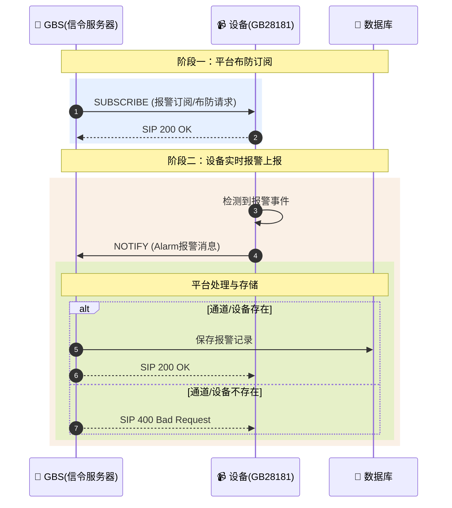

# 国标设备报警订阅与上报机制详解

## 1. 简介

在GB/T 28181标准中，设备报警功能是实现前端智能感知与后端平台联动的重要机制。当摄像机检测到移动侦测、视频丢失、入侵等事件时，需要实时将警情上报给监控中心。

GB28181采用SIP**SUBSCRIBE/NOTIFY**模型实现报警的订阅与推送：

- SUBSCRIBE：平台向设备发起订阅（布防），告知设备需要上报哪些报警
- NOTIFY：设备在有报警发生时，通过NOTIFY请求将警情推送给平台

本文将从平台布防订阅、设备报警上报，到平台存储记录的全流程，结合时序图与真实SIP信令日志，帮助深入理解国标平台的报警机制设计与实现细节。

## 2. 整体交互流程

### 2.1 核心时序图

以下为设备报警订阅与上报的完整时序：



### 2.2 流程说明

| 步骤	 | 方向     | 	内容             | 	说明                          |
|:----|:-------|:----------------|:-----------------------------|
| 1   | GBS→设备 | SUBSCRIBE       | 平台向设备发起报警订阅（布防），指定需要上报的报警类型  |
| 2   | 设备→GBS | 200 OK          | 设备确认收到订阅请求                   |
| 3   | 设备内部	  | -               | 设备监测到报警事件发生                  |
| 4   | 设备→GBS | NOTIFY          | 设备主动上报报警信息，消息体为XML格式的Alarm内容 |
| 5   | GBS→DB | INSERT          | 平台解析报警消息，校验设备合法性，存入数据库       |
| 6   | GBS→设备 | 200 OK          | 平台确认收到报警（校验通过）               |
| 7   | GBS→设备 | 400 Bad Request | 平台拒绝报警（校验失败，如设备不存在）          |

## 3. 核心信令详解

### 3.1 平台布防订阅 (SUBSCRIBE)

平台向设备发送SUBSCRIBE请求，订阅报警事件。Expires头表示订阅有效期（单位：秒），平台需在过期前重新订阅以维持布防状态。

**请求报文**

```
[GBS] 2026-03-02 16:13:16 [UDP][192.168.50.87:11008]>>>>>>[192.168.50.104:5060]>>>>>>
SUBSCRIBE sip:34020000001320000104@192.168.50.104:5060 SIP/2.0
Via: SIP/2.0/UDP 192.168.50.87:11008;rport=11008;branch=z9hG4bK5111380649
From: <sip:31010000042220000002@192.168.50.87:11008>;tag=095861915
To: <sip:34020000001320000104@192.168.50.104:5060>
Call-ID: 9581233242
User-Agent: SkeyevssSevVss 192.168.50.87
CSeq: 872 MESSAGE
Max-Forwards: 70
Expires: 3900
Content-Type: Application/MANSCDP+xml
Content-Length: 259
Contact: <sip:34020000001320000104@3101000004>
Event: presence

<?xml version="1.0" encoding="GB2312"?>
<Query>
  <CmdType>Alarm</CmdType>
  <SN>871</SN>
  <DeviceID>34020000001320000104</DeviceID>
  <StartAlarmPriority>0</StartAlarmPriority>
  <EndAlarmPriority>0</EndAlarmPriority>
  <AlarmMethod>0</AlarmMethod>
</Query>
```

### 3.2 设备报警上报 (NOTIFY)

当设备检测到报警事件时，向平台发送NOTIFY请求，消息体为完整的报警信息XML。

**请求报文**

```
[GBS] 2026-03-02 00:01:42 [UDP][[::]:11008]<<<<<<[设备ip:5060]<<<<<<
MESSAGE sip:31010000042220000002@10.206.0.4:11008 SIP/2.0
Call-ID: c40e1e82cdd9a3f548b301b4cc419a4f
Content-Length: 0
Content-Type: Application/MANSCDP+xml
CSeq: 15314 MESSAGE
From: <sip:34020000001320000108@192.168.0.109:5060>;tag=a4ff486495941283b014ebaeb73780d4
Max-Forwards: 70
To: <sip:31010000042220000002@10.206.0.4:11008>
User-Agent: SIP UAS V.2016.xxxx
Via: SIP/2.0/UDP 192.168.0.109:5060;rport=5060;branch=z9hG4bKa5dda7a0013d19ee38ed7d6bacb9627c;received=设备ip

<?xml version="1.0" encoding="GB2312" standalone="yes" ?>
<Notify>
    <CmdType>Alarm</CmdType>
    <SN>15007</SN>
    <DeviceID>34020000001320000108</DeviceID>
    <AlarmPriority>1</AlarmPriority>
    <AlarmMethod>5</AlarmMethod>
    <AlarmTime>2026-03-02T00:01:42</AlarmTime>
    <AlarmDescription>描述</AlarmDescription>
    <AlarmInfo>11</AlarmInfo>
    <Info>
        <AlarmType>2</AlarmType>
        <AlarmTypeParam>
            <EventType>1</EventType>
        </AlarmTypeParam>
    </Info>
</Notify>

```

## 4. 报警信息字段详解

### 4.1 核心字段说明

| 字段                            | 字段说明   | 取值说明                                                                                                                                                                                                                                                                                                                 |
|:------------------------------|:-------|:---------------------------------------------------------------------------------------------------------------------------------------------------------------------------------------------------------------------------------------------------------------------------------------------------------------------|
| CmdType                       | 命令类型   | Alarm-报警                                                                                                                                                                                                                                                                                                             |
| SN                            | 消息序列号  | 唯一标识请求/响应                                                                                                                                                                                                                                                                                                            |
| DeviceID                      | 设备国标ID | 20位国标编码                                                                                                                                                                                                                                                                                                              |
| AlarmPriority                 | 报警级别   | 1-一级警情<br>2-二级警情<br>3-三级警情<br>4-四级警情                                                                                                                                                                                                                                                                                 |
| AlarmMethod                   | 报警方式   | 1-电话报警<br>2-设备报警<br>3-短信报警<br>4-GPS报警<br>5-视频报警<br>6-设备故障报警<br>7-其他报警                                                                                                                                                                                                                                                |
| AlarmTime                     | 报警时间   | ISO格式: yyyy-MM-ddTHH:mm:ss                                                                                                                                                                                                                                                                                           |
| AlarmDescription              | 报警描述   | 文本描述信息                                                                                                                                                                                                                                                                                                               |
| Longitude                     | 经度     | GPS经度坐标                                                                                                                                                                                                                                                                                                              |
| Latitude                      | 纬度     | GPS纬度坐标                                                                                                                                                                                                                                                                                                              |
| AlarmInfo                     | 报警附加信息 | 自定义扩展字段                                                                                                                                                                                                                                                                                                              |
| Info/AlarmType                | 报警类型   | **AlarmMethod=2时**:<br>1-视频丢失报警<br>2-设备防拆报警<br>3-存储磁盘满报警<br>4-设备高温报警<br>5-设备低温报警<br>**AlarmMethod=5时**:<br>1-人工视频报警<br>2-运动目标检测报警<br>3-遗留物检测报警<br>4-物体移除检测报警<br>5-绊线检测报警<br>6-入侵检测报警<br>7-逆行检测报警<br>8-徘徊检测报警<br>9-流量统计报警<br>10-密度检测报警<br>11-视频异常检测报警<br>12-快速移动报警<br>**AlarmMethod=6时**:<br>1-存储设备磁盘故障<br>2-存储设备风扇故障 |
| Info/AlarmTypeParam/EventType | 事件类型   | 入侵检测报警时:<br>1-进入区域<br>2-离开区域                                                                                                                                                                                                                                                                                         |

### 4.2 嵌套字段说明 (Info)

当 `AlarmMethod` 为特定值时，`Info` 字段提供更详细的报警类型参数，其结构如下：

| AlarmMethod  | AlarmType 取值 | AlarmType 说明 | EventType 取值 | EventType 说明 |
|:-------------|:-------------|:-------------|:-------------|:-------------|
| **2-设备报警**   | 1            | 视频丢失报警       | -            | -            |
| 2-设备报警       | 2            | 设备防拆报警       | -            | -            |
| 2-设备报警       | 3            | 存储磁盘满报警      | -            | -            |
| 2-设备报警       | 4            | 设备高温报警       | -            | -            |
| 2-设备报警       | 5            | 设备低温报警       | -            | -            |
| **5-视频报警**   | 1            | 人工视频报警       | -            | -            |
| 5-视频报警       | 2            | 运动目标检测报警     | -            | -            |
| 5-视频报警       | 3            | 遗留物检测报警      | -            | -            |
| 5-视频报警       | 4            | 物体移除检测报警     | -            | -            |
| 5-视频报警       | 5            | 绊线检测报警       | -            | -            |
| 5-视频报警       | 6            | **入侵检测报警**   | 1            | 进入区域         |
| 5-视频报警       | 6            | 入侵检测报警       | 2            | 离开区域         |
| 5-视频报警       | 7            | 逆行检测报警       | -            | -            |
| 5-视频报警       | 8            | 徘徊检测报警       | -            | -            |
| 5-视频报警       | 9            | 流量统计报警       | -            | -            |
| 5-视频报警       | 10           | 密度检测报警       | -            | -            |
| 5-视频报警       | 11           | 视频异常检测报警     | -            | -            |
| 5-视频报警       | 12           | 快速移动报警       | -            | -            |
| **6-设备故障报警** | 1            | 存储设备磁盘故障     | -            | -            |
| 6-设备故障报警     | 2            | 存储设备风扇故障     | -            | -            |

## 5. 设计要点与注意事项

在设计GB28181报警订阅与上报模块时，建议重点关注以下几点：

### 5.1 **订阅维持**

心跳机制：Expires过期前需重新SUBSCRIBE，否则设备会认为平台已离线，停止报警上报

持久化订阅关系：平台需在内存或数据库中维护当前活跃的订阅关系

### 5.2 **报警去重**

同一报警事件可能被设备重复上报（如移动侦测持续期间），平台需设计去重机制

可根据DeviceID + AlarmTime + AlarmType组合判断是否已处理

### 5.3 **并发处理**

当大量设备同时上报报警时，平台需具备足够的处理能力，建议引入消息队列削峰

### 5.4 **安全校验**

收到报警后需校验DeviceID是否在平台注册

对于非法设备上报的报警返回403

## 6. 总结

通过以上机制，平台可以实现：

- 实时布防：向指定设备订阅报警事件
- 警情接收：实时接收设备上报的各类报警
- 数据存储：将报警记录持久化，供后续查询与分析
- 业务联动：基于报警触发录像、联动大屏、推送通知等

GB28181的报警订阅与上报机制为构建智能化的视频监控应用提供了标准化的数据通道，是设备与平台间实时交互的重要桥梁。