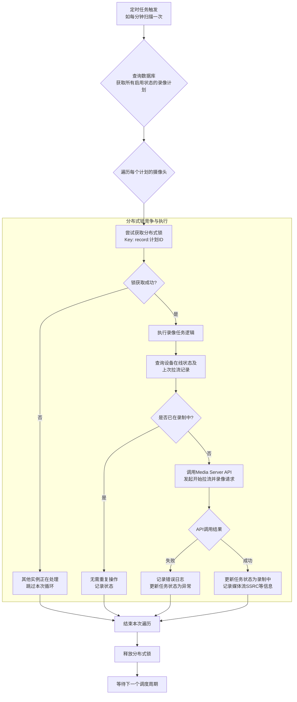
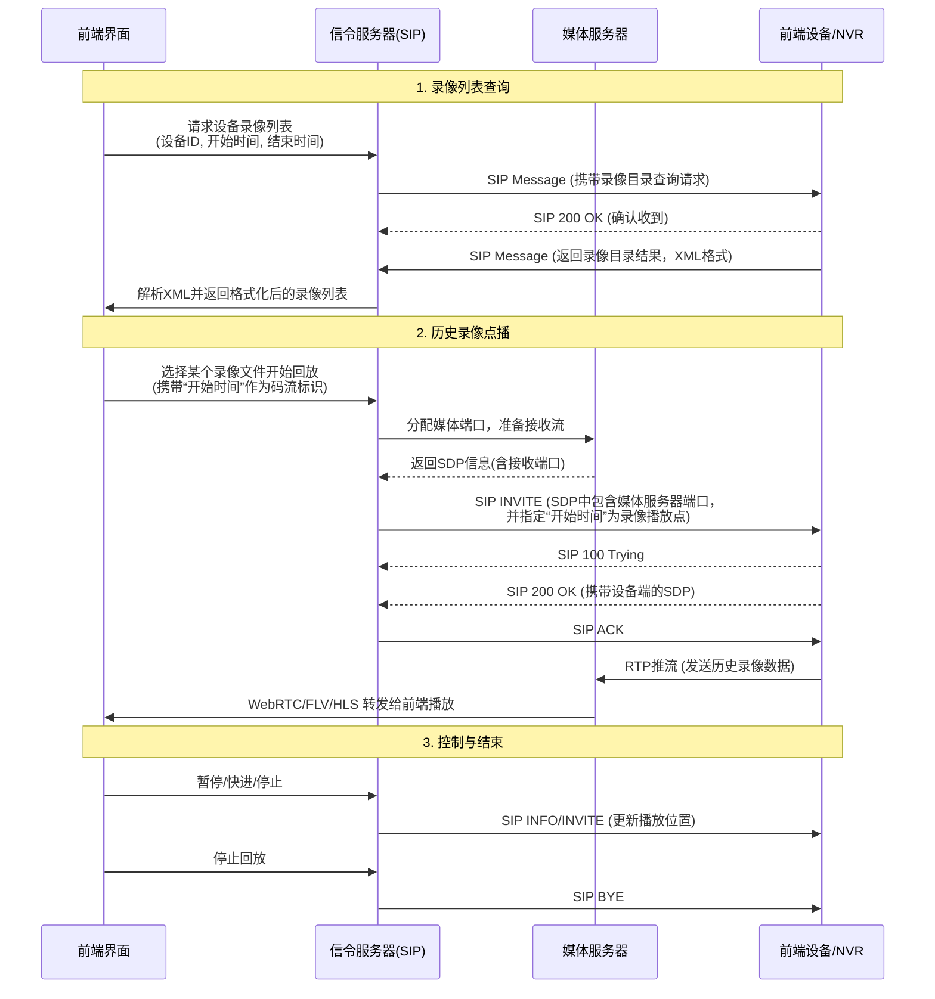

# GB28181 平台录像任务调度与设备录像查询机制详解

## 1. 简介

在基于 GB/T 28181 国家标准构建的视频监控平台中，录像功能是核心业务之一，主要分为两类：

- **平台侧计划录像**：由平台主动发起，通过媒体服务器向设备请求实时流，并在平台侧（本地或云存储）进行录制。适用于需要集中存储或长期备份的场景。
- **设备端历史录像查询与回放**：前端通过信令服务器向设备请求其磁盘或NVR中已存储的历史录像文件。适用于取证查询或设备离线时的数据回溯。

本文将完整覆盖 **从录像任务创建、分布式调度执行，到设备端历史录像分批查询**
的全流程，结合流程图、时序图与真实SIP信令日志，帮助深入理解国标平台的录像机制设计与实现细节。

---

## 2. 平台侧录像任务调度机制

平台侧录像的核心在于 **“任务配置 -> 分布式调度 -> 流媒体操作”** 的闭环。

### 2.1 录像计划配置与持久化

用户在前端界面配置录像策略，如选择摄像头、设定录像时间段（如每天 00:00–24:00）、录像类型（定时/移动侦测/报警）以及存储策略。

- **数据流转**：前端提交配置 -> 后端服务校验 -> 持久化至数据库。

- **任务状态**：录像计划在数据库中通常包含启用/禁用、开始时间、结束时间、重复周期等字段。

### 2.2 分布式任务调度与执行流程

在分布式微服务架构中，如何避免多个服务实例同时对同一个摄像头执行录像任务，是设计的关键。通常采用 **“定时扫描 + 分布式锁”** 的机制。

以下是任务执行流程图：



#### 2.2.1 关键细节

- **创建录像计划**：
- **定时粒度**：调度器通常每分钟运行一次，检查当前时间是否落在某个录像计划的开始-结束时间范围内。
- **分布式锁**：使用或Redis乐观锁，确保一个摄像头在同一时间只有一个服务实例在处理其录像任务，防止重复拉流。
- **状态机管理**：每个录像计划应有明确的状态（待执行、录制中、已停止、异常），以便系统恢复或人工干预。
- **与Media Server交互**：
    - **开始录像**：调用媒体服务器的api/record/start。
    - **停止录像**：当系统时间超过计划结束时间，或用户手动停用计划时，调度器应调用api/record/stop接口，并更新状态。

---

## 3. 设备端历史录像查询与点播机制

### 3.1 核心交互流程（SIP + RTSP/RTP）

整个流程分为“查询”与“点播”两个阶段：

- 查询阶段：平台向设备发送SIP消息，询问某段时间内的录像文件列表。
- 点播阶段：用户选择某个录像文件，平台向设备发送INVITE请求，开始播放历史流。

### 3.2 时序图




### 3.3 核心信令详解

#### 3.3.1 录像目录查询请求 (SIP Message)

平台向设备发送MESSAGE请求，其消息体为XML格式，用于查询历史录像。

`Type 录像类型：time（定时），alert（报警），all（全部）`

```xml
<?xml version="1.0"?>
<Query>
  <CmdType>RecordInfo</CmdType>
  <SN>1</SN>
  <DeviceID>34020000001320000104</DeviceID>
  <StartTime>2026-03-13T00:00:00</StartTime>
  <EndTime>2026-03-13T23:59:59</EndTime>
  <Type>all</Type>
</Query>
```

#### 3.3.2 设备侧录像目录响应 (SIP Message)

设备收到查询后，会以另一个MESSAGE请求回复录像列表。录像文件可能很多，设备不会一次性全部返回，而是分批次返回（整理流程和catalog类似）。

```xml
<?xml version="1.0"?>
<Response>
  <CmdType>RecordInfo</CmdType>
  <SN>2</SN>
  <DeviceID>34020000001320000104</DeviceID>
  <SumNum>3</SumNum>
  <RecordList>
    <Item>
      <DeviceID>34020000001320000104</DeviceID>
      <Name>通道01录像</Name>
      <StartTime>2026-03-13T08:00:00</StartTime>
      <EndTime>2026-03-13T10:00:00</EndTime>
      <FileSize>1048576</FileSize>
    </Item>
    <!-- 更多Item... -->
  </RecordList>
</Response>
```

#### 3.3.3 历史录像点播 (SIP INVITE)

与点播实时流不同，点播历史流需要在SDP中携带startTime和endTime参数，以告诉设备需要播放哪一段。

`参考/core/app/sev/vss/internal/pkg/sip/gbs_send.go:858`

```sdp
v=0
o=34020000001320000104 0 0 IN IP4 192.168.1.100
s=Play
c=IN IP4 192.168.1.200
t=1696147200 1696150800  // 开始和结束时间的NTP格式
m=video 6000 RTP/AVP 96 97 98
a=recvonly
a=rtpmap:96 PS/90000
a=rtpmap:97 H264/90000
a=rtpmap:98 MPEG4/90000
y=0200000001  // ssrc
```

## 4. 总结与设计要点

在设计GB28181录像相关模块时，建议重点关注以下几点：

- **资源隔离与锁**：在分布式录像任务调度中，必须引入分布式锁，避免对同一设备的重复拉流，造成资源浪费或设备异常。
- **异步处理**：无论是调用媒体服务器拉流，还是与设备进行SIP交互，都应采用异步机制，避免阻塞核心调度线程。
- **状态持久化**：录像任务的状态需要持久化到数据库，以便系统重启后能够恢复任务。
- **分页处理**：对于录像目录查询，必须实现分批查询逻辑，以应对海量录像文件的场景。

通过以上机制，一个稳定、高效的国标录像系统才能被构建出来，满足安防监控领域多样化的业务需求。
