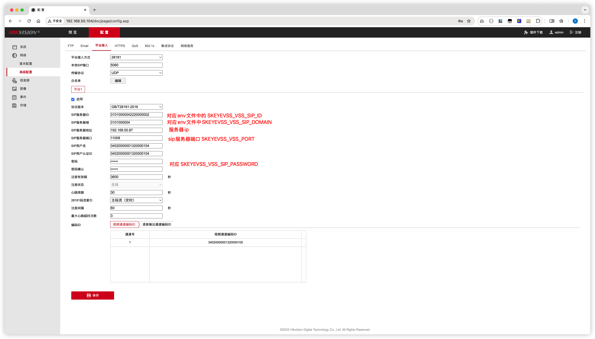

# Skeyevss 项目安装使用说明

## 1. 服务资源

本项目为 `Skeyevss Community Edition (go-vss)`，包含后端服务、前端管理后台、国标信令与流媒体联动能力。

**项目地址** [https://github.com/openskeye/go-vss](https://github.com/openskeye/go-vss)

[试用安装包下载](https://www.openskeye.cn/releases) | [在线演示](https://showcase.openskeye.cn/)


### 1.1 代码与配置资源

- 项目源码：当前仓库根目录
- 默认环境变量模板：`.env.local.default`
- 服务配置文件目录：`etc/`
- Docker 编排：`docker-compose.yml`
- 开发生成脚本：`scripts/dev/`

### 1.2 主要运行组件

- 基础依赖：MySQL / Redis / etcd
- 业务服务：DB RPC / VSS / Backend API / Cron / Web Proxy
- 媒体服务：`SkeyesMS`（独立进程）

---

## 2. 服务架构

核心调用关系如下：

1. 前端通过 `Web Proxy` 访问后端接口与静态资源。
2. `Backend API` 负责业务 API，调用 `DB RPC` 与 `VSS`。
3. `VSS` 负责 GB28181/ONVIF/RTSP 等协议处理，并与 `SkeyesMS` 协同完成收流、转发与播放。
4. `Cron` 负责定时任务与录像计划。
5. `MySQL/Redis/etcd` 提供数据存储、缓存与服务发现。

---

## 3. 服务说明

### 3.1 环境准备

- Go >= 1.23.x
- Node.js（前端开发需要）
- Docker + Docker Compose（容器部署需要）
- 可选：本地 MySQL / Redis / etcd（非 Docker 运行）

### 3.2 关键配置文件

- 环境变量：`.env.local`（可由 `.env.local.default` 复制）
- VSS 配置：`etc/.vss.yaml`
- DB RPC 配置：`etc/.db-rpc.yaml`
- Backend API 配置：`etc/.backend-api.yaml`
- Web 代理配置：`etc/.web-sev.yaml`
- Cron 配置：`etc/.cron.yaml`

### 3.3 默认端口（基于 `.env.local.default`）

- MySQL：`11001`
- Redis：`11002`
- etcd(Client)：`11003`
- Web Proxy：`11004`
- Media Server(HTTP)：`11005`
- VSS(SIP)：`11008`
- Cron：`11009`
- DB RPC：`11010`
- Backend API：`11011`
- Guard：`11012`
- VSS HTTP：`11013`
- VSS SSE：`11014`
- VSS Cascade SIP：`11015`
- VSS WS：`11018`

---

## 4. 服务运行

## 4.1 Linux / macOS 本地开发运行

### 第一步：准备环境变量

在项目根目录执行：

```bash
cp .env.local.default .env.local
```

至少确认以下参数：

- `SKEYEVSS_INTERNAL_IP`
- `SKEYEVSS_EXTERNAL_IP`
- `SKEYEVSS_DATABASE_TYPE`（`sqlite` 或 `mysql`）
- `SKEYEVSS_*_PORT` 系列端口是否冲突
- `SKEYEVSS_VSS_SIP_ID` / `SKEYEVSS_VSS_SIP_DOMAIN` / `SKEYEVSS_VSS_SIP_PASSWORD`

### 第二步：启动基础依赖

若使用本地依赖，先启动 MySQL / Redis / etcd。  
若使用 SQLite，可不启动 MySQL（并将 `SKEYEVSS_DATABASE_TYPE=sqlite`）。

### 第三步：按顺序启动服务

在项目根目录分别启动：

```bash
go run core/app/sev/db/main.go -env .env.local -f etc/.db-rpc.yaml
go run core/app/sev/vss/main.go -env .env.local -f etc/.vss.yaml
go run core/app/sev/backend/main.go -env .env.local -f etc/.backend-api.yaml
go run core/app/sev/cron/main.go -env .env.local -f etc/.cron.yaml
go run core/app/sev/web/main.go -env .env.local -f etc/.web-sev.yaml -web-static-dir <前端构建目录>
```

`SkeyesMS` 需单独启动（按照其配置文件与运行参数启动）。

## 4.2 Windows 运行说明

Windows 与 Linux/macOS 运行顺序一致，建议：

1. 先配置 `.env.local`
2. 启动基础依赖（MySQL/Redis/etcd 或 SQLite 模式）
3. 依次启动 `db -> vss -> backend -> cron -> web`
4. 确认防火墙放行 SIP/RTP/HTTP 相关端口

## 4.3 Docker Compose 运行

使用 Docker 方式时：

1. 准备 `.env.prod.d`（或 compose 使用的 env 文件）
2. 校验 `SKEYEVSS_SEV_VOLUMES_DIR`、端口、镜像地址配置
3. 启动（示例）：

```bash
docker-compose --profile core --profile conf up -d
```

`docker-compose.yml` 中服务已定义依赖关系，包含 `mysql/redis/etcd/skeyesms/dbrpc/vss/backendapi/cron/webproxy`。

---

## 5. 配置设备接入（GB28181）

设备接入前，重点确认 VSS SIP 参数（来自 `.env.local` 与 `etc/.vss.yaml`）：

- SIP Host：`SKEYEVSS_INTERNAL_IP`（或公网场景配置对应地址）
- SIP 端口：`SKEYEVSS_VSS_PORT`（默认 `11008`）
- SIP ID：`SKEYEVSS_VSS_SIP_ID`
- SIP 域：`SKEYEVSS_VSS_SIP_DOMAIN`
- 设备统一接入密码：`SKEYEVSS_VSS_SIP_PASSWORD`
- 是否启用密码校验：`SKEYEVSS_VSS_SIP_USE_PASSWORD`

公网部署场景可按需开启：

- `SKEYEVSS_VSS_USE_EXTERNAL_IP`
- `SKEYEVSS_VSS_SIP_USE_EXTERNAL_WAN`
- `SKEYEVSS_EXTERNAL_IP`



---

## 6. 平台使用

## 6.1 管理平台

- 默认入口（开发环境）：`http://<部署IP>:11004`
- 默认管理员账号（来自 `.env.local.default`）：
  - 用户名：`admin`
  - 密码：`111111`

## 6.2 接口文档

- 建议入口：`http://<部署IP>:11004/apidoc`
- 通用 API 约定与请求体说明见：`source/doc/api/common.md`

## 6.3 视频能力

项目支持设备直播、录像回放、云台控制、语音对讲等能力；前端通过 Web 代理与后端交互，后端通过 VSS + 媒体服务完成流控制和播放链路。

---

## 7. 统一编码规则

为保证 GB28181 编码一致性，项目约定了国标 ID 前缀变量（见 `.env.local.default`）：

- 平台前缀：`SKEYEVSS_GEN_PLATFORM_UNIQUEID`
- 目录前缀：`SKEYEVSS_GEN_DIR_UNIQUEID`
- NVR 前缀：`SKEYEVSS_GEN_NVR_UNIQUEID`
- 摄像机前缀：`SKEYEVSS_GEN_CAMERA_UNIQUEID`

建议：

1. 统一采用 20 位国标编码。
2. 同一部署内保持前缀唯一，避免设备、通道、目录编码冲突。
3. 在多级级联场景中，按组织或区域规划编码段，避免跨域重复。

---

## 8. 服务器硬件配置建议

以下为生产环境建议（按并发规模调整）：

- CPU：2 核及以上
- 内存：4GB 及以上
- 磁盘：SSD（录像与日志分盘更优）
- 网络：公网场景建议固定公网 IP

录像、高并发转发场景建议独立部署媒体服务并提升：

- CPU 核数与网络带宽
- 磁盘写入吞吐
- RTP/RTC 端口段与防火墙策略

---

## 9. 常见问题排查

1. 服务启动失败：先检查 `.env.local` 与 `etc/.xxx.yaml` 的变量是否可解析。
2. DB RPC 连不上：确认 etcd 已启动，`SKEYEVSS_ETCD_HOST/PORT` 正确。
3. 设备注册失败：核对 SIP ID/域/密码、SIP 端口、防火墙策略。
4. 无法播放：确认 `SkeyesMS` 已启动，且 VSS 通知地址可访问。
5. 页面打不开：确认 `webproxy` 已启动、`-web-static-dir` 指向正确前端构建目录。

