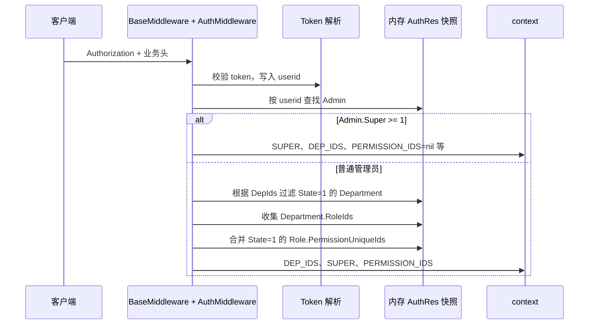
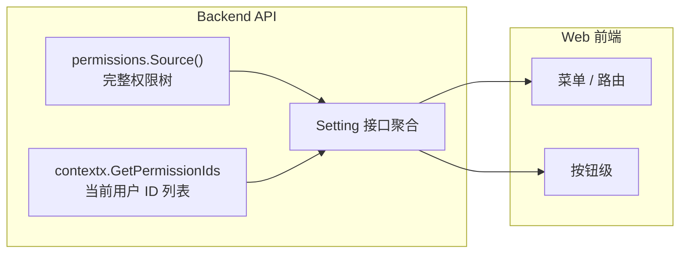

# 前后台权限模型定义与设计

[试用安装包下载](https://www.openskeye.cn/releases) | [SMS](https://github.com/openskeye/go-vss/releases/tag/V1.0.6) | [在线演示](https://showcase.openskeye.cn/)

**项目地址**：[https://github.com/openskeye/go-vss](https://github.com/openskeye/go-vss)

本文将详细描述 Skeyevss 管理端与业务前台在工程中的**权限定义方式**、**组织与角色如何落库**、
**一次 HTTP 请求如何从登录态推导权限并最终校验接口**，并说明前端如何消费权限元数据。内容以当前仓库实现为准。

---

## 1. 设计目标

| 目标          | 实现要点                                                                                                             |
|-------------|------------------------------------------------------------------------------------------------------------------|
| **前后台分域**   | 权限资源在代码中分为 `backend`（`P_0*`）与 `frontend`（`P_1*`）两棵逻辑树，统一由 `permissions.Source()` 暴露给前端做菜单/按钮控制。                  |
| **RBAC**    | 管理员隶属于**组织部门**；部门挂载**角色**；角色持有**权限点 ID 列表**（`permissionUniqueIds`）。                                              |
| **超级管理员旁路** | 管理员 `Super >= 1` 时，中间件不拼接业务权限列表，接口校验阶段直接放行（见下文）。                                                                 |
| **高性能读路径**  | 全量「管理员 + 部门 + 角色」通过 DB RPC `AuthRes` 拉取后在 Backend API 进程内缓存；变更后通过 `AuthSet` 等 channel 节流刷新（参考 《数据查询优化》）。               |
| **接口级强校验**  | 除登录、鉴权通路的通用中间件外，各 Handler 对具体操作显式调用 `permissions.Verify.Authentication`，与前端展示的权限 ID 同源（代码常量），避免「前端藏菜单、接口仍可用」的脱节。 |

---

## 2. 核心概念与数据模型

### 2.1 实体关系（逻辑）


权限点元数据以源码树为准：`UniqueId`、`Universal`、`Super` 等字段见 `permissions.Item`。

- **管理员（Admin）**：字段含 `Super`、`DepIds`（JSON 存库，业务层展开为 `[]uint64`）。非超级管理员若 `DepIds` 为空，中间件直接拒绝（`localization.M0011`）。  
- **部门（Department）**：`State == 1` 且 ID 落在管理员 `DepIds` 中的部门参与权限计算；部门上 `RoleIds` 汇总为候选角色。  
- **角色（Role）**：`State == 1` 且 ID 被上述部门引用时生效；`PermissionUniqueIds` 为权限点字符串列表，与代码中定义的 `P_*` 一一对应。  
- **权限点（Permission Node）**：不单独建「权限表」作为主数据；**以 Go 源码树为权威定义**，运行时 `init()` 注册到内存 `maps`，供校验与下发前端。

### 2.2 权限资源定义（代码即协议）

- **包路径**：`core/common/source/permissions/`  
- **结构**：`Item` 包含 `UniqueId`、`Name`、`Universal`、`Super`、`ActionType`、子节点 `Children` 等。  
- **权限树**：`backend`（`P_0`，名称「后台权限」）、`frontend`（`P_1`，名称「前台权限」）。  
- **对外聚合**：`permissions.Source()` 返回 `map[string][]*Item`，键为 `"backend"` / `"frontend"`，值为各自一级子节点列表，供「系统设置」类接口下发完整树，供前端渲染菜单与按钮。

权限 ID 在 `backend.go`、`frontend.go` 中以常量声明（如 `P_0_1_2_1` 角色创建），**新增菜单或接口时必须同步增加常量并在树中挂好**，同时在对应 Handler 里写入 `Authentication(..., permissions.P_xxx, ...)`。

---

## 3. 运行时数据：`AuthRes` 与中间件

### 3.1 全量权限相关快照

类型定义于 `core/common/types/auth.go`：

- `Admins`、`Departments`、`Roles` 均为列表，由 DB 服务 `BackendService.AuthRes` 一次查出并序列化返回；Backend API 侧缓存在进程内，供每个请求推导当前用户权限，无需每请求扫库。

### 3.2 从 JWT 到「当前用户权限 ID 列表」



中间件将结果写入 `context`（键名见 `core/constants/header.go`）：

- `CTX_SUPER_STATE`：是否超级管理员（`uint`）。  
- `CTX_DEP_IDS`：当前用户部门 ID 列表。  
- `CTX_PERMISSION_IDS`：当前用户**展平后的权限点 ID 列表**（超级管理员场景下校验函数不依赖此列表）。  

实现见 `core/app/sev/backend/internal/middleware/authmiddleware.go` 中 `permissions()` 与 `CustomerCall`。

### 3.3 接口级校验：`Verify.Authentication`

各业务 Handler 在鉴权通过后调用：

```go
permissions.New(ctx).Authentication(
    contextx.GetSuperState(ctx),
    permissions.P_0_x_x_x,              // 本接口对应的权限点 ID
    contextx.GetPermissionIds(ctx),     // 中间件注入的展平列表
)
```

规则摘要（`core/common/source/permissions/verify.go`）：

| 条件                           | 结果                       |
|------------------------------|--------------------------|
| 权限 ID 未在 `init` 注册的 `maps` 中 | `权限未配置`（开发期配置错误）         |
| `super > 0`                  | 直接通过                     |
| 该节点 `Universal == true`      | 直接通过（如「获取设置」类只要求登录）      |
| 用户权限列表不包含该 `uniqueId`        | `无权限[001]`               |
| 该节点 `Super == true` 且当前非超管   | `无权限[002]`（预留字段，树中可按需标记） |

说明：**超级管理员**在中间件阶段已标记，`Authentication` 内对 `super > 0` 短路；**普通用户**必须持有显式 `permissionUniqueId`，或由角色的权限列表覆盖到该点。

---

## 4. 前端权限模型（与后端对齐）

前端不单独维护一套 ID 规则，而是依赖接口返回：

- **`Permissions`**：`permissions.Source()` 的 JSON，含 `backend` / `frontend` 完整树，用于侧栏、路由元信息、按钮显隐。  
- **`PermissionIds`**：当前登录用户已拥有的权限点 ID 列表（与中间件注入一致），用于快速 `includes` 判断。  
- **`Super` / `Showcase`**：超级管理员与演示账号等展示策略（见 `SettingLogic` 与中间件中的 `CTX_SHOWCASE`）。

下发入口在 `core/app/sev/backend/internal/logic/config/setting/settinglogic.go` 的 `Setting()` 返回值（`common.Setting` 结构体字段 `Permissions`、`PermissionIds`、`Super`、`Showcase` 等）。



**重要**：前端隐藏仅改善体验；**真正的安全边界在 Handler 的 `Authentication`**。新增页面时须同时改权限树、角色可选项与后端 Handler 校验常量。

---

## 5. 与「内部调用 / 设备操作员」相关的约定

- **后台**权限树中包含「内部调用」等子树（如 `P_0_7_*`），对应转发 VSS、流媒体、云台等业务 API，同样走 `Authentication`。  
- `permissions.EquipmentOperator()` 在代码中汇总了一组前后台权限 ID 字符串，便于初始化「设备操作员」类角色时批量勾选（实现见 `main.go`）。

---

## 6. 配置变更如何生效

当管理员、角色、部门等影响 `AuthRes` 的数据被修改时，对应 Logic 在写库成功后会向 `ServiceContext.AuthSet` 发送通知；监听协程经 `ThrottleFixedGridTrailing` 合并后调用 `fetchAuth()` 刷新内存中的 `authRes`。因此：

- 权限变更后，**已签发 JWT的旧连接**仍携带旧 `userid`，但下一次请求会使用**刷新后的 AuthRes** 重算 `PermissionIds`，一般可在短时间内生效而无需重新登录（除非业务另有 token 版本策略）。

---

## 7. 扩展与维护

1. **新增权限点**：在 `backend.go` 或 `frontend.go` 增加常量 → 挂到 `Item` 树 → 确保 `initVerifyData` 后 ID 全局唯一（重复会在 `init` 时 `log.Fatalf`）。  
2. **新增 API**：在对应 `*handler.go` 增加 `Authentication(..., permissions.P_new, ...)`。  
3. **新增角色默认能力**：可考虑扩展 `EquipmentOperator()` 或提供迁移 SQL/种子数据，为角色写入新的 `permission_unique_ids`。  
4. **部门/角色停用**：依赖 `State` 字段过滤，避免下线部门/角色仍参与权限并集。

---

## 8. 总结

- **定义**：前后台权限是**代码内的树形资源**，`P_0*` / `P_1*` 为稳定协议；角色存 **ID 列表** 与之绑定。  
- **推导**：`AuthRes` + 管理员部门 + 部门角色 → 展平 `permissionUniqueIds` 写入上下文。  
- **校验**：超级管理员旁路；`Universal` 登录即可；其余接口显式校验常量 ID。  
- **前端**：同一套树 + 当前用户 ID 列表驱动 UI，与后端 Handler 成对使用。
