# Skeyevss 技术分享：数据库设计与 ER 图

[试用安装包下载](https://www.openskeye.cn/releases) | [SMS](https://github.com/openskeye/go-vss/releases/tag/V1.0.6) | [在线演示](https://showcase.openskeye.cn/)

**项目地址**：[https://github.com/openskeye/go-vss](https://github.com/openskeye/go-vss)

---

## 1. 设计目标

Skeyevss 的数据库设计围绕三类核心诉求：

1. **设备与视频链路高并发读写**（设备、通道、流状态）  
2. **后台管理与权限体系稳定可扩展**（管理员、角色、部门）  
3. **运维与审计可追溯**（日志、告警、任务、配置）

项目采用了“**关系模型 + JSON扩展字段**”的混合方案：

- 主实体采用关系型字段（`id`、`uniqueId`、`deviceUniqueId` 等）
- 多值关联采用 JSON 字段（如 `depIds`、`msIds`、`permissionUniqueIds`）

---

## 2. 核心实体分层

## 2.1 身份与权限域

- `sk-admins`：管理员账号
- `sk-roles`：角色
- `sk-departments`：组织部门
- `sk-dictionaries`：字典与枚举配置

## 2.2 设备与视频域

- `sk-devices`：设备主表
- `sk-channels`：设备通道
- `sk-media-servers`：流媒体服务节点
- `sk-cascade`：平台级联配置
- `sk-video-projects`：录像计划
- `sk-alarms`：告警记录

## 2.3 运维与系统域

- `sk-crontab`：任务调度配置
- `sk-settings`：系统设置
- `sk-system-operation-logs`：操作审计日志

---

## 3. ER 图（核心业务）

> 说明：项目中部分关系由业务层维护（JSON 字段/逻辑外键），并非全部采用数据库物理外键约束。

```mermaid
erDiagram
    ADMINS {
        bigint id PK
        string username UK
        string depIds "JSON: 部门ID数组"
        int super
        int isDel
    }

    ROLES {
        bigint id PK
        string name
        string permissionUniqueIds "JSON: 权限唯一ID数组"
        int state
    }

    DEPARTMENTS {
        bigint id PK
        string name
        bigint parentId
        string roleIds "JSON: 角色ID数组"
        string cascadeDepUniqueId
        int state
    }

    DICTIONARIES {
        bigint id PK
        string uniqueId UK
        bigint parentId
        int state
        int readonly
    }

    DEVICES {
        bigint id PK
        string deviceUniqueId UK
        int accessProtocol
        int online
        bigint expire
        bigint manufacturerId
        string msIds "JSON: mediaServer ID数组"
        string depIds "JSON: 部门ID数组"
    }

    CHANNELS {
        bigint id PK
        string uniqueId UK
        string deviceUniqueId
        int online
        int streamState
        bigint streamMSId
        string depIds "JSON: 部门ID数组"
        string cascadeChannelUniqueId
    }

    MEDIA_SERVERS {
        bigint id PK
        string name
        string ip
        string extIP
        int port
        int state
    }

    CASCADE {
        bigint id PK
        string uniqueId UK
        string sipId
        string sipDomain
        string sipIp
        int sipPort
        int online
        string relations "JSON: 分组/通道关联"
    }

    VIDEO_PROJECTS {
        bigint id PK
        string name
        int state
        string channelUniqueIds "JSON: 通道唯一ID数组"
        string plans "JSON: 计划详情"
    }

    ALARMS {
        bigint id PK
        string deviceUniqueId
        int alarmMethod
        int alarmPriority
        int alarmType
        bigint createdAt
    }

    CRONTAB {
        string uniqueId PK
        string title
        bigint interval
        int status
        string logs "JSON"
    }

    SETTINGS {
        int id PK
        string content "JSON"
    }

    SYSTEM_OPERATION_LOGS {
        bigint id PK
        bigint userid
        int type
        string data
        string ip
        bigint createdAt
    }

    DEVICES ||--o{ CHANNELS : "deviceUniqueId"
    MEDIA_SERVERS ||--o{ CHANNELS : "streamMSId(逻辑关联)"
    DEVICES ||--o{ ALARMS : "deviceUniqueId"
    ADMINS ||--o{ SYSTEM_OPERATION_LOGS : "userid"
    DEPARTMENTS ||--o{ DEPARTMENTS : "parentId"
    DICTIONARIES ||--o{ DICTIONARIES : "parentId"
```

---

## 4. 关键关系说明（按业务）

## 4.1 设备与通道（1:N）

- 主关系：`sk-devices.deviceUniqueId` -> `sk-channels.deviceUniqueId`
- 含义：一个设备可挂多个通道
- 业务价值：播放、录像、告警都以通道为最小粒度

## 4.2 通道与媒体节点（N:1，逻辑关联）

- 关系字段：`sk-channels.streamMSId` -> `sk-media-servers.id`
- 含义：当前通道流由哪个媒体节点承载
- 特点：运行态会更新，属于“热状态字段”

## 4.3 管理员与操作日志（1:N）

- 主关系：`sk-admins.id` -> `sk-system-operation-logs.userid`
- 用途：审计追踪“谁在什么时间做了什么操作”

## 4.4 组织树/字典树（自关联）

- `sk-departments.parentId` 形成组织树
- `sk-dictionaries.parentId` 形成字典树

## 4.5 多值关联（JSON字段）

下列关系由业务层解析维护：

- `admins.depIds`
- `departments.roleIds`
- `roles.permissionUniqueIds`
- `devices.msIds` / `devices.depIds`
- `video-projects.channelUniqueIds`

这种设计减少了中间表数量，提升配置类读写效率，但需要应用层保证一致性。

---

## 5. 典型查询链路

## 5.1 播放链路

1. 前端请求通道播放  
2. 通过 `channels.uniqueId` 找到 `deviceUniqueId`  
3. 读取 `devices` 获取接入协议、媒体偏好、在线状态  
4. 根据 `streamMSId` 或 `msIds` 选择 `media-servers`  
5. VSS 发起 Invite 并同步通道流状态

## 5.2 告警链路

1. 设备上报告警  
2. 写入 `sk-alarms`（按 `deviceUniqueId`）  
3. 回查 `devices/channels` 做前端联动展示  
4. 可关联快照/录像路径做事件闭环

---

## 6. 索引与唯一键策略（现状）

从模型定义可见，项目已在关键字段上做了唯一索引/普通索引：

- `admins.username`（唯一）
- `devices.deviceUniqueId`（唯一）
- `channels.uniqueId` 与 `(deviceUniqueId, uniqueId)`（唯一组合）
- `cascade.uniqueId`、`cascade.username`（唯一）
- `dictionaries.uniqueId`（唯一）
- `alarms.deviceUniqueId`（索引）

建议持续关注：

- 告警、日志类表的时间维度索引
- 高频列表页条件字段联合索引

---

## 7. 当前设计特点与取舍

## 7.1 优点

- 模型直观，符合视频平台业务语义
- `uniqueId/deviceUniqueId` 贯穿服务，跨模块定位简单
- JSON 字段降低了中间表复杂度，迭代速度快

## 7.2 取舍

- 关系一致性更依赖应用层校验
- JSON 字段不利于复杂统计查询
- 部分逻辑关联无法依赖数据库 `Foreign Key` 保护

---

## 8. 后期建议

1. 对高频 JSON 关系逐步引入关系型中间表（按压力点演进）  
2. 给审计/告警表增加分区或冷热分层策略  
3. 建立 ER 图与模型代码同步检查流程  
4. 对关键逻辑关联增加“引用完整性巡检任务”

---

## 9. 总结

Skeyevss 数据库设计的核心思路是：

- 用关系模型承载主干实体  
- 用 JSON 字段承载可变配置关系  
- 用业务服务层保证最终一致性

这套方案兼顾了视频平台场景下的**开发效率、运行性能与可扩展性**，适合持续演进的工程化项目。
