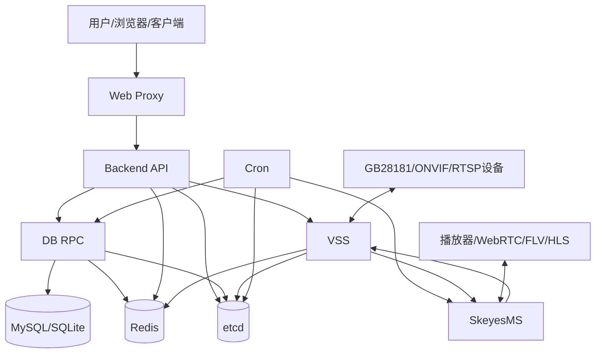
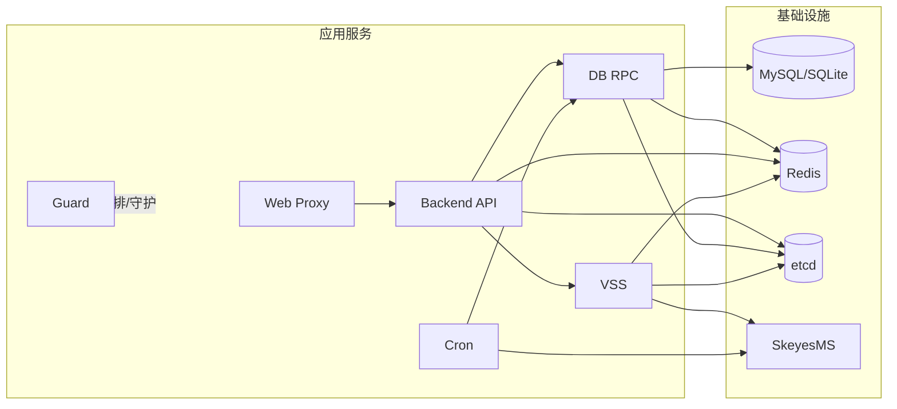
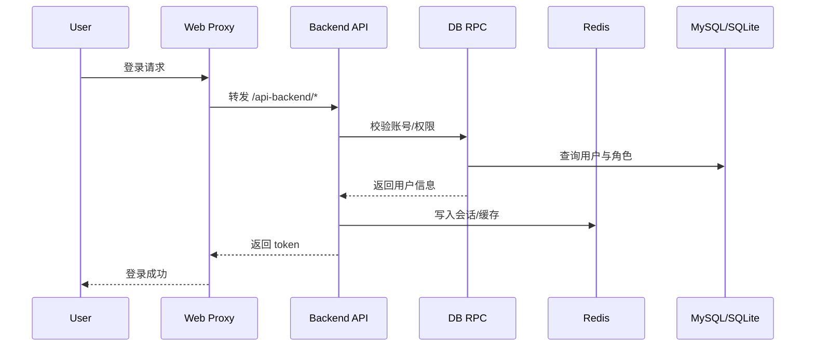
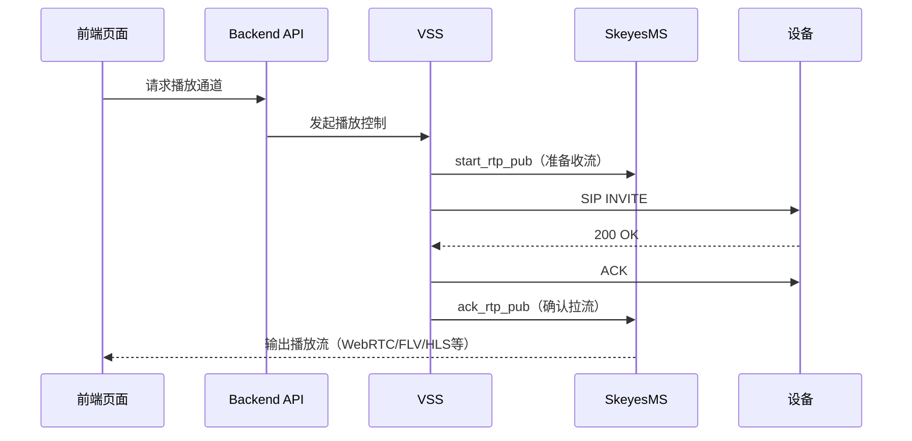
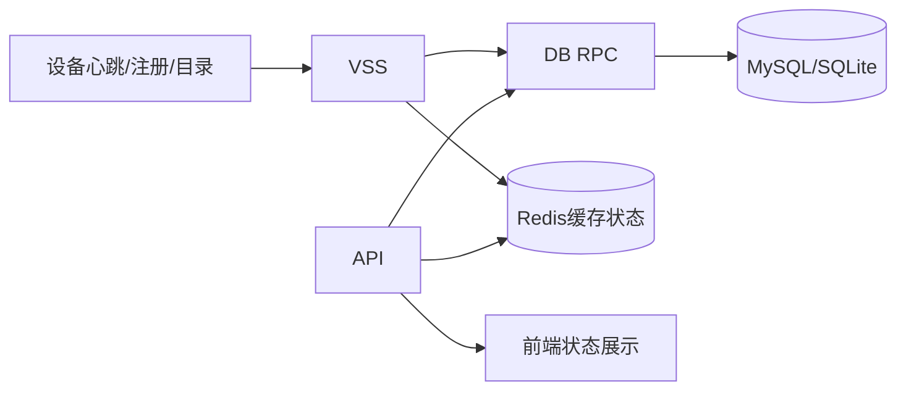
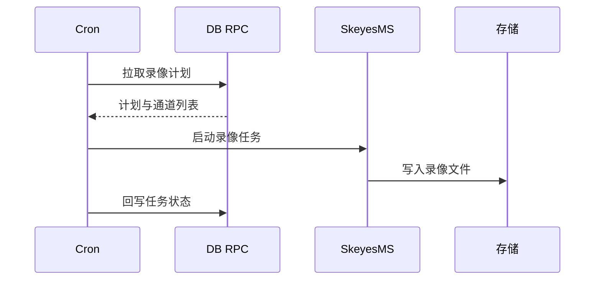
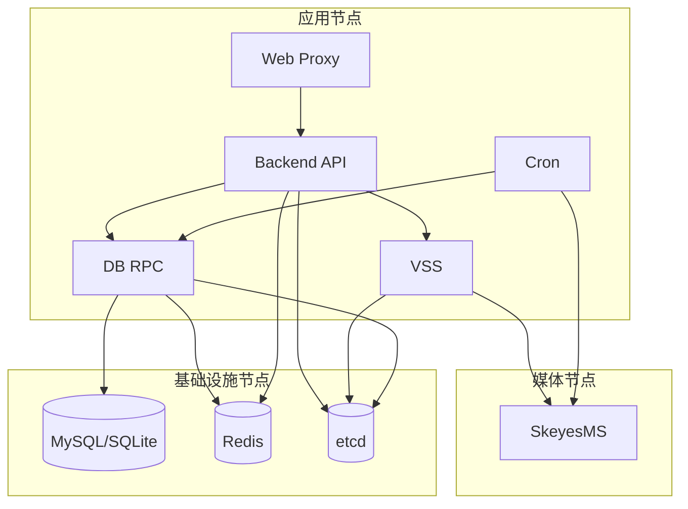

# Skeyevss 架构图解：分层、服务划分与数据流向

[试用安装包下载](https://www.openskeye.cn/releases) | [SMS](https://github.com/openskeye/go-vss/releases/tag/V1.0.6) | [在线演示](https://showcase.openskeye.cn/)

**项目地址**：[https://github.com/openskeye/go-vss](https://github.com/openskeye/go-vss)

---

## 1. 文档目标

本文面向开发、实施与运维，解释3个核心问题：

1. 系统按什么层次组织（分层架构）  
2. 每个服务边界是什么（服务划分）  
3. 一次典型业务请求如何流转（数据流向）

---

## 2. 总体分层架构

### 分层说明

- **接入层**：Web Proxy、设备接入（GB28181/ONVIF/RTSP）
- **业务层**：Backend API、VSS、Cron
- **数据访问层**：DB RPC（统一数据服务）
- **基础设施层**：MySQL/SQLite、Redis、etcd、SkeyesMS

---

## 3. 服务划分与职责边界

## 3.1 服务地图

## 3.2 职责边界

- `Web Proxy`：统一入口、静态资源与 API 反向代理
- `Backend API`：业务接口、鉴权、参数校验、业务编排
- `DB RPC`：统一数据访问（数据库/缓存操作入口）
- `VSS`：视频信令与会话生命周期（注册、Invite、ACK、状态）
- `SkeyesMS`：流媒体处理（收流、转发、协议输出）
- `Cron`：定时任务、录像计划、离线处理
- `Guard`：部署态服务守护与一键启停

**设计意图**：`Backend API` 不直接连数据库，统一通过 `DB RPC`；视频控制逻辑集中在 `VSS`，媒体处理集中在 `SkeyesMS`。

---

## 4. 关键数据流向图解

## 4.1 用户登录与业务访问链路

## 4.2 视频实时播放链路

## 4.3 设备状态与监控数据流

## 4.4 录像任务链路（Cron）

---

## 5. 部署视角（节点级）

---

## 6. 为什么这样划分

- **解耦清晰**：业务编排、数据访问、媒体处理职责独立
- **扩展方便**：单服务可独立扩容（如 VSS、MediaServer）
- **问题隔离**：某服务异常不等于整体不可用
- **运维友好**：可按服务维度做日志、监控、告警与容量评估

---

## 7. 排障建议

出现“页面能打开但视频异常”时，按链路逆向排查：

1. `UI -> Web Proxy`（路由与鉴权）  
2. `Backend API -> VSS`（播放请求是否触发）  
3. `VSS -> 设备`（Invite/ACK/SIP状态）  
4. `VSS -> SkeyesMS`（start/ack 回调）  
5. `SkeyesMS -> 播放端`（协议输出与端口）

---

## 8. 总结

Skeyevss 的核心架构思路可以概括为：

- **业务接口走 Backend API**
- **数据访问收敛到 DB RPC**
- **视频控制收敛到 VSS**
- **媒体处理收敛到 SkeyesMS**

在此基础上，通过 Redis/etcd 与日志监控体系保证系统可观测、可维护、可扩展。
