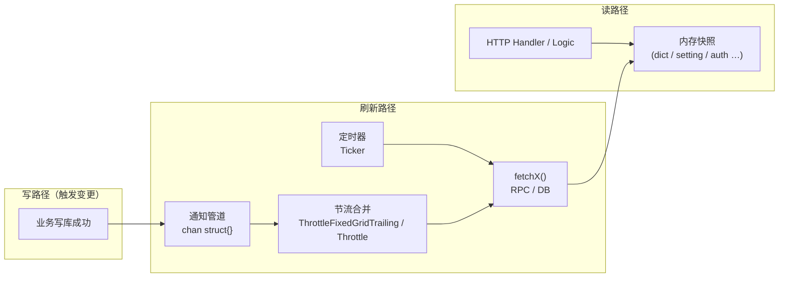
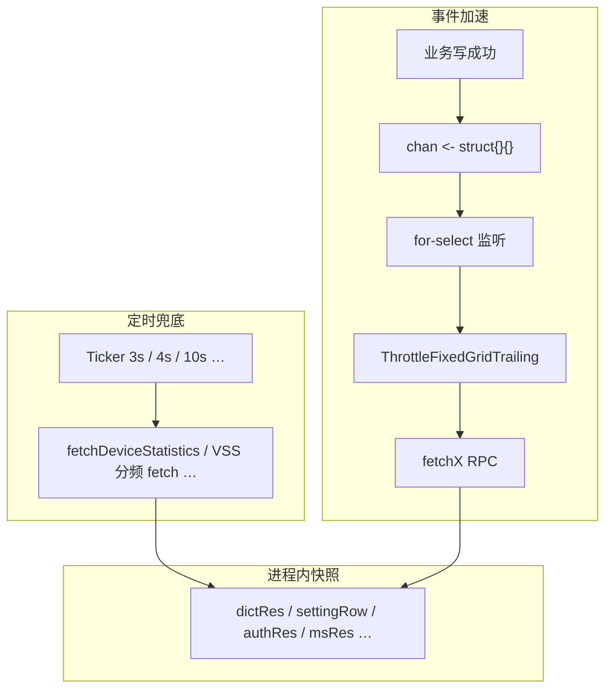
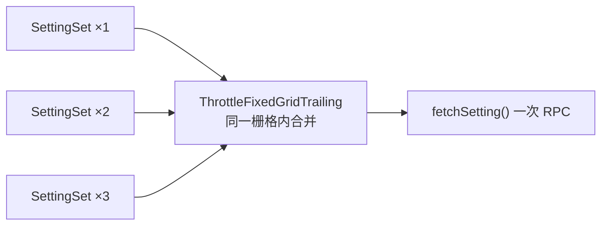

# 数据查询优化

[试用安装包下载](https://www.openskeye.cn/releases) | [SMS](https://github.com/openskeye/go-vss/releases/tag/V1.0.6) | [在线演示](https://showcase.openskeye.cn/)

**项目地址**：[https://github.com/openskeye/go-vss](https://github.com/openskeye/go-vss)

本文将说明在vss项目中常见的**读多写少**数据优化策略：**先把查询结果注入到 `ServiceContext`（或进程内全局快照）**，用**定时任务**保证数据的实时性；
当业务侧发生变更时，通过**带缓冲的 channel**发出“需要刷新”的信号，再经**节流（throttle）**合并短时间内的多次信号，**只执行一次**真正的 RPC/DB 查询，从而压低峰值、节省资源。

---

## 1. 要解决的问题

| 痛点      | 说明                                                        |
|---------|-----------------------------------------------------------|
| 请求路径过重  | 每个 HTTP 请求都去查字典、系统设置、权限资源、流媒体节点等，RPC/DB QPS 与接口 QPS 线性相关。 |
| 配置类数据特征 | 读远大于写；允许秒级延迟；但需要**写后尽快**在多数实例上可见。                         |
| 突发写放大   | 批量导入、脚本、连续保存可能在一小段时间内触发大量“配置已变”事件，若每次都全量拉取，容易打满下游服务。      |

目标可以概括为：

1. **读路径走内存**（或本地快照），把延迟和下游压力降到最低。  
2. **定时拉取**兜底，避免长期不触发事件时数据没有变化。  
3. **事件驱动 + 节流**在“有变更”时快速收敛到最新，同时合并抖动。

---

## 2. 总体模式: 三层结构

下面用一张总览图描述三种机制如何配合（与具体业务无关的抽象模型）。



**要点：**

- **注入 svc**：刷新协程把 RPC/DB 结果写入进程内变量（本项目中多为包级或 `ServiceContext` 持有的指针/切片），读接口只读这份快照。  
- **管道**：写路径不直接 `fetch`，只向 channel 发空结构体 `struct{}{}`，把“哪里修改了什么”简化成“需要刷新”。  
- **节流**：多个信号在窗口内合并为一次 `fetch`，控制下游 QPS 与 CPU。

---

## 3. 项目中的典型实现

### 3.1 Backend API：`ServiceContext` + 四路 channel + 尾部节流

**启动阶段**：先做一次关键数据拉取（如系统设置失败则直接 `panic`，保证服务不会在无配置时误启动），再拉起多组 goroutine：`auth` / `dict` / `setting` / `ms` 各自 **for-select** 监听 channel，收到通知后调用 `dt.ThrottleFixedGridTrailing` 包裹真正的 `fetchX()`。

**channel 与节流窗口（摘自实现）**：

| 数据      | Channel      | 节流键名                      | 周期    |
|---------|--------------|---------------------------|-------|
| 权限资源    | `AuthSet`    | `fetchAuthRes`            | 500ms |
| 字典      | `DictSet`    | `fetchDictRes`            | 2s    |
| 系统设置    | `SettingSet` | `fetchSettingRes`         | 2s    |
| 流媒体节点列表 | `MSSet`      | `fetchMediaServerRecords` | 2s    |

**谁往 channel 里发信号**：配置/系统管理相关 Logic 在**写库成功后**发送（例如字典增删改、设置更新、流媒体节点增删改、角色/部门/管理员等影响权限树的变更）。

**另外还有纯定时刷新**：例如设备在线统计 `deviceStatistics()` 使用约 **3 秒** 的 `Ticker` 周期性 RPC，结果注入快照，供接口直接读取——这是典型的“**与写事件无关、但必须周期性一致**”的数据。

### 3.2 VSS：`FetchDataLogic` 单协程 + 1 秒 Ticker 分频

VSS 侧在 `fetch_data_proc` 中：**先并行完成首轮拉取**（字典、设置、流媒体、ONVIF、设备在线等），再进入 `time.NewTicker(time.Second)` 循环，按时间取模把不同数据放到不同刷新频率上，例如：

- 每 **4 秒** 一轮：字典、设置、流媒体  
- 每 **10 秒**：设备在线状态  
- 每 **120 秒**：ONVIF 发现  

这样用**一个 ticker** 驱动多类数据，避免为每类数据各起一个定时器，也便于统一控制 goroutine 数量。

### 3.3 Cron 服务：3 秒统一刷新基础数据

Cron 中 `FetchDataLogic.DO` 在首次并发拉取完成后，进入 `time.NewTicker(3 * time.Second)`，周期性执行注册好的 `FetchDataProcLogic`（如设置、定时任务配置、流媒体等），保证调度侧始终有较新的基础数据。

### 3.4 DB 服务：单用途 channel + 节流批量写

设备与组织部门关联在通道 `depIds` 变更时，通过 `DeviceDepIdSetChan` 通知；`deviceDepIdSet` 中对该信号使用 **`ThrottleFixedGridTrailing("deviceDepIdSet", 2*time.Second, …)`**，在请求末尾执行一次较重的“扫通道表 + 批量更新设备”的逻辑。  
这是同一思想的变体：**读路径不放大**，**写路径合并**。

---

## 4. 流程图解

### 4.1 从“配置更新”到“快照更新”（序列图）

```mermaid
sequenceDiagram
  participant Admin as 管理端/调用方
  participant Logic as Backend Logic（写配置）
  participant DB as DB RPC / 数据库
  participant Ch as chan（如 SettingSet）
  participant Loop as setting() 监听协程
  participant Th as ThrottleFixedGridTrailing
  participant Fetch as fetchSetting()
  participant Snap as 内存快照 settingRow

  Admin->>Logic: 更新系统设置
  Logic->>DB: 持久化成功
  Logic->>Ch: struct{}{}通知刷新
  Note over Ch: 缓冲 channel，避免短时阻塞写路径

  Loop->>Ch: select收到信号
  Loop->>Th: 登记「本窗口内需要刷新」
  Note over Th: 2s 栅格内多次信号合并为一次执行

  Th->>Fetch: 窗口边界触发
  Fetch->>DB: Config.SettingRow RPC
  DB-->>Fetch: 最新设置
  Fetch->>Snap: 覆盖 settingRow

  Note over Admin,Snap: 后续 HTTP 读 Settings() 只读内存无额外 RPC
```

### 4.2 定时刷新与事件刷新并存



### 4.3 节流合并多次信号



当管理员连续多次保存，channel 可能收到多次通知，但在 **2 秒周期**内通常只会在**UniqueId 右边界**触发**一次** `fetchSetting()`，既跟上变更，又限制下游压力。

---

## 5. `Throttle` 与 `ThrottleFixedGridTrailing` 怎么选

- **`Throttle`**（`core/pkg/dt/throttle.go`）：**前缘节流**——固定时间窗内**第一次**执行，后续调用丢弃。适合“来一次就先响应，后面先忽略”。  
- **`ThrottleFixedGridTrailing`**（`core/pkg/dt/throttle_fixed_grid.go`）：**固定周期 + 尾部执行**——每个时间槽结束时执行**该槽内最后一次**请求对应的逻辑。适合“合并一串变更，**以最后一次状态为准**”的配置拉取。

Backend 对配置类刷新使用后者，多次保存只关心最终配置。

---

## 6. 注意点

1. **channel 容量**使用带缓冲的 `make(chan struct{}, N)`（项目中常见 `20`），避免监听协程短暂卡住时反压到业务写路径。信号本身不携带业务载荷，**丢几个重复信号无害**，因为最终会 `fetch` 全量快照。

2. **首次可用性**  
   启动时应对关键数据做**同步或失败即退出**的拉取，避免接口已监听但快照仍为 `nil`。本项目中设置首次拉取失败会 `panic`，属于强依赖。

3. **一致性与延迟**  
   这是 **eventually consistent** 模型：写库成功到各进程快照更新之间，存在“节流窗口 + RPC 延迟”。若某接口强依赖**读完立即读到**，应改为读主库或带版本号的强制刷新路径，而不是仅依赖快照。

4. **定时周期与节流窗口**  
   - 周期过短：空转 RPC多。  
   - 周期过长：仅靠定时、无事件时，变更生效慢。  
   - 事件 + 节流：在“写少”场景下通常可把定时周期**适当延长**，仍保持体验。

5. **快照并发读**  
   Go 中若多个 goroutine 读指针/切片而刷新协程整体替换指针，需保证**替换原子性**（例如始终替换整个指针，而不是边读边改同一块切片）。本仓库多为赋值新查询结果，读侧注意不要缓存切片元素引用跨多次请求长期持有。

---

## 7. 总结

- **定时注入**：用 Ticker 把数据周期性写入 `svc` 内快照，适合统计类、发现类、对延迟不敏感的配置。  
- **管道通知**：写路径只发信号，解耦“变更检测”与“拉取成本”。  
- **节流合并**：抑制突发刷新，保护 DB/RPC，并以“最后一次为准”对齐配置语义。

这一套组合设计在Vss项目中已分散在 **Backend / VSS / Cron / DB** 等多处实现。若后续扩展多副本部署，可在 channel 节流之上再叠加 Redis发布订阅等跨进程通知；单进程内仍以本文模式为底座。
