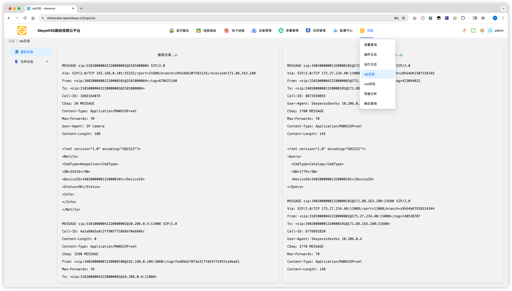
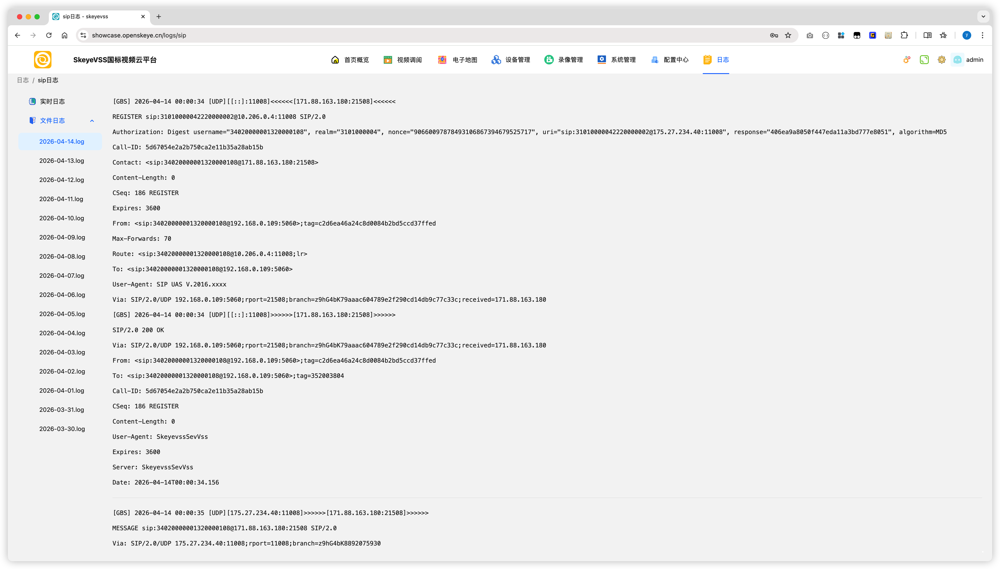

# Skeyevss FAQ：SIP 日志使用说明

[试用安装包下载](https://www.openskeye.cn/releases) | [SMS](https://github.com/openskeye/go-vss/releases/tag/V1.0.6) | [在线演示](https://showcase.openskeye.cn/)

**项目地址**：[https://github.com/openskeye/go-vss](https://github.com/openskeye/go-vss)

---

## 1. 适用场景

在开发与排障过程中，常见需要查看 SIP 信令报文的场景：

- 设备注册失败
- 通道播放失败（Invite/ACK 流程异常）
- 设备频繁掉线（心跳异常）
- 级联联通异常

后台已提供 SIP 日志查看能力，入口为：**日志 -> SIP日志**。

---

## 2. 日志类型说明

SIP 日志分为两类：

### 2.1 实时日志

实时日志展示 VSS 与设备当前交互的信令报文，包含：

- 接收记录（服务端收到的设备报文）
- 发送记录（服务端发给设备的报文）

该能力基于 SSE 订阅推送到前端页面，适合在线排查。

### 2.2 文件日志

文件日志用于查看服务器已落盘的 SIP 历史日志。  
页面通过接口分批读取日志内容（每批次 100 行）返回前端，适合回溯历史问题。

---

## 3. 如何开启 SIP 文件日志

要将 SIP 报文写入文件，需要在 `.env.prod` 中确认：

- `SKEYEVSS_PRINT_SAVE_SIP_LOG_FILE=true`
- `SKEYEVSS_SERVER_LOG_PATH` 已配置为有效日志目录

修改配置后请重启相关服务，使配置生效。

---

## 4. 日志文件路径

SIP 日志默认目录：

sip日志文件目录: `${SKEYEVSS_SERVER_LOG_PATH}/${SKEYEVSS_VSS_NAME}/sip/Y-M-D.log`

例如使用命令行实时查看：

`tail -f ${SKEYEVSS_SERVER_LOG_PATH}/${SKEYEVSS_VSS_NAME}/sip/Y-M-D.log`

---

## 5. 推荐排查流程

1. 先看 **实时日志**，确认请求是否到达、响应是否返回
2. 再看 **文件日志**，回溯问题时间段完整上下文
3. 重点检索关键字：`REGISTER`、`INVITE`、`ACK`、`BYE`、`401`、`403`、`408`、`486`
4. 对照设备配置与 `.env.prod` 中 SIP 参数，确认是否一致

---

## 6. 注意事项

- 日志中可能包含设备编号、IP 等敏感信息，请注意脱敏与访问权限控制
- 生产环境建议开启文件日志并定期归档，避免长期占用磁盘
- 如问题复现概率低，优先保留文件日志便于事后分析

以上就是sip日志相关功能，祝你使用愉快
