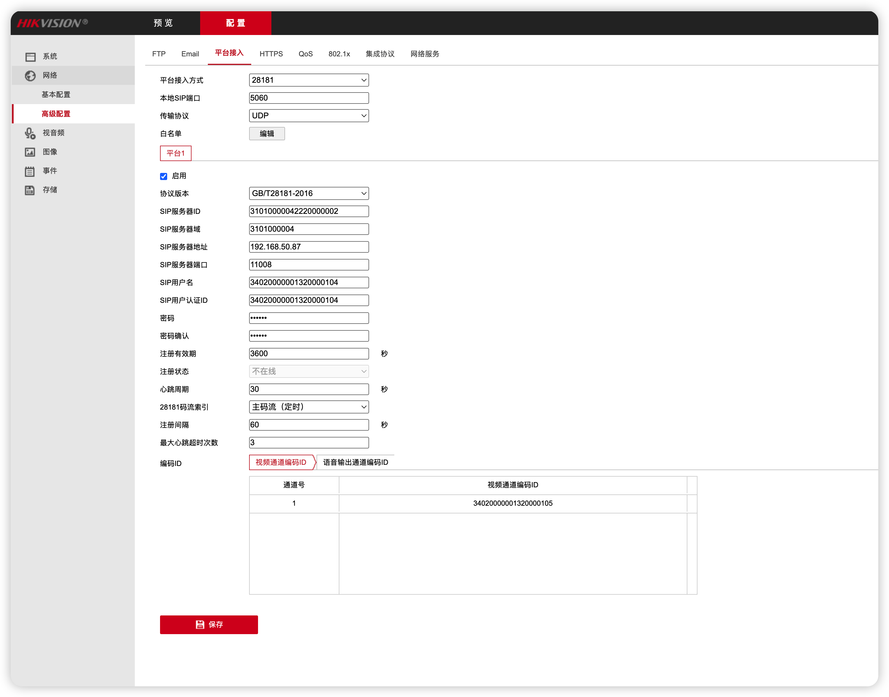
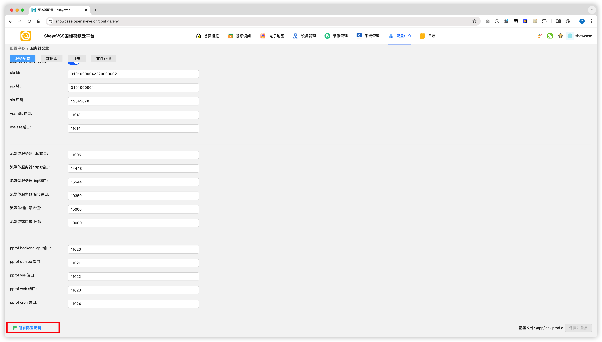
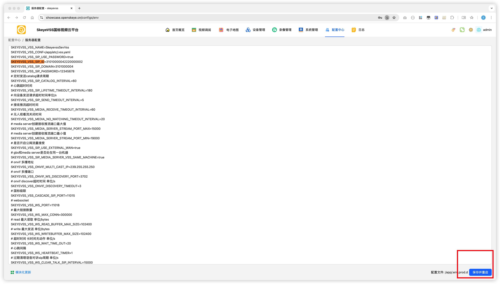

# Skeyevss FAQ：服务正常运行但没有画面

[试用安装包下载](https://www.openskeye.cn/releases) | [SMS](https://github.com/openskeye/go-vss/releases/tag/V1.0.6) | [在线演示](https://showcase.openskeye.cn/)

**项目地址**：[https://github.com/openskeye/go-vss](https://github.com/openskeye/go-vss)

---

## 1. 问题现象

系统已正常启动，后台可以登录，设备也显示已接入，但点击通道播放后没有画面（黑屏/一直加载）。

---

## 2. 快速判断

该问题最常见的原因是：**设备侧 SIP 参数与服务端 `.env.prod` 配置不一致**，尤其是 IP、端口、ID、域、密码配置不匹配。

建议先按本文第 3、4 节完成核对，再进行其他排查。

---

## 3. 第一步：核对设备接入参数（以海康为例）

设备端参数需要与服务端配置一一对应：

- `SIP服务器ID` = `SKEYEVSS_VSS_SIP_ID`
- `SIP服务器域` = `SKEYEVSS_VSS_SIP_DOMAIN`
- `SIP服务器端口` = `SKEYEVSS_VSS_PORT`
- `密码` = `SKEYEVSS_VSS_SIP_PASSWORD`
- `SIP服务器地址` = 服务器 IP（按网络场景填写）

### SIP 服务器地址填写规则

- 设备与服务端在同一局域网：填写服务端**内网 IP**
- 设备与服务端跨公网：填写服务端**公网 IP**

---

## 4. 第二步：核对服务端 `.env.prod` 配置

重点确认以下参数：

- `SKEYEVSS_INTERNAL_IP=服务器内网IP`
- `SKEYEVSS_EXTERNAL_IP=服务器公网IP`
- `SKEYEVSS_VSS_SIP_USE_EXTERNAL_WAN`

### 外网场景说明

如果设备与服务端通过公网交互，`SKEYEVSS_VSS_SIP_USE_EXTERNAL_WAN` 必须设为 `true`。

如果全部在局域网内，通常可将 `SKEYEVSS_EXTERNAL_IP` 与 `SKEYEVSS_INTERNAL_IP` 设置为同一个内网地址。

> 修改 `.env.prod` 后，需重启相关服务使配置生效。

---

## 5. 常见误区

- 设备填了内网 IP，但设备实际上从公网接入
- 修改了 `.env.prod`，但没有重启服务
- SIP 端口配置正确，但防火墙/安全组未放行对应端口
- 多套环境混用，设备连到了错误的服务实例

---

## 6. 结论

完成以上检查后，绝大多数“服务正常但无画面”问题都能解决。

如果仍无法播放，请联系技术支持，并提供以下信息以便快速定位：

- 当前 `.env.prod` 中 SIP 相关配置
- 设备端 SIP 配置截图
- 问题出现时间与设备编号/通道编号
