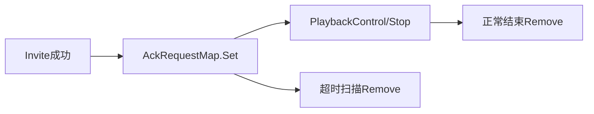

# ACK请求映射清理与超时回收

[试用安装包下载](https://www.openskeye.cn/releases) | [SMS](https://github.com/openskeye/go-vss/releases/tag/V1.0.6) | [在线演示](https://showcase.openskeye.cn/)

**项目地址**：[https://github.com/openskeye/go-vss](https://github.com/openskeye/go-vss)

## 背景

在 VSS 的直播/回放流程里，`AckRequestMap` 承载了后续控制（如回放控制、停流）所需上下文。若只增不删，会导致内存长期上涨，并让旧会话误命中新请求。

## 项目实践

当前链路中已经有两处关键动作：

- 建流后写入 `AckRequestMap`（发送流程持有控制上下文）。
- 停流时在 `stream_stop` 路径显式 `Remove(streamName)`，并联动 BYE 与媒体侧 stop。

建议再补一层“兜底回收”：按时间轮询清理超时 ACK 会话，避免异常路径漏删。

## 建议

1. `AckRequestMap` value 增加 `createdAt/lastUsedAt`。
2. 每 30 秒扫描一次，超过阈值（如 2~5 分钟）回收。
3. 在 `SevState` 中增加 ACK 老化数量，便于观测泄漏趋势。
4. 停流失败重试期间不要立刻删除，需用状态位标识“删除中”。

