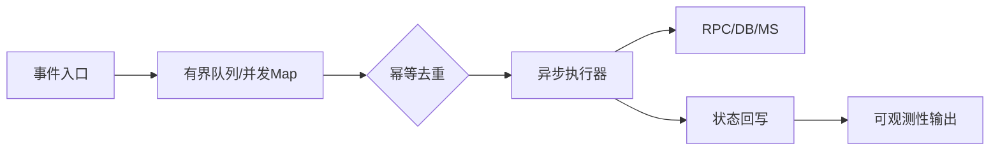

# 注册风暴下的 SN 生成与热点键削峰

[试用安装包下载](https://www.openskeye.cn/releases) | [SMS](https://github.com/openskeye/go-vss/releases/tag/V1.0.6) | [在线演示](https://showcase.openskeye.cn/)

**项目地址**：[https://github.com/openskeye/go-vss](https://github.com/openskeye/go-vss)

## 背景

围绕设备大批量 REGISTER 时 `SipGBSSNMap` 热点与并发竞争。 目标是在不改变协议语义的前提下，把峰值抖动收敛到可控窗口，并让异常路径可观测、可回收。

## 优化方案

- **入口削峰**：把突发事件先写入有界 channel 或并发 map，避免在热路径直接重操作。
- **状态去重**：按 `deviceUniqueId` / `streamName` 作为键做幂等聚合，只保留最新有效状态。
- **异步执行**：将重逻辑放到后台 worker/定时循环，降低请求线程阻塞时间。
- **超时回收**：为长期驻留状态增加 TTL 或周期扫描，避免内存泄漏。

## 建议

1. 先在 `SevState` 增加该链路的计数指标（长度、耗时、丢弃数）。
2. 以 30s/60s 为粒度观察峰值，再决定队列容量和扫描周期。
3. 对失败重试使用指数退避，避免同一故障源放大重试风暴。
4. 在压测环境验证“稳态吞吐 + 故障恢复时间”，再进入生产。
