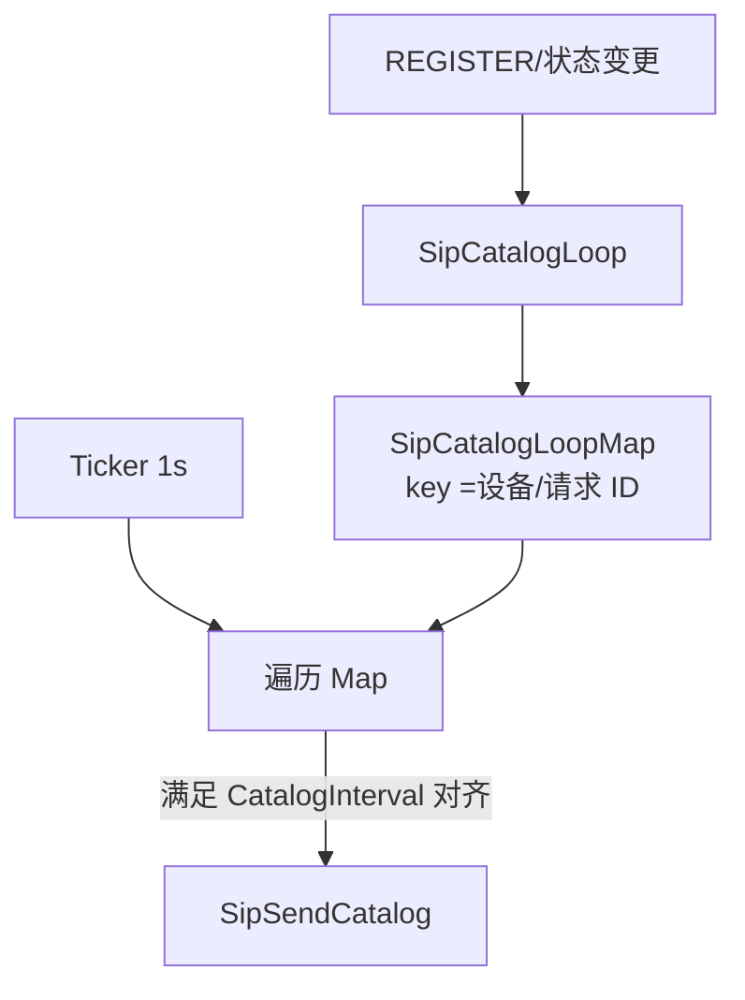
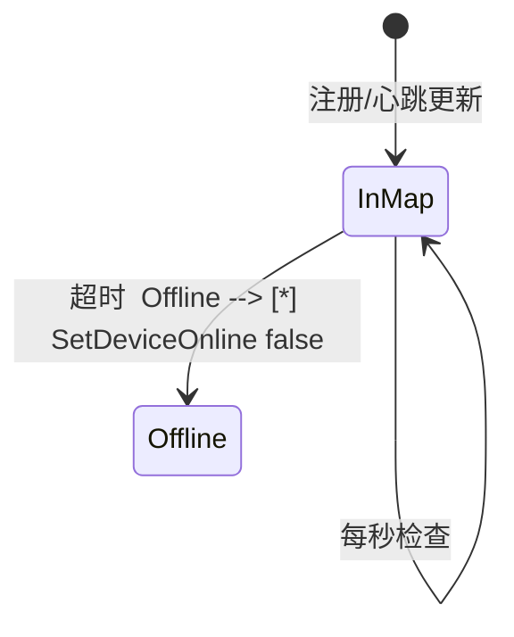

# 目录与心跳任务的 Map 节流

[试用安装包下载](https://www.openskeye.cn/releases) | [SMS](https://github.com/openskeye/go-vss/releases/tag/V1.0.6) | [在线演示](https://showcase.openskeye.cn/)

**项目地址**：[https://github.com/openskeye/go-vss](https://github.com/openskeye/go-vss)

## 背景

国标设备上线后需要 **周期性 Catalog**，同时要对 **注册/心跳超时** 做检测。若「每个设备单独起 `time.Ticker`」，上万路设备会产生 **数万 goroutine + 数万定时器**，调度与内存开销不可接受。本仓库用 **共享 Map + 全局1 秒刻度** 统一驱动。

## 项目中的做法

### 1. Catalog：`SipCatalogLoop` + `SipCatalogLoopMap`

-设备状态变更时向 `SipCatalogLoop` channel 投递 `SipCatalogLoopReq`（上线 `Online=true` 写入 Map，下线移除）。  
- `CatalogLoopLogic.proc` 中 **每秒**遍历 `SipCatalogLoopMap.Values()`。  
- 通过 `item.Now % val.Unix() != Config.Sip.CatalogInterval` 过滤，只在 **与配置间隔对齐的秒** 向 `SipSendCatalog` 投递真正发送任务。

效果：**一个定时器服务所有设备**，Catalog 发送节奏由配置 `CatalogInterval` 与当前 Unix 秒对齐控制。

### 2. 心跳：`SipHeartbeatLoop` + `SipHeartbeatLoopMap`

- 注册/心跳报文侧把任务写入 `SipHeartbeatLoopMap`。  
- `HeartbeatOfflineLogic.proc` **每秒**扫描条目：若 **注册过期超过 10s** 或 **距上次心跳超过 `HeartbeatTimeout`**，从 Map 删除并投递 `SetDeviceOnline` 下线。

## 要点

1. **时间对齐**：Catalog 使用取模对齐，设备多时会在同一秒「齐发」一批 Catalog，可能对 SIP 栈与设备侧造成尖峰；若现场出现设备侧处理不过来，可在 Map 扫描内加 **随机抖动** 或 **分批 sleep**（需改代码）。  
2. **Map 与 channel 分工**：channel 只做 **增删事件**，周期逻辑只在 **单协程** 里读 Map，避免多写者竞态（`xmap` 并发安全）。  
3. **可观测性**：SSE `sev_state` 会输出 `SipCatalogLoopMap.Len()`、`SipHeartbeatLoopMap.Len()`，用于判断泄漏或规模。

## 相关代码路径

- `core/app/sev/vss/internal/logic/gbs_proc/catalog_loop.go`  
- `core/app/sev/vss/internal/logic/gbs_proc/heartbeat_offline_loop.go`  
- `core/app/sev/vss/internal/types/types.go`
