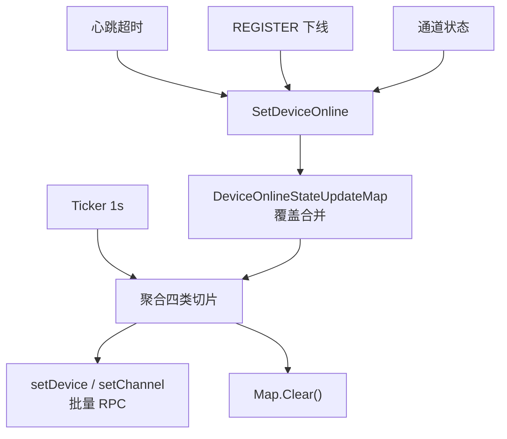

# 设备上下线写库的批量合并

[试用安装包下载](https://www.openskeye.cn/releases) | [SMS](https://github.com/openskeye/go-vss/releases/tag/V1.0.6) | [在线演示](https://showcase.openskeye.cn/)

**项目地址**：[https://github.com/openskeye/go-vss](https://github.com/openskeye/go-vss)

## 背景

设备/通道上下线可能 **短时间爆发**（网络断联、批量重启、心跳风暴）。若每次 SIP 事件都立即请求一次 DB RPC，会把 DB 连接与写入 IOPS 打满，并放大锁竞争。本仓库对 **在线状态变更** 做「**先攒队列 Map，再按秒批量 flush**」。

## 项目中的做法

### 1. 事件入口：`SetDeviceOnline` channel

各逻辑将 `DCOnlineReq` 写入 channel；`SetDeviceOnlineStateLogic` 主循环读到后，以 `DeviceUniqueId`（或通道维度）为键 **`Set` 进 `DeviceOnlineStateUpdateMap`**。同一键多次翻转时，**后写覆盖前写**，自然合并抖动。

### 2. 批量 flush：`proc` 每秒一次

`proc` 中 `time.NewTicker(time.Second)`：

- 遍历 Map，按 **设备 / 通道**、**在线 / 离线** 分成四个切片；  
- 分别 `go setDevice(...)` / `go setChannel(...)` 做 **批量更新**；  
- 最后 **`Clear()`** 整个 Map，进入下一秒。

## 要点

1. **延迟与吞吐的权衡**：状态落库最坏延迟约 **1 秒**；换得的是 **写合并** 与 **更低 DB QPS**。对大屏「在线数」类展示通常可接受。  
2. **最后一次覆盖**：若 1 秒内同一设备「上→下→上」，Map 中只保留最后一次，flush 时可能 **少一次中间态写入**，这是性能优化常见取舍。  
3. **与 Catalog 联动**：`setDevice` 内对下线设备会 **停止 Catalog定时**（代码后续逻辑），避免离线设备仍被周期 Catalog。

## 相关代码路径

- `core/app/sev/vss/internal/logic/gbs_proc/set_device_online_state_loop.go`  
- `core/app/sev/vss/internal/types/types.go` — `SetDeviceOnline`、`DeviceOnlineStateUpdateMap` 
