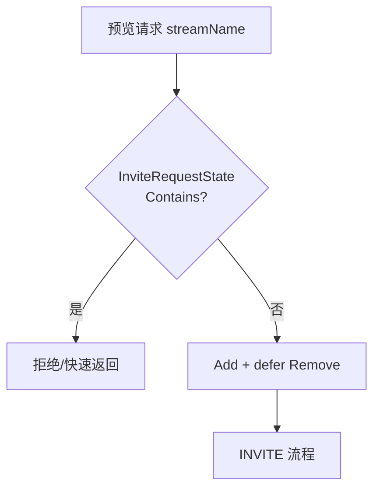
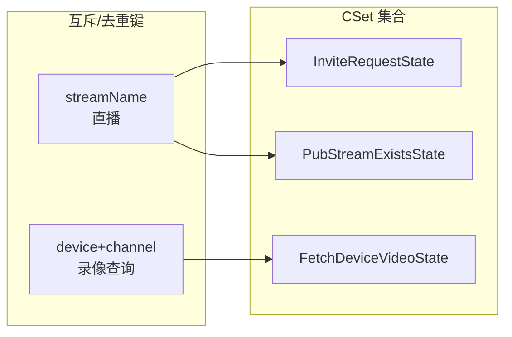

# 直播 INVITE 防击穿与流状态去重

[试用安装包下载](https://www.openskeye.cn/releases) | [SMS](https://github.com/openskeye/go-vss/releases/tag/V1.0.6) | [在线演示](https://showcase.openskeye.cn/)

**项目地址**：[https://github.com/openskeye/go-vss](https://github.com/openskeye/go-vss)

## 背景

同一路 **实时预览** 可能被多个客户端同时点击，或前端重试导致 **重复 INVITE**。若不加控制，会对设备连续发多路 INVITE、对流媒体重复 `start_rtp_pub`，造成信令混乱与媒体资源浪费。本仓库用 **进程内集合** 做「互斥键」与「流是否已存在」判断。

## 项目中的做法

### 1. `InviteRequestState`：按 `streamName` 防并发击穿

在 `video_live_invite` 逻辑中：

- 若 `InviteRequestState.Contains(streamName)`，直接拒绝或短路后续流程；  
- 否则 `Add(streamName)`，并用 **`defer Remove(streamName)`** 保证退出路径释放。

**同一流名在同一时刻只允许一条 INVITE 流水线**，避免信令风暴。

### 2. `PubStreamExistsState`：流已存在时跳过重复建流

发送侧在推流建立成功路径会 `PubStreamExistsState.Add(req.StreamName)`；`on_pub_stop` 等通知里 `Remove`。邀请逻辑里会结合流媒体查询判断 **是否已有 Pub**，避免重复发布。

### 3. `FetchDeviceVideoState`：录像能力查询互斥

`device_videos` 中若某 **设备+通道** 已在拉取录像列表，后续请求等待或短路，避免对同一设备并发 **QueryRecord** 打爆。

## 要点

1. **`defer Remove` 必须覆盖错误分支**：否则异常退出会 **永久占位**，后续同流永远无法 INVITE（卡死现象）。合理使用 `defer`，扩展时务必注意。  
2. **集合容量**：`set.New[string](1000)` 等为预分配，流名极多时关注 **内存与清理** 是否及时（依赖 `bye` / `stop_stream` / `on_pub_stop`）。  
3. **多实例部署**：上述集合 **仅在单进程内有效**；多 VSS 实例前需 **负载均衡粘性** 或 **分布式锁/Redis**，否则防重失效。

## 相关代码路径

- `core/app/sev/vss/internal/logic/http/gbs/video_live_invite.go`  
- `core/app/sev/vss/internal/logic/gbs_proc/send_sip_proc.go` — `PubStreamExistsState.Add`  
- `core/app/sev/vss/internal/logic/http/notify/on_pub_stop.go` — `Remove`  
- `core/app/sev/vss/internal/logic/http/base/device_videos.go` — `FetchDeviceVideoState`
