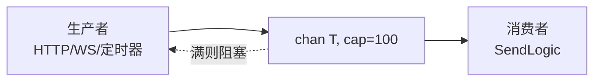
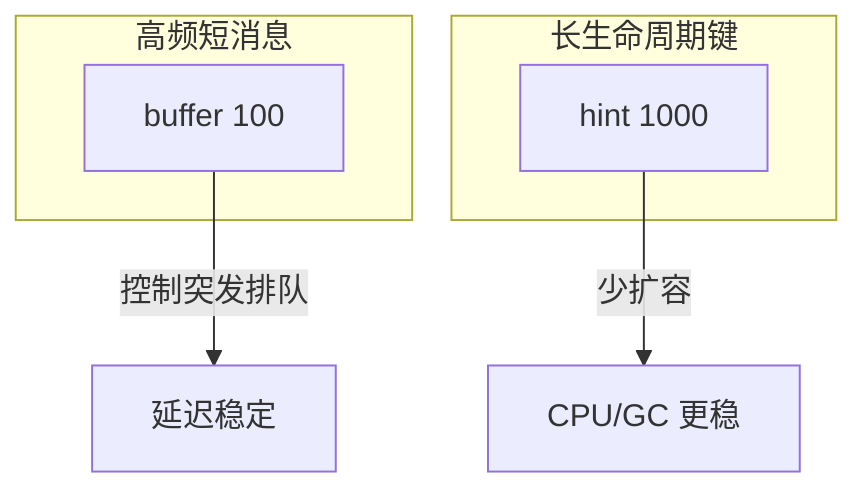

# 06 有界 Channel 与并发容器容量

[试用安装包下载](https://www.openskeye.cn/releases) | [SMS](https://github.com/openskeye/go-vss/releases/tag/V1.0.6) | [在线演示](https://showcase.openskeye.cn/)

**项目地址**：[https://github.com/openskeye/go-vss](https://github.com/openskeye/go-vss)

## 背景

高并发服务中 **无界队列** 会在故障或下游变慢时把内存耗尽；**小队列** 则频繁阻塞生产者。并发 Map 若频繁扩容也会带来 CPU 与 GC 压力。VSS 在 `ServiceContext` 初始化时为 channel 与 `xmap` 指定了 **统一的容量策略**。

## 项目中的做法

### 1. 有界 channel：多数为 100

例如 `SipSendCatalog`、`SipSendVideoLiveInvite`、`WSProc` 各通道、`SipLog` 等均为 `make(chan T, 100)`。

含义：

- **背压**：当 `SendLogic` 处理不过来时，写入方会阻塞在 send（或可选用 `select`+`default` 丢弃——当前以阻塞为主，依赖上游超时）。  
- **边界可预期**：最坏情况下队列中待处理消息条数有上限，便于估算内存（每条消息指针 + 负载）。

### 2. `xmap` / `set` 初始容量：1000 量级

如 `SipCatalogLoopMap`、`AckRequestMap`、`PubStreamExistsState`、`InviteRequestState` 等使用 `1000` 作为预分配 hint（具体以 `service_context.go` 为准）。

- **减少 rehash / 扩容**：设备与流规模在千级时，命中预设桶大小可降低分配次数。  
- **xmap不是硬性上限**：`xmap` 仍可增长；若单机万路以上，应结合监控观察 `Len()` 与内存。

## 要点

1. **调大 channel**：信令尖峰仍丢包时，可先 **调大缓冲** 换时间；但若持续满载，应 **加机器** 或 **优化单条处理耗时**。  
2. **调大 map hint**：在已知设备数规模时，把 hint 调到 **1.2× 预期设备数** 可减少扩容；过大则浪费初始内存。  
3. **泄漏排查**：`AckRequestMap`、`SipCatalogLoopMap` 等若 **未 Remove**，Map 调涨——配合 SSE状态中的计数做告警。

## 相关代码路径

- `core/app/sev/vss/internal/svc/service_context.go`
