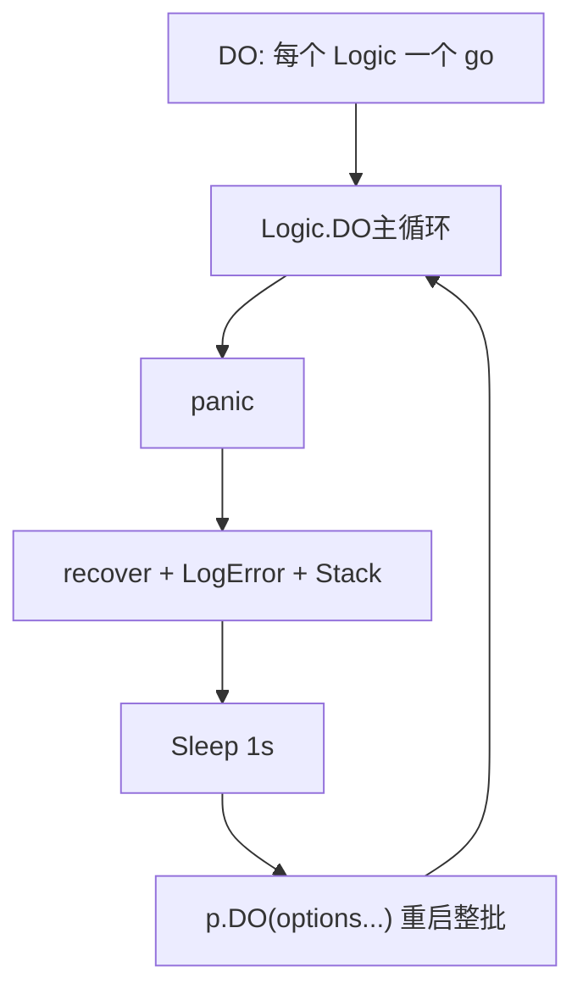

# 07 长任务 Panic 隔离与协程恢复

[试用安装包下载](https://www.openskeye.cn/releases) | [SMS](https://github.com/openskeye/go-vss/releases/tag/V1.0.6) | [在线演示](https://showcase.openskeye.cn/)

**项目地址**：[https://github.com/openskeye/go-vss](https://github.com/openskeye/go-vss)

## 背景

VSS 长期运行，任何 **nil 指针、越界、第三方库 bug** 都可能触发 panic。若 panic 发生在 **唯一** 的 SIP 发送循环或 Catalog 定时器里，会导致 **整类信令崩溃**。本仓库对「长生命周期任务」采用 **defer recover + 休眠重启** 的策略，把故障 **限制在单次崩溃**，并 **自动拉起**。

## 项目中的做法

### `SipProc.DO` 包装每个 `SipProcLogic`

`server/sip.go` 中 `SipProc.DO` 对每个注册的 Logic（`FetchDataLogic`、`SendLogic`、`CatalogLoopLogic` 等）启动 goroutine，并在参数里注入 `RecoverCall`：

- `recover()` 捕获栈；  
- 打日志；  
- **`time.Sleep(1 * time.Second)`** 防止 panic 死循环刷日志；  
- **递归调用 `p.DO(options...)`** 把同一组任务 **整批重启**。

### 与「子 proc」的关系

部分 Logic 内部还有 **子 goroutine**（如 `CatalogLoopLogic` 里 `go l.proc()`），子协程若 panic 且未 recover，仍会 **进程崩溃**。当前主要防护在 **外层 DO**；对特别关键的 `proc`，可再加一层 recover（后续增强点）。

## 要点

1. **1秒退避**：避免故障依赖（如 DB 挂了）时 **CPU 空转 + 日志洪峰**。  
2. **整批重启**：一次 `DO` 重启所有 Logic，需保证 **无全局脏锁**；若某 Logic 重启两次可能 **重复 Listen**，当前 SIP Listen 在 main 不在此 `DO` 内，风险主要在 **业务循环**。  
3. **根因仍需修**：recover 是 **保命**不是修复；线上应配 **告警** 对接日志关键字 `Recover`。

## 相关代码路径

- `core/app/sev/vss/internal/server/sip.go` — `SipProc.DO`、`RecoverCall`  
- `core/app/sev/vss/main.go` — 注册的所有 `gbs_proc` / `proc` Logic
