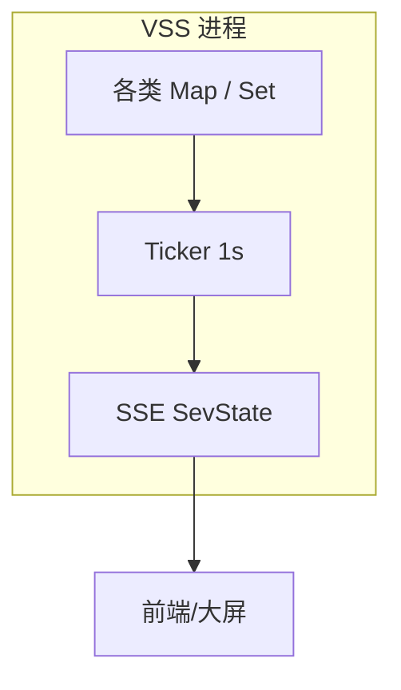

# 08 可观测性：pprof 与「服务状态」SSE

[试用安装包下载](https://www.openskeye.cn/releases) | [SMS](https://github.com/openskeye/go-vss/releases/tag/V1.0.6) | [在线演示](https://showcase.openskeye.cn/)

**项目地址**：[https://github.com/openskeye/go-vss](https://github.com/openskeye/go-vss)

## 背景

性能优化离不开 **数据**：要知道是 **队列积压**、**Map 泄漏** 还是 **goroutine 暴涨**。VSS 在 `main` 中启动 **pprof**，并通过 **SSE** 周期性推送内部计数器，形成 **轻量级仪表盘**。

## 项目中的做法

### 1. pprof

`main.go` 调用 `pprof.Start(c.PProfPort, c.PProfFileDir)`（与配置中的端口、目录对应）。用于：

- `goroutine` / `heap` / `profile` 采样；  
- 定位 **CPU 热点**（如 XML 解析、RTMP 打包）与 **内存分配**。

### 2. SSE `SevState`：每秒快照内部结构规模

`logic/sse/sev_state.go` 中 `Ticker 1s` 向客户端推送多项计数，包括但不限于：

- 下载管理器任务数 / 客户端数；  
- **`SipCatalogLoopMap` / `SipHeartbeatLoopMap` 长度**（节流器规模）；  
- **`InviteRequestState` / `PubStreamExistsState` 大小**；  
- `AckRequestMap`、`DeviceOnlineStateUpdateMap`、`SipGBSSNMap` 等；  
- WebSocket 连接数、部分业务列表长度。

这些指标是 **判断泄漏与容量** 的第一道线：例如 `PubStreamExistsState` 长期上涨而实际无流，说明 **stop 路径未触发 Remove**。

## 要点

1. **pprof 勿对公网开放**：应仅 **内网** 或 **SSH 隧道** 访问。  
2. **建立基线**：正常业务量下记录 `SevState` 各字段 **区间**，异常时对比。  
3. **与日志关联**：出现计数异常时，叠加 **SIP 日志** 缩短定位时间。

## 相关代码路径

- `core/app/sev/vss/main.go` — `pprof.Start`  
- `core/app/sev/vss/internal/logic/sse/sev_state.go` — 指标列表