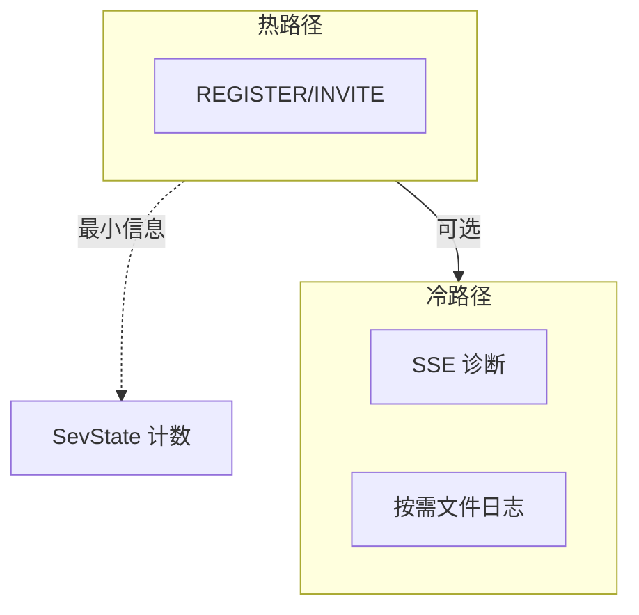

# 09 日志与诊断路径的成本控制

[试用安装包下载](https://www.openskeye.cn/releases) | [SMS](https://github.com/openskeye/go-vss/releases/tag/V1.0.6) | [在线演示](https://showcase.openskeye.cn/)

**项目地址**：[https://github.com/openskeye/go-vss](https://github.com/openskeye/go-vss)

## 背景

GB28181 场景下 **SIP 报文量大**，全量 debug 会 **拖垮磁盘 I/O 与 CPU**（格式化、锁、刷盘）。同时 **SSE 实时 SIP 日志**、**通道诊断** 等能力若不加节制，会在排障时反而制造 **二次故障**。本仓库通过 **开关、异步 channel、独立逻辑** 把诊断与热路径分离。

## 项目中的做法

### 1. Resty /打印类开关

`main.go` 中 `functions.RestyDebug = c.UseSipPrintLog`，将 **HTTP 客户端调试输出** 与配置绑定。默认生产应关闭，仅在排障窗口开启。

### 2. `SipLog` channel +专用 `SipLogLogic`

`ServiceContext` 中 `SipLog chan *SipLogItem`（容量 100），由独立 Logic 消费（`gbs_proc/sip_log.go`）。**记录路径与热路径分离**：SIP 收发主流程只 **非阻塞或轻量投递**（具体以实现为准），避免在 gosip 回调里写大段日志。

### 3. 诊断类 SSE：按需订阅

`channel_diagnose`、`device_diagnose`、`sip_logs` 等 SSE 路由面向 **排障**，应：

- **控制并发连接数**（网关或应用层）；  
- **限制单客户端推送频率**；  
- 排障结束 **主动断开**，避免长期占用 **goroutine + 通道**。

## 要点

1. **生产默认**：`UseSipPrintLog`、详细 SIP 文本落盘保持关闭；需要时 **短时间打开** 并轮转日志。  
2. **队列满**：`SipLog` 满时可能丢日志或阻塞生产者——需监控 channel 深度（可扩展 metrics）。  
3. **合规**：日志中可能含 **设备 ID、IP、部分报文**，注意存储周期与脱敏策略。

## 相关代码路径

- `core/app/sev/vss/main.go` — `UseSipPrintLog`  
- `core/app/sev/vss/internal/svc/service_context.go` — `SipLog`  
- `core/app/sev/vss/internal/logic/gbs_proc/sip_log.go`  
- `core/app/sev/vss/internal/logic/sse/sip_logs.go`
