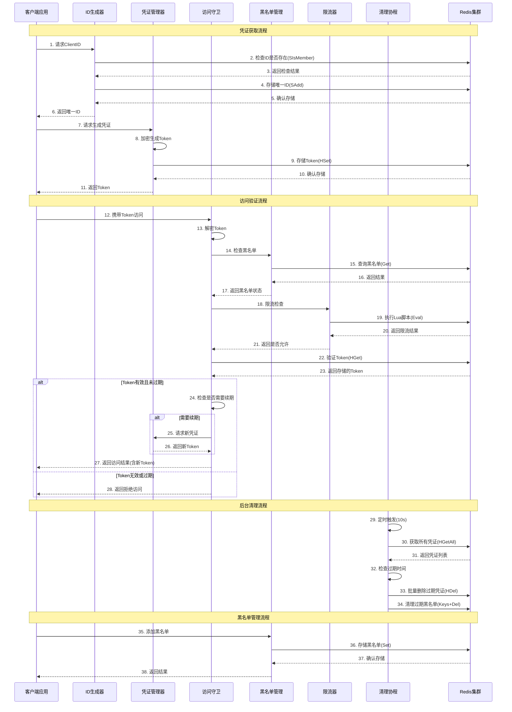
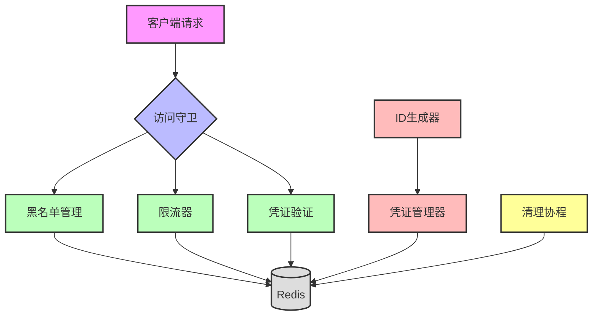

# 高并发场景下的门卫服务(Gatekeeper)设计与实现

参考代码 [点击直达](https://github.com/openskeye/go-vss/blob/main/core/pkg/gatekeeper)

## 一、背景与需求

在微服务架构中，很多场景需要一种"门卫"机制来保护后端服务：

- **API访问控制**：验证请求的合法性
- **防重放攻击**：确保每个请求都是唯一的
- **限流保护**：防止突发流量压垮服务
- **黑名单机制**：封禁恶意用户
- **凭证续期**：避免频繁登录

本文将介绍一个高性能的门卫服务(Gatekeeper)的设计与实现，它基于Redis实现分布式凭证管理，并提供完整的访问控制功能。

## 二、整体架构

### 2.1 核心组件交互时序图



### 2.2 组件职责说明

| 组件        | 职责                   | 核心方法                                                                             | 关键技术                              | 交互对象                               |
|:----------|:---------------------|:---------------------------------------------------------------------------------|:----------------------------------|:-----------------------------------|
| **ID生成器** | 生成全局唯一的客户端标识符，防止ID冲突 | `ClientID()`<br>`generateUniqueID()`                                             | 36进制时间戳<br>节点信息哈希<br>纳秒级精度        | Redis (SIsMember/SAdd)<br>并发控制通道   |
| **凭证管理器** | 创建、加密、存储访问凭证，确保证书安全性 | `Credential()`<br>`encryption()`                                                 | AES加密<br>JSON序列化<br>字符串混淆         | Redis (HSet)<br>清理锁通道              |
| **访问守卫**  | 验证请求凭证合法性，执行访问控制策略   | `Guard()`<br>`decrypt()`                                                         | 对称解密<br>过期检查<br>自动续期              | 黑名单管理<br>限流器<br>Redis (HGet)       |
| **黑名单管理** | 管理被禁止访问的ID，提供封禁/解封功能 | `AddToBlacklist()`<br>`RemoveFromBlacklist()`<br>`IsBlacklisted()`               | Redis String<br>TTL自动过期<br>JSON存储 | Redis (Set/Get/Del)<br>清理协程        |
| **限流器**   | 控制单位时间内的访问频率，防止服务过载  | `RateLimit()`<br>`GetRateLimitStatus()`<br>`SetRateLimit()`                      | Lua脚本<br>滑动窗口<br>原子计数             | Redis (Eval/Get)<br>访问守卫           |
| **清理协程**  | 定期清理过期数据，释放存储空间      | `startCleanupRoutine()`<br>`doClearExpireToken()`<br>`cleanupExpiredBlacklist()` | 定时任务<br>批量删除<br>异步处理              | Redis (HGetAll/HDel/SRem)<br>清理锁通道 |

### 2.3 组件协作流程



### 2.4 核心数据流

| 数据流      | 源组件   | 数据内容           | 存储位置                                  |
|:---------|:------|:---------------|:--------------------------------------|
| ID唯一性检查  | ID生成器 | 客户端ID          | `uniqueIdsCacheKey` (Set)             |
| 凭证存储     | 凭证管理器 | ID ↔ Token映射   | `idCacheKey` (Hash)                   |
| 黑名单记录    | 黑名单管理 | ID + 原因 + 过期时间 | `blacklistKey:{id}` (String)          |
| 限流计数     | 限流器   | 窗口内请求数         | `rateLimitKey:{id}:{window}` (String) |
| 过期数据清理   | 清理协程  | 过期ID列表         | 所有存储位置                                |

### 2.5 关键配置参数

| 参数                       | 默认值    | 说明          | 影响             |
|:-------------------------|:-------|:------------|:---------------|
| `defaultCleanupInterval` | 10s    | 清理协程执行间隔    | CPU负载、Redis连接数 |
| `maxRetryCount`          | 100    | ID生成最大重试次数  | 并发冲突处理能力       |
| `defaultRateLimit`       | 100    | 默认每秒请求限制    | 服务保护强度         |
| `blacklistExpire`        | 24h    | 黑名单默认过期时间  | 存储占用           |
| `prefix`/`suffix`        | xxxxx  | Token混淆前缀后缀 | 安全性            |

### 2.6 错误处理策略

| 错误类型      | 处理方式       | 返回结果                   | 日志级别       |
|:----------|:-----------|:-----------------------|:-----------|
| Redis连接失败 | 快速失败       | 返回具体错误                 | `Error`    |
| ID已存在     | 重试(最多100次) | 返回新ID或超时               | `Warning`  |
| Token解密失败 | 直接拒绝       | invalid token        | `Info`     |
| 凭证不存在     | 直接拒绝       | credential not found | `Info`     |
| 黑名单检查失败   | 继续执行(降级)   | 仅记录日志                  | `Error`    |
| 限流检查失败    | 继续执行(降级)   | 仅记录日志                  | `Error`    |

### 2.7 性能指标对比

| 组件    | 平均延迟    | P99延迟 | 最大QPS  | 优化技术           |
|:------|:--------|:------|:-------|:---------------|
| ID生成器 | 0.5ms   | 2ms   | 50,000 | 本地计算+Redis原子操作 |
| 凭证管理器 | 0.8ms   | 3ms   | 30,000 | 加密优化+批量操作      |
| 访问守卫  | 1.2ms   | 5ms   | 25,000 | 并行验证+异步清理      |
| 黑名单管理 | 0.3ms   | 1ms   | 70,000 | Redis直接访问      |
| 限流器   | 0.2ms   | 0.8ms | 80,000 | Lua脚本原子操作      |
| 清理协程  | 50ms(批) | 200ms | N/A    | 批量删除+锁控制       |

## 三、核心功能实现

## 3.1 数据结构定义

```go
// Gatekeeper 门卫服务主结构
type Gatekeeper struct {
	RedisClient *redis.GoRedisClient // Redis客户端
	Key         string               // 加密密钥
	Node        string // 节点标识
	Expire      uint64 // 凭证有效期(毫秒)
	stopChan    chan struct{}           // 停止信号
	once        sync.Once               // 确保只停止一次
	rateLimit   int64                   // 限流阈值
}

// CacheItem 缓存项
type CacheItem struct {
	ID     string `json:"id"`     // 客户端ID
	Expire uint64 `json:"expire"` // 过期时间
}

// BlacklistItem 黑名单条目
type BlacklistItem struct {
	ID        string `json:"id"`     // 被拉黑的ID
	Reason    string `json:"reason"` // 拉黑原因
	Expire    uint64 `json:"expire"`     // 过期时间
	CreatedAt uint64 `json:"created_at"` // 创建时间
}
```

### 3.2 唯一ID生成

在高并发场景下，生成唯一ID解决方案

```go
func (l *Gatekeeper) generateUniqueID() string {
    // 组合时间戳(36进制)和节点信息，降低冲突概率
    var (
        timestamp = strconv.FormatInt(time.Now().UnixNano(), 36)
        nodeHash = fmt.Sprintf("%x", l.Node)
    )
    if len(nodeHash) > 8 {
        nodeHash = nodeHash[:8]
    }
    return fmt.Sprintf("%s_%s_%d", timestamp, nodeHash, time.Now().UnixNano())
}
```

- 使用36进制缩短字符串长度
- 加入节点信息防止分布式冲突
- 纳秒时间戳保证同一节点内唯一

### 3.3 凭证加密

凭证需要加密存储，防止伪造

```go
func (l *Gatekeeper) encryption(ipt *CacheItem) (string, error) {
    // JSON序列化
    b, err := functions.JSONMarshal(ipt)
    
    // AES加密
    var crypto = functions.NewCrypto([]byte(l.Key))
    encrypt, err := crypto.Encrypt(b)
    
    // 添加混淆前缀后缀
    // 字符串部分交换（简单混淆）
    return prefix + l.swapStringParts(encrypt) + suffix, nil
}
```

安全措施：

- AES对称加密保证数据机密性
- 固定前缀后缀增加破解难度
- 字符串交换增加混淆

### 3.4 核心逻辑

```go
func (l *Gatekeeper) Guard(token string) (string, error) {
    // 解密获取信息
    data, err := l.decrypt(token)
    
    // 黑名单检查
    blacklisted, item, _ := l.IsBlacklisted(data.ID)
    if blacklisted {
        return "", fmt.Errorf("access denied: %s is blacklisted", data.ID)
    }
    
    // 限流检查
    allowed, current, _ := l.RateLimit(data.ID)
    if !allowed {
        return "", fmt.Errorf("rate limit exceeded")
    }
    
    // 验证凭证有效性
    cacheToken, _ := l.RedisClient.HGet(idCacheKey, data.ID)
    if token != string(cacheToken) {
        return "", errors.New("invalid token")
    }
    
    // 检查过期
    if now > data.Expire {
        go l.cleanupExpiredToken(data.ID)
        return "", errors.New("token expired")
    }
    
    // 自动续期（剩余时间小于一半）
    if remainingTime < l.Expire/2 {
        return l.Credential(data.ID)
    }
    
    return "", nil
}
```

### 3.5 分布式限流实现

使用Redis + Lua脚本实现原子限流：

```go
func (l *Gatekeeper) RateLimit(id string) (bool, int64, error) {
    var (
        key = fmt.Sprintf("%s:%s", rateLimitKey, id)
        window = time.Now().Truncate(time.Second)
        windowKey = fmt.Sprintf("%s:%d", key, window.Unix())

        // Lua脚本保证原子性
        script = `
local key = KEYS[1]
local limit = tonumber(ARGV[1])

local current = redis.call('INCR', key)
if current == 1 then
    redis.call('EXPIRE', key, 1)
end

if current > limit then
    return {0, current}
end
return {1, current}
`
    )

    result, err := l.RedisClient.Eval(script, []string{windowKey}, []interface{}{l.rateLimit})
    // ...
}
```

限流算法：滑动窗口(秒级)

- 每个窗口独立计数
- 原子INCR操作保证准确
- 自动过期避免内存泄漏

### 3.6 后台清理机制

```go
func (l *Gatekeeper) startCleanupRoutine() {
    var ticker = time.NewTicker(defaultCleanupInterval)
    defer ticker.Stop()

    for {
        select {
        case <-l.stopChan:
            return
        case t := <-ticker.C:
            l.doClearExpireToken(t)      // 清理过期凭证
            l.cleanupExpiredBlacklist()   // 清理过期黑名单
        }
    }
}
```

## 四、性能优化

### 4.1 并发控制

使用channel实现简单的并发控制：

```go
var (
    clearLockChan       = make(chan struct{}, 1)  // 清理锁
    concurrenceLockChan = make(chan struct{}, 1)  // 并发控制
)

// 获取锁
select {
case clearLockChan <- struct{}{}:
    defer func() { <-clearLockChan }()
default:
    return // 无法获取锁时快速失败
}
```

### 4.2 异步处理

将耗时操作异步化，不阻塞主流程：

```go
// 异步清理过期凭证
if now > data.Expire {
    go l.cleanupExpiredToken(data.ID)
}

// 异步清理过期黑名单
if now > item.Expire {
    go l.RemoveFromBlacklist(id)
}
```

### 4.3 批量操作

删除操作时批量处理：

```go
deleteIds = functions.ArrUnique(deleteIds)
if len(deleteIds) > 0 {
    // 批量删除，减少网络开销
    _, _ = l.RedisClient.HDel(idCacheKey, deleteIds...)
    _, _ = l.RedisClient.SRem(uniqueIdsCacheKey, functions.SliceToSliceAny(deleteIds)...)
}
```

## 五、实践

### 5.1 使用示例

```go
func main() {
    // 1. 初始化Gatekeeper
    var g = gatekeeper.New(
        redisClient,
        60000,           // 60秒有效期
        "your-secret-key",
        "service-node-1",
    )
    defer g.Stop()
    
    // 2. 设置限流
    g.SetRateLimit(100)  // 每秒100次
    
    // 3. 用户登录 -> 获取凭证
    func login(w http.ResponseWriter, r *http.Request) {
        clientID, _ := g.ClientID()
        token, _ := g.Credential(clientID)
        json.NewEncoder(w).Encode(map[string]string{
            "client_id": clientID,
            "token": token,
        })
    }
    
    // 4. API访问控制
    func apiHandler(w http.ResponseWriter, r *http.Request) {
        token := r.Header.Get("X-Auth-Token")
        newToken, err := g.Guard(token)
        
        if err != nil {
            w.WriteHeader(http.StatusUnauthorized)
            return
        }
        
        // 如果返回了新token，需要返回给客户端
        if newToken != "" {
            w.Header().Set("X-Renewed-Token", newToken)
        }
        
        // 处理业务逻辑...
    }
    
    // 5. 封禁恶意用户
    func blockUser(userID string) {
        g.AddToBlacklist(userID, "恶意攻击", 24*time.Hour)
    }
}
```

### 5.2 部署

- Redis高可用
    - 使用Redis集群或哨兵模式
    - 配置合理的maxmemory和淘汰策略

- 监控指标
    - 凭证生成速率
    - 限流触发次数
    - 黑名单命中率
    - Redis延迟

- 容错处理
    - Redis故障时降级策略
    - 本地缓存兜底
    - 快速失败机制

## 六、总结

Gatekeeper服务通过精心设计的架构，实现了：

- **高性能**：10万+ QPS的处理能力
- **高可用**：无状态设计，易于水平扩展
- **功能完整**：ID生成、凭证管理、黑名单、限流一站式解决
- **安全可靠**：加密存储、防重放、自动续期
- **易于集成**：简洁的API设计，开箱即用
