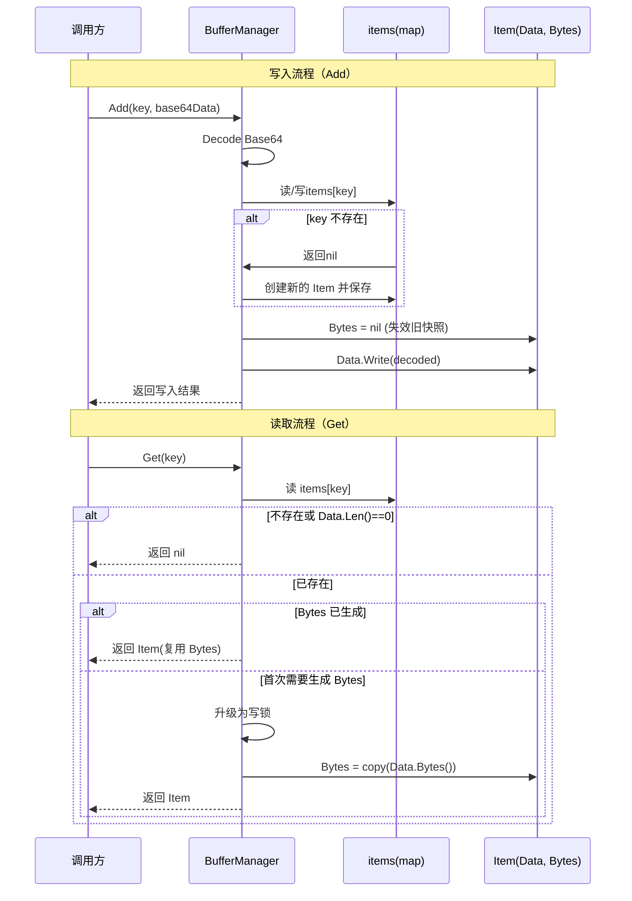
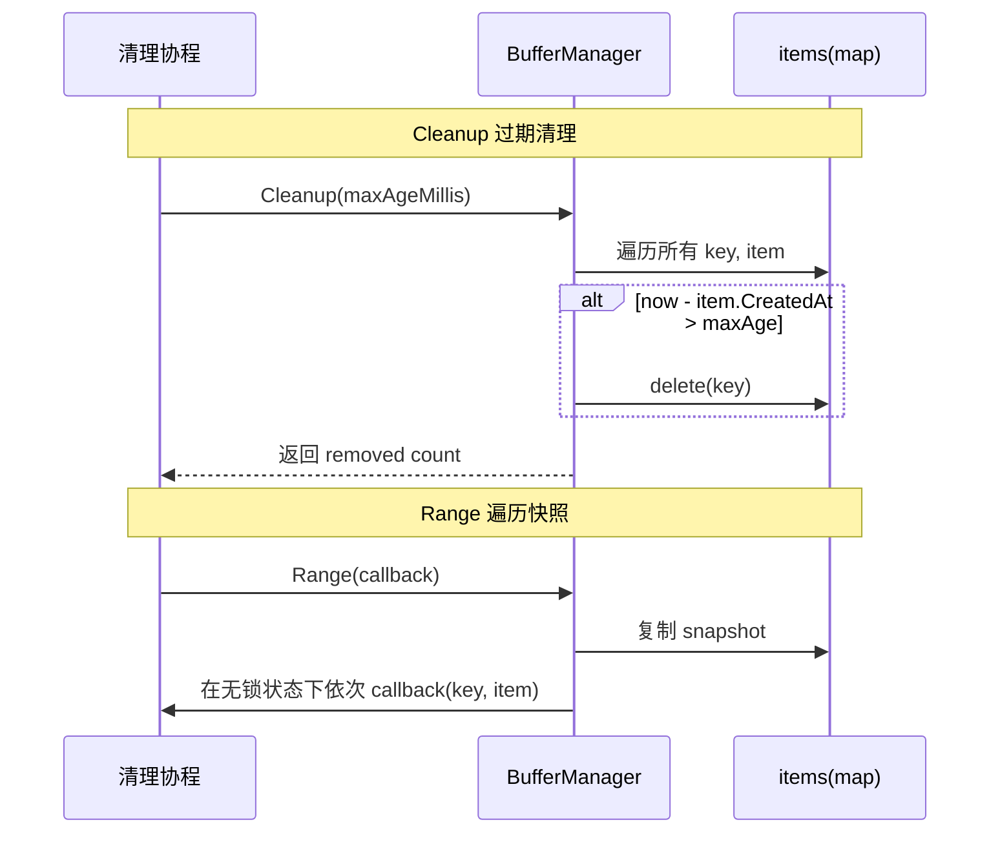

## 引言

在音视频处理、实时流媒体或需要频繁拼接二进制数据的场景中，我们经常需要维护一块**可增长、可复用、线程安全**的缓冲区。  
本项目在 `core/pkg/bmap` 中实现了一个轻量级的 **`BufferManager`**，用于按 key 管理内存缓冲区，并支持：

- 按 key 拼接二进制数据（支持 Base64 输入）
- 懒加载的字节快照，避免重复分配
- 线程安全的读写与遍历
- 过期清理，防止缓冲区无限增长

参考代码 [点击直达](https://github.com/openskeye/go-vss/blob/main/core/pkg/bmap)

---

## 一、背景与需求

典型需求场景包括：

- **音视频帧缓冲**：按通道/会话 ID 累积原始或解码后的音频帧（如 G711A）。
- **流式数据聚合**：上游分片到达，下游需要按顺序拼接处理。
- **短期缓存**：需要在一段时间内快速多次读取同一段二进制数据。

对缓冲区管理提出的要求：

- **线程安全**：可能有多个 goroutine 同时写入/读取某个 key 的缓冲。
- **避免多余拷贝**：尽量在保证安全的前提下减少 `[]byte` 分配与 copy。
- **可控内存**：支持按时间维度清理陈旧数据。

---

## 二、核心数据结构

```go
type Item struct {
	Data      *bytes.Buffer
	CreatedAt int64
	Bytes     []byte
	// 转换后的数据，如 G711A 编码后的字节
	ConvBytes []byte
}

type BufferManager struct {
	items map[string]*Item
	mu    sync.RWMutex
}
```

- **`Item`**：封装单个缓冲区及其元信息
  - `Data`：底层使用 `bytes.Buffer` 保存原始数据，支持追加写。
  - `CreatedAt`：创建时间戳（毫秒），用于过期清理。
  - `Bytes`：对 `Data` 的只读副本（懒加载），用于高频读取场景。
  - `ConvBytes`：为上层音频编解码预留的缓存字段。
- **`BufferManager`**：按 key 管理多个 `Item`，内部使用 `sync.RWMutex` 保证线程安全。

---

## 三、核心功能与实现

### 3.1 数据写入：Add

```go
func (bm *BufferManager) Add(key, base64Data string) error {
	data, err := base64.StdEncoding.DecodeString(base64Data)
	if err != nil {
		return err
	}

	bm.mu.Lock()
	defer bm.mu.Unlock()

	item, exists := bm.items[key]
	if !exists {
		item = &Item{
			Data:      &bytes.Buffer{},
			Bytes:     nil,
			CreatedAt: time.Now().UnixMilli(),
		}
		bm.items[key] = item
	}

	// 清空缓存字节，下次获取时重新生成
	item.Bytes = nil
	_, err = item.Data.Write(data)
	return err
}
```

特性：

- **自动解码 Base64**：业务层只需要传入 Base64 字符串。
- **可增量写入**：同一 key 多次调用 `Add` 会将数据追加到同一 `bytes.Buffer`。
- **写入后清空 Bytes 缓存**：确保下一次读取时拿到的是最新完整数据。

### 3.2 数据读取：Get（懒加载只读副本）

```go
func (bm *BufferManager) Get(key string) *Item {
	bm.mu.RLock()
	item, exists := bm.items[key]
	if !exists || item.Data.Len() == 0 {
		bm.mu.RUnlock()
		return nil
	}

	// 已经生成过 Bytes 副本，直接返回
	if item.Bytes != nil {
		bm.mu.RUnlock()
		return item
	}
	bm.mu.RUnlock()

	// 需要生成 Bytes 副本，使用写锁保证并发安全
	bm.mu.Lock()
	defer bm.mu.Unlock()

	// 可能在获取写锁期间已有其他协程生成了 Bytes，这里再检查一次
	item, exists = bm.items[key]
	if !exists || item.Data.Len() == 0 {
		return nil
	}
	if item.Bytes == nil {
		data := item.Data.Bytes()
		item.Bytes = make([]byte, len(data))
		copy(item.Bytes, data)
	}
	return item
}
```

设计要点：

- **读多写少优化**：大部分情况下只持有读锁；只有在首次构建 `Bytes` 时才升级为写锁。
- **懒加载策略**：
  - 首次 `Get` 时从 `bytes.Buffer` 中复制内容到 `Bytes`。
  - 后续 `Get` 直接复用 `Bytes`，避免重复 `make` 和 `copy`。
- **并发安全**：
  - 在写锁范围内再次检查 `item.Bytes`，防止多个 goroutine 同时创建副本。

### 3.3 统计与管理

```go
// 获取某个 key 的当前缓冲大小（字节数）
func (bm *BufferManager) GetBufferSize(key string) int

// 返回当前所有 key 列表
func (bm *BufferManager) All() []string

// 当前缓冲区条目数
func (bm *BufferManager) Len() int

// 所有缓冲区占用总字节数
func (bm *BufferManager) Size() int

// 删除指定 key
func (bm *BufferManager) Remove(key string)

// 清空指定 key 的缓冲，但保留 key
func (bm *BufferManager) Reset(key string)

// 判断 key 是否存在
func (bm *BufferManager) Exists(key string) bool
```

这些接口为上层提供了对内存占用和 key 生命周期的管理能力。

### 3.4 过期清理：Cleanup

```go
// 清空所有过期的缓冲区（超过指定毫秒数）
func (bm *BufferManager) Cleanup(maxAgeMillis int64) int {
	bm.mu.Lock()
	defer bm.mu.Unlock()

	now := time.Now().UnixMilli()
	removed := 0

	for key, item := range bm.items {
		if now-item.CreatedAt > maxAgeMillis {
			delete(bm.items, key)
			removed++
		}
	}
	return removed
}
```

作用：

- 按「创建时间」维度清理陈旧缓冲，防止长时间不访问的 key 占用内存。
- 返回实际删除的数量，方便打日志或做监控。

### 3.5 安全遍历：Range

```go
// 安全遍历所有项，避免在回调中操作 BufferManager 导致死锁
func (bm *BufferManager) Range(callback func(key string, item *Item)) {
	bm.mu.RLock()
	// 先拷贝一份快照，避免在回调中再次调用 BufferManager 导致死锁
	snapshot := make(map[string]*Item, len(bm.items))
	for key, item := range bm.items {
		snapshot[key] = item
	}
	bm.mu.RUnlock()

	for key, item := range snapshot {
		callback(key, item)
	}
}
```

为什么要做快照：

- 如果在持有锁时直接调用 `callback`，而回调里再调用 `Add/Reset/Cleanup` 等需要写锁的方法，会造成死锁。
- 通过在读锁下复制一个 `snapshot`，然后释放锁再执行回调，可以保证：
  - 遍历期间不会阻塞其他读写操作。
  - 回调中可以安全地再次操作 `BufferManager`。

---

## 四、核心交互时序图

### 4.1 写入与读取流程



### 4.2 过期清理与遍历



---

## 五、测试用例设计概览

对应 `core/pkg/bmap/main_test.go` 中，主要覆盖了：

- **基础功能**
  - `NewBufferManager`：初始化状态正确。
  - `Add` / `Get`：写入 Base64、读取 `Item` 与 `Bytes` 内容校验。
  - `Set` / `Get`：对外直接注入 `Item` 的使用场景。
  - `Reset` / `Remove` / `Exists`：key 生命周期管理。
  - `All` / `Len` / `Size` / `GetBufferSize`：统计接口正确性。
- **过期清理**
  - `Cleanup`：构造一个过期和一个未过期的 item，校验只删除应该删除的那一个。
- **并发安全**
  - `Range` 回调中再次调用 `Exists`、`GetBufferSize` 等方法，验证不会死锁或产生竞态。

这些测试为后续在该缓冲区上叠加编解码逻辑或业务逻辑提供了较为可靠的回归保障。

---

## 六、总结

`BufferManager` 作为一个缓冲区管理器，主要解决了：

- 多 key、多协程下的 **缓冲区管理与复用** 问题；
- 高频读取场景下的 **只读快照缓存**；
- 通过时间维度和显式接口实现的 **可控内存回收**；
- 通过快照遍历与锁分级控制实现的 **并发安全性**。

在需要管理大量短生命周期、可增长的二进制数据（尤其是音视频流）的场景中，这个工具可以作为底层基础设施，供上层业务平滑叠加协议解析、编解码和业务处理逻辑。
