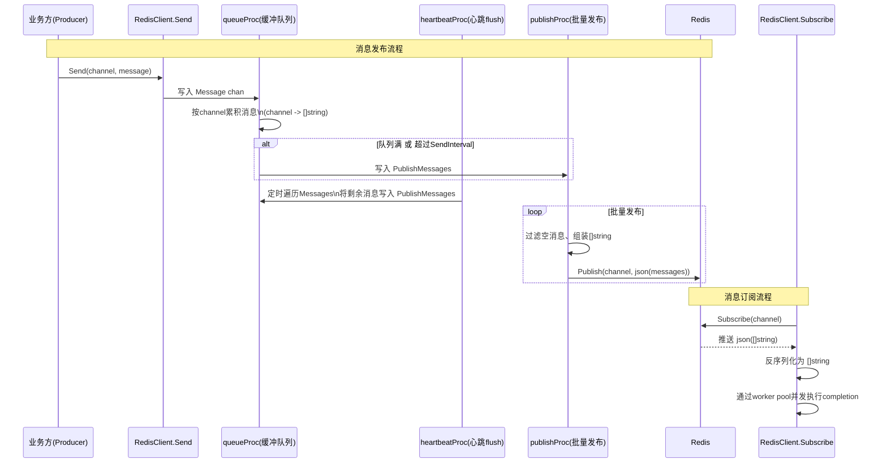
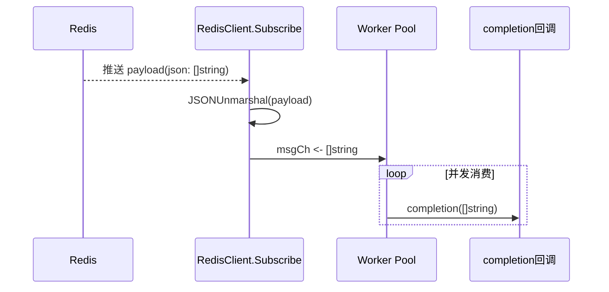

## 引言

在分布式系统中，**发布订阅(Pub/Sub)** 是最常见的异步通信模型之一。  
本项目在 `core/pkg/pubsub` 中基于 Redis 实现了一套**高性能、可配置、支持批量发送**的 PubSub 组件，用于在多节点之间高效传递事件消息。

参考代码：  
`https://github.com/openskeye/go-vss/blob/main/core/pkg/pubsub`

**项目地址** [https://github.com/openskeye/go-vss](https://github.com/openskeye/go-vss)

---

## 一、背景与需求

在实际业务中，我们需要满足以下场景：

- **多节点消息广播**：IM 消息、通知、事件推送等，需要跨节点分发。
- **高吞吐写入**：单节点每秒可能产生大量消息，如果直接一条一发，会给 Redis 和网络带来较大压力。
- **可控的延迟与批量**：需要在「实时性」和「吞吐」之间做折中，通过配置控制。
- **可观测与可靠**：出现异常能够发告警邮件，避免静默失败。

### 设计目标

- **批量发送**：同一频道的多条消息聚合后一次性 Publish，减少 Redis QPS 与网络开销。
- **可配置节流策略**：支持按消息数量与时间窗口两种维度做发送节流。
- **健壮的并发与关闭机制**：在高并发下不会 panic，不会出现数据竞争。
- **简单易用的 API**：对业务方暴露的只有 `Send` 和 `Subscribe` 两个核心入口。

---

## 二、整体架构与核心组件

### 2.1 关键结构体

```go
type Conf struct {
	Email tps.YamlEmail
	// 消息列表最大容量
	MaxMessageCount,
	// 心跳检测清空数据周期
	HeartbeatInterval,
	// 没有消息进入是最后一次发送时间间隔
	SendInterval int
	// 当前节点域名
	Host string
}
```

```go
// 内部状态
type ps struct {
	Ctx           context.Context
	conf          *Conf
	closeOnce     sync.Once
	Message       chan redisPublishMessageChanType   // 生产者写入的消息
	Messages      sync.Map                           // channel -> []string
	SendTimestamps sync.Map                          // channel -> int64(lastSend)
	PublishMessages chan *redisMessageChanType       // 待发布到 Redis 的批量消息
	ExitSignal      chan error
	IsClosed        bool
	closed          int32
}

// 对外暴露的 Redis 客户端包装
type RedisClient struct {
	*ps

	isCluster     bool
	client        *redis.Client
	clusterClient *redis.ClusterClient
}
```

### 2.2 系统时序图：消息发布全流程



---

## 三、核心流程解析

### 3.1 消息生产：Send 与内部队列

业务方只需要调用一个简单的接口：

```go
// 推送消息
func (r *RedisClient) Send(channel string, message []byte) {
	if r.isClosed() {
		return
	}
	r.Message <- redisPublishMessageChanType{channel, string(message)}
}
```

特性：

- **非阻塞场景可控**：`Message` 通道有缓冲容量（5000），足以应对普通峰值。
- **统一入口**：所有发布请求都汇聚到 `queueProc`，集中做批量与节流控制。

### 3.2 队列聚合与按 channel 维度的节流

`queueProc` 是整个组件的“心脏”，负责：

- 将同一 `channel` 的消息聚合为一个 `[]string`。
- 根据配置决定何时触发一次批量发送。
- 维护每个 channel 的最近发送时间。

核心逻辑简化如下（伪代码）：

```go
for {
    select {
    case <-r.Ctx.Done():
        r.close()
        r.sendEmail("redis publish 消息队列异常结束", ...)
        return

    case val := <-r.Message:
        if r.isClosed() || val.channel == "" {
            continue
        }

        now := nowMilli()

        // 取出当前 channel 的消息列表
        msgs := loadOrInitMessages(val.channel)

        // 读取上次发送时间
        lastSend := loadOrInitLastSend(val.channel, now)

        // 满足任一条件则触发批量发送
        if len(msgs) >= conf.MaxMessageCount ||
           now-lastSend >= int64(conf.SendInterval) {
            PublishMessages <- {channel: val.channel, messages: msgs}
            updateLastSend(val.channel, now)
            clearMessages(val.channel)
        }

        // 追加当前消息
        appendMessage(val.channel, val.message)

    case err := <-r.ExitSignal:
        r.sendEmail("redis publish 消息队列异常退出", ..., err.Error())
        r.close()
        return
    }
}
```

**关键点：**

- **按 channel 维度独立节流**：`Messages` 与 `SendTimestamps` 都是按 channel 分片管理，不同业务频道互不干扰。
- **双条件触发**：
  - 数量阈值：`MaxMessageCount`
  - 时间阈值：`SendInterval` 毫秒
- **配置驱动**：所有阈值都由 `Conf` 控制，支持按场景调参。

### 3.3 心跳 flush：避免残留

仅依靠 `SendInterval` 可能会出现一种情况：

- 某个 channel 短时间内只收到少量消息，数量未达阈值，但长时间也没有新的消息进入。

为了解决这个数据残留问题，引入了 `heartbeatProc`：

```go
func (r *RedisClient) heartbeatProc() {
	ticker := time.NewTicker(time.Millisecond * time.Duration(r.conf.HeartbeatInterval))
	defer ticker.Stop()

	for {
		select {
		case <-r.Ctx.Done():
			return
		case <-ticker.C:
			if r.isClosed() {
				return
			}

			now := nowMilli()
			r.Messages.Range(func(key, value any) bool {
				if r.isClosed() {
					return false
				}

				channel, ok := key.(string)
				msgs, ok2 := value.(redisMessages)
				if !ok || !ok2 || len(msgs) == 0 {
					return true
				}

				r.PublishMessages <- &redisMessageChanType{channel: channel, messages: msgs}
				r.SendTimestamps.Store(channel, now)
				r.Messages.Store(channel, redisMessages(nil))
				return true
			})
		}
	}
}
```

**作用：**

- 定期扫描所有 channel，主动 flush 剩余消息。
- 避免“低频” channel 的消息长时间滞留在内存中。

### 3.4 批量发布：publishProc

`publishProc` 将 `PublishMessages` 中的批量消息真正写入 Redis：

```go
for {
    select {
    case <-r.Ctx.Done():
        return

    case data := <-r.PublishMessages:
        if r.isClosed() || data == nil || len(data.messages) == 0 {
            continue
        }

        // 过滤空消息，组装最终批量消息
        msgs := filterEmpty(data.messages)
        if len(msgs) == 0 {
            continue
        }

        payload, err := JSONMarshal(msgs)
        if err != nil {
            LogError("redis publish["+data.channel+"] 消息序列化失败")
            continue
        }

        if _, err := r.publish(data.channel, payload).Result(); err != nil {
            if r.isClosed() {
                return
            }
            r.ExitSignal <- err
            return
        }
    }
}
```

**特点：**

- **统一 JSON 批量格式**：订阅端一次性拿到 `[]string`，减少流量与解析开销。
- **错误上报**：发布失败会通过 `ExitSignal` 通知 `queueProc`，并最终触发邮件告警。

---

## 四、订阅端设计：高并发安全消费

### 4.1 基础订阅流程

订阅端接口：

```go
func (r *RedisClient) Subscribe(channel string, completion func(messages RedisPublishMessageType)) {
	ps := r.subscribe(channel)
	defer func() { _ = ps.Close() }()

	const (
		workerCount = 10
		bufferSize  = 100
	)

	msgCh := make(chan RedisPublishMessageType, bufferSize)
	var wg sync.WaitGroup

	// 固定 worker 数并发消费
	for i := 0; i < workerCount; i++ {
		wg.Add(1)
		go func() {
			defer wg.Done()
			for item := range msgCh {
				completion(item)
			}
		}()
	}

	defer func() {
		close(msgCh)
		wg.Wait()
	}()

	for item := range ps.Channel() {
		if item.Payload == "" {
			continue
		}

		var list RedisPublishMessageType
		if err := functions.JSONUnmarshal([]byte(item.Payload), &list); err != nil {
			functions.LogError("消息解析失败, err: %s", err)
			continue
		}

		// 统一走 worker pool，避免每条消息起一个 goroutine
		msgCh <- list
	}
}
```

**设计要点：**

- **固定 worker 数**：`workerCount` 控制并发度，防止高 QPS 时疯狂起 goroutine。
- **buffered channel 缓冲**：`bufferSize` 提供背压缓冲区，在短暂突发时不上来就阻塞。
- **统一退出机制**：`defer close(msgCh)` + `wg.Wait()` 确保所有消息处理完毕再返回，避免 goroutine 泄漏。

### 4.2 订阅时序图



---

## 五、并发安全与优雅关闭

### 5.1 防止重复 close 与数据竞争

`ps` 内部使用：

- `closeOnce sync.Once`：保证 `close()` 至多执行一次。
- `closed int32` + `atomic`：提供 `isClosed()` / `markClosed()` 两个方法，并发安全判断状态。

```go
func (r *RedisClient) isClosed() bool {
	return atomic.LoadInt32(&r.closed) == 1
}

func (r *RedisClient) markClosed() {
	r.IsClosed = true
	atomic.StoreInt32(&r.closed, 1)
}

func (r *RedisClient) close() {
	r.closeOnce.Do(func() {
		r.markClosed()
		close(r.Message)
		close(r.PublishMessages)
		close(r.ExitSignal)
	})
}
```

**效果：**

- 即使多个 goroutine 同时触发关闭逻辑，也不会出现 `close of closed channel` 的 panic。
- 所有发送和消费逻辑都会优先调用 `isClosed()` 判断是否需要提前退出。

### 5.2 异常告警机制

当：

- `Ctx.Done()` 导致队列异常结束，或
- `publishProc` 发布失败触发 `ExitSignal`

都会调用 `sendEmail` 发送邮件告警，包含：

- 节点信息（`conf.Host`）
- 邮件配置（`conf.Email`）
- 简要错误描述

这保证了 **发布订阅链路出问题时，不会静默失效**。

---

## 六、配置参数与调优建议

### 6.1 关键配置

| 配置项              | 含义                         | 典型建议值     | 影响维度           |
|:------------------|:---------------------------|:-------------|:-----------------|
| `MaxMessageCount` | 单个 channel 批量最大条数      | 100 ~ 5000   | 吞吐量 / 延迟 / 内存 |
| `SendInterval`    | 未达数量阈值时的最大发送间隔(ms) | 50 ~ 1000    | 实时性 / 批量程度    |
| `HeartbeatInterval` | 心跳强制 flush 周期(ms)      | 500 ~ 5000   | 尾部消息滞留时间     |
| `Email`           | 告警邮件配置                    | 视环境而定     | 故障可观测性        |
| `Host`            | 当前节点标识，用于日志/路由       | 节点域名/IP   | 运维排查           |

### 6.2 调优建议

- **实时性优先**：
  - 将 `SendInterval` 调小（如 50~100ms），`MaxMessageCount` 适度降低；
  - `HeartbeatInterval` 可以略大（如 1000ms）。
- **吞吐优先**：
  - 提高 `MaxMessageCount`，适当放大 `SendInterval`；
  - 结合 Redis 集群能力合理评估单 channel 流量。
- **内存敏感场景**：
  - 限制 `MaxMessageCount`，避免单个 channel 堆积过多消息；
  - `HeartbeatInterval` 不宜过大，避免残留过久。

---

## 七、总结

这个基于 Redis 的 PubSub 组件通过：

- **按 channel 维度的批量聚合与节流策略**
- **心跳驱动的尾部 flush 机制**
- **固定 worker pool 的订阅消费模型**
- **并发安全的关闭与异常告警机制**

在保证 **高吞吐** 的同时，也兼顾了 **实时性、可靠性与可维护性**。  

在需要跨节点消息广播、事件推送、高频通知的场景下，这套设计可以作为一个通用的基础通信组件，进一步和业务协议封装后即可在多项目间复用。
