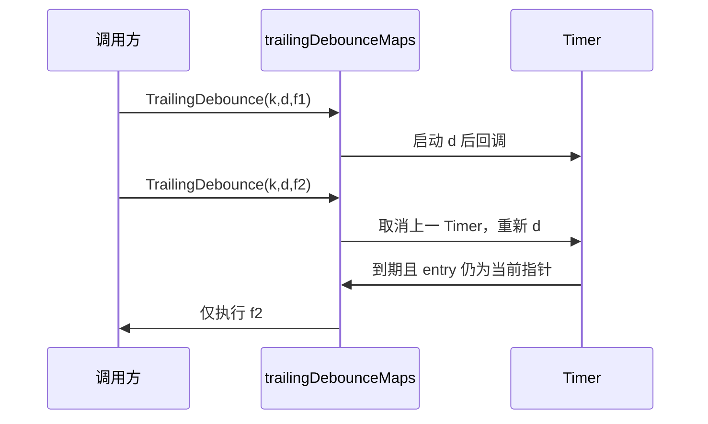
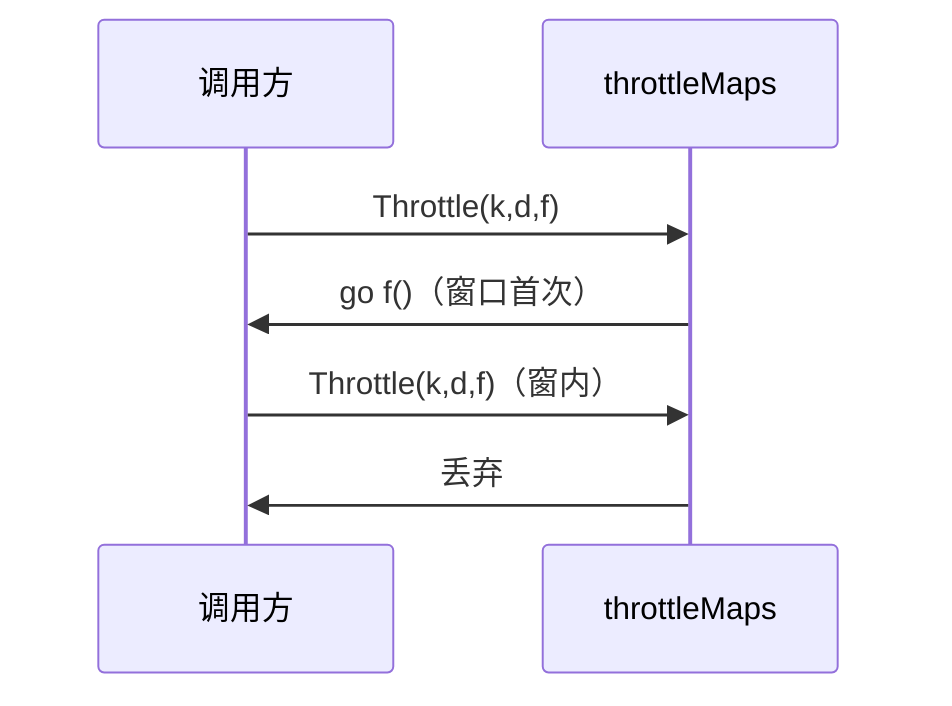
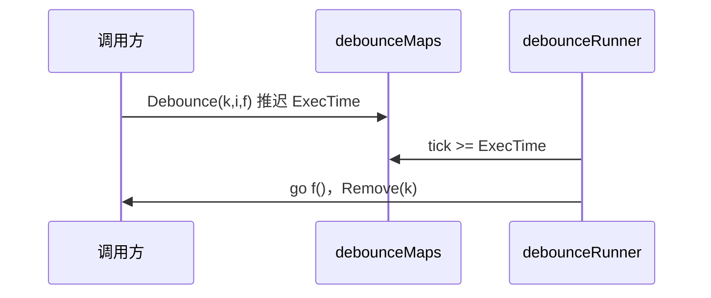
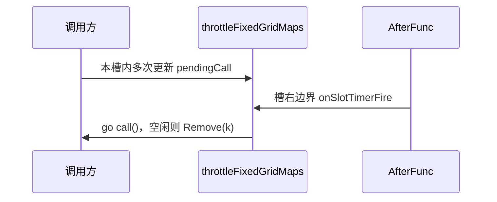

# 定时与防抖工具包（`core/pkg/dt`）设计与实现

**项目地址** [https://github.com/openskeye/go-vss](https://github.com/openskeye/go-vss)

## 1. 包做什么

`dt`（delay / timer）封装与时间窗口相关的常用能力，减少业务侧手写 `Timer` / `Ticker` / 竞态处理。

| API                         | 作用                                                                                      |
|-----------------------------|-----------------------------------------------------------------------------------------|
| `SetTimeout`                | 延迟执行一次，支持取消                                                                             |
| `SetInterval`               | 按固定间隔重复执行，直到取消                                                                          |
| `Debounce`                  | 每次调用将执行时刻推迟到 `now+interval`，全局轮询到点后执行一次并 **Remove key**                                 |
| `TrailingDebounce`          | 同一 key 连续触发时取消上次未到期任务，仅在「最后一次触发」后再静默 `duration` 执行（尾部防抖）                                |
| `Throttle`                  | 同一 key 在滑动 `duration` 窗口内**仅首次**调用立即执行，窗口内其余丢弃（前缘节流）                                    |
| `ThrottleFixedGridTrailing` | 从首次调用建立 **epoch**，按固定 `period` 对齐分槽；每槽右边界执行该槽内**最后一次** `call`；空闲时 **Remove key**，并带周期清理 |

> **术语**：口语里「节流 / 防抖」常混用。本包中 **首触限频** 用 `Throttle`；**末触合并** 用 `TrailingDebounce` 或 `Debounce`；**对齐时间轴、按槽尾执行** 用 `ThrottleFixedGridTrailing`。

---

## 2. 各函数语义与实现要点

### 2.1 `SetTimeout`

- 到期执行 `f` 一次；返回 `cancel`，提前调用则停止 `Timer` 并在必要时 drain，减轻计时器残留。

### 2.2 `SetInterval`

- `Ticker` 循环执行 `f` 直至 `cancel`；**首帧在第一个 `interval` 之后**（与常见 `setInterval` 一致，非立即首帧）。

### 2.3 `Debounce(uniqueId, interval, call)`

- `debounceMaps` 存 `ExecTime = now + interval`；`debounceRunner`（约 **10ms** 步进）扫描，到点 `go call()` 并 **`Remove(uniqueId)`**。
- 空槽不执行；每次调用都会**重置**截止时间。

### 2.4 `TrailingDebounce(uniqueId, duration, call)`

- `trailingDebounceMaps` 存 `*throttledType`（`Cancel` + `Call`）；每次调用取消旧 `SetTimeout`，再排新的 `duration`。
- 定时器回调用 **entry 指针**与 map 内现条目比对，避免被替换后旧定时器误执行新回调。

### 2.5 `Throttle(uniqueId, duration, call)`

- 每 key `throttleEntry`：`sync.Mutex` + `lastExec`；`now.Sub(lastExec) < duration` 则丢弃。
- 与 `TrailingDebounce` 对照：**节流保首次，尾部防抖保末次**。

### 2.6 `ThrottleFixedGridTrailing(uniqueId, period, call)`

- **epoch**：该 key 首次成功入队时的 `now`，之后槽为 `[epoch+k·period, epoch+(k+1)·period)`。
- 同槽多次调用只更新 `pendingCall`；在槽右边界 `epoch+(k+1)·period` 由 `AfterFunc` 触发 `onSlotTimerFire`（锁内 flush，锁外 `go call()`）。
- **跨槽**：若新调用槽号大于当前 `pendingSlot` 且仍有未执行 pending，先 **Stop 定时器**再**同步补跑**上一槽最后一次，再为当前槽重排期。
- **map 清理**：`tryRemoveFixedGridEntryIfIdle` 当 `pendingCall==nil` 且 `timer==nil`、且 map 中仍指向本 entry 时 `Remove`；`onSlotTimerFire` 末尾会调用；另有 **10s** 一次的 `throttleFixedGridIdleRunner` 兜底。
- **并发**：`ThrottleFixedGridTrailing` 在持 `entry.mu` 后再次 `Get` 校验 `v==entry`，不匹配则解锁重试（避免已删键仍操作entry）。
- 键被移除后，同一 `uniqueId` 再次调用会**重新建立 epoch**（新时间轴）。

通俗的说10.2s内我执行了100次，我传入了500毫秒为一个执行周期，实际上只会触发执行21次，等于说无论我调用多少次，
只会在开始时间开始计时500毫秒为一个周期执行这个周期内的最后一次调用，尾部不足500ms的内容会在10.5s执行，总共执行了21次。

---

## 3. 时序示意

### 3.1 `TrailingDebounce`（尾部防抖）



### 3.2 `Throttle`（前缘节流）



### 3.3 `Debounce`（防抖）



### 3.4 `ThrottleFixedGridTrailing`（固定栅格尾部节流）



---

## 4. 并发与依赖

- Map：`github.com/orcaman/concurrent-map`。
- `Throttle`：`sync.Mutex` 每 entry。
- `TrailingDebounce` / `ThrottleFixedGridTrailing`：entry 级互斥 + 指针或 map 二次校验。
- 回调多为 **`go call()`** 异步执行，业务回调内需自行保证并发安全。

---

## 5. 使用建议
`SetTimeout`、`SetInterval` 与javascript类似

| 场景             | 推荐 API                      |
|----------------|-----------------------------|
| 延迟执行           | `SetTimeout`                |
| 固定周期执行         | `SetInterval`               |
| 停止调用后后执行最后一次调用 | `TrailingDebounce`          |
| 停止调用后后执行第一次调用  | `Throttle`                  |
| 周期性执行周期内最后一次调用 | `ThrottleFixedGridTrailing` |
| 依赖全局10ms粒度执行   | `Debounce`                  |

同一业务 key 避免混用多套语义不同的 API。

---

## 6. 测试说明（`core/pkg/dt/dt_test.go`）

| 测试函数                                                     | 覆盖点                |
|----------------------------------------------------------|--------------------|
| `TestSetTimeout_CancelSkipsCallback`                     | 取消后无回调             |
| `TestSetInterval_FiresMultipleTimesBeforeCancel`         | 周期触发至少 2 次         |
| `TestDebounce_ResetsDeadlineOnRepeatCall`                | 推迟截止、最终 1 次        |
| `TestTrailingDebounce_MergesToSingleExecution`           | 末触合并               |
| `TestTrailingDebounce_ReplacedScheduleDoesNotFireStale`  | entry 指针竞态         |
| `TestThrottle_LeadingEdgeOncePerWindow`                  | 前缘节流 + 窗后可再触发      |
| `TestThrottleFixedGridTrailing_SlotCountMatchesTimeline` | 约 102ms/50ms → 3 次 |
| `TestThrottleFixedGridTrailing_RemovesIdleKeyFromMap`    | 执行后 map 无 key      |
| `TestThrottleFixedGridTrailing_LastCallWinsInSlot`       | 同槽闭包覆盖             |

运行：

```bash
go test ./core/pkg/dt/... -race
```

---

## 7. 小结

`dt` 将定时、防抖、节流与**固定栅格槽尾**执行统一到少数 API：
`TrailingDebounce` 与 `Throttle` 解决多数末触 / 首触问题；`ThrottleFixedGridTrailing` 
适合**整段对齐周期**、且需**控制 map 生长**的长连接/报表类场景；
`Debounce` 适合能接受全局轮询步长的轻量推迟执行。
