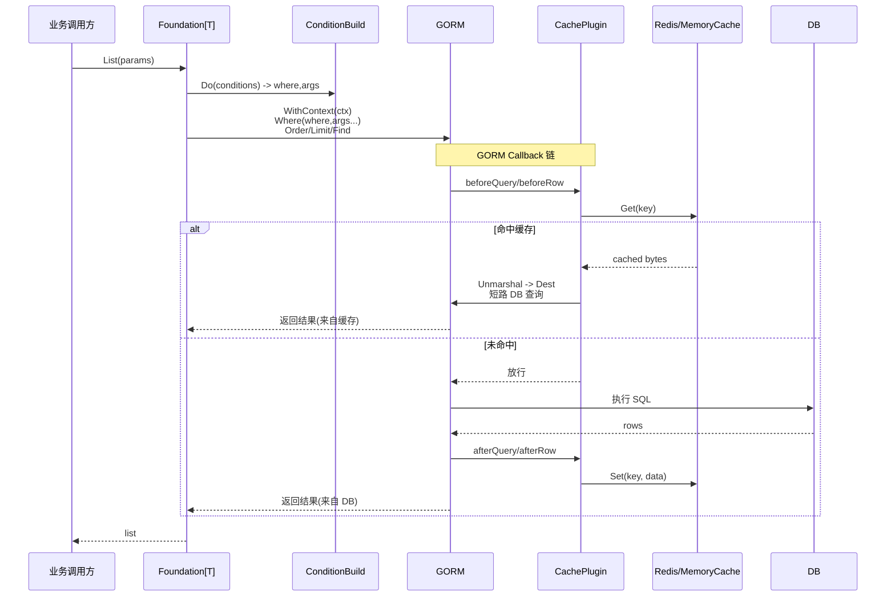
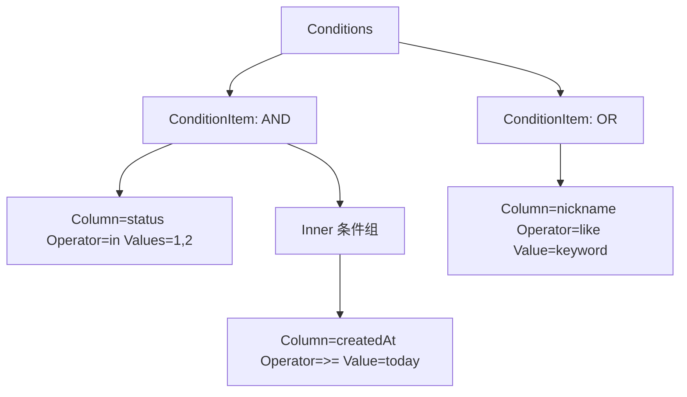

## 引言

在微服务与中台化的业务架构中，“数据访问层”往往是代码量最大、重复最多、也最容易出现不一致的地方：  
同样的列表查询在不同模块里写出不同的 where/order/limit，既不利于维护，也不利于统一性能与安全标准。

本项目在 `core/pkg/orm` 基于 GORM 实现了一套**通用 ORM 工具库**，聚焦三个目标：

- **把 CRUD 写成基础能力**：业务更关注参数与模型规则，而不是重复拼 SQL。
- **把复杂查询“参数化”**：通过 `ReqParams` 表达条件树/排序/分页/字段选择，实现一致的查询体验。
- **把可观测与性能策略“工程化”**：通过 Logger 与缓存插件形成标准化链路。

参考代码 [点击直达](https://github.com/openskeye/go-vss/tree/main/core/pkg/orm)

**项目地址** [https://github.com/openskeye/go-vss](https://github.com/openskeye/go-vss)

---

## 一、整体架构与设计理念

### 1.1 设计理念：三层职责清晰

`core/pkg/orm` 不是“替代 GORM”，而是对 GORM 的工程化封装：

- **模型层（Model）**：描述元信息与规则（字段白名单、主键、唯一索引、缓存策略、数据纠正等）
- **基础层（Foundation[T]）**：面向业务的统一入口（Row/List/Count/Exists/Insert/Update/Delete/Upsert/BulkUpdate）
- **执行层（DBX[T]）**：面向 GORM 的可复用执行能力（查、聚合、冲突更新、批量更新等）

这种分层让团队协作时的边界更明确：  
业务只需要实现 `Model` 并调用 `Foundation[T]`，复杂执行细节全部收敛在 `DBX[T]`。

### 1.2 组件职责（Quick View）

| 组件               | 职责                                             | 文件                  |
|:-----------------|:-----------------------------------------------|:----------------------|
| `Model`          | 模型元信息与规则：字段白名单、主键、唯一索引、数据纠正、缓存策略               | `orm.base.types.go`   |
| `ReqParams`      | 通用查询参数：条件树、排序、分页、字段选择等                         | `orm.base.types.go`   |
| `ConditionBuild` | 条件树转 where + placeholders（支持嵌套、组合、特殊条件）        | `orm.db.condition.go` |
| `Foundation[T]`  | 统一业务访问 API：读写聚合、上下文超时、trace 注入                 | `orm.foundation.go`   |
| `DBX[T]`         | 执行层：Find/Row/Count/Aggregate/Upsert/BulkUpdate | `orm.db.*.go`         |
| `CachePlugin`    | GORM Plugin：在 callback 链路中完成缓存读写与失效            | `orm.plugin.cache.go` |
| `StdFileLogger`  | GORM Logger 扩展：落盘、慢 SQL、调用点定位                  | `orm.logger.go`       |

### 1.3 核心调用时序：一次“列表查询 + 缓存”



---

## 二、核心抽象：ReqParams + Model

### 2.1 ReqParams：把“查询需求”结构化

`ReqParams` 的价值在于把高频需求统一成“标准形态”：

- **条件**：`Conditions []*ConditionItem`
- **排序**：`Orders []*OrderItem`
- **分页**：`Limit` / `Page` / `All`
- **字段选择**：`Columns []string`（适用于只取部分字段的轻量接口）
- **统计/容错**：`IgnoreNotFound` 等控制项

这让你在不同业务模块里能获得一致的能力与体验：

- 后台列表页：同一套分页/排序/筛选
- 详情页：同一套 Row 查询语义
- 统计接口：同一套 Count/聚合能力

### 2.2 Model：把“规则与策略”下沉到模型

`Model` 的设计亮点在于“把约定变成约束”：

- **字段白名单**：`Columns()` 决定哪些字段可被条件引用
- **主键/唯一键**：`PrimaryKey()`、`UniqueKeys()` 让 Upsert/BulkUpdate 等能力通用化
- **条件修正**：`QueryConditions()` 让业务可以统一追加/修正条件（例如多租户、软删过滤等）
- **写入纠正**：`Correction()` / `CorrectionMap()` 让写入前的数据格式化、默认值填充有统一入口
- **缓存策略**：`UseCache()` 让热点模型天然拥有缓存能力（可选 Memory/Redis）

---

## 三、ConditionBuild：可表达“真实业务”的条件树

`ConditionBuild` 负责把条件树转换成 where + placeholders，并支持：

- **AND/OR 组合**：通过 `LogicalOperator` 表达条件之间关系
- **括号嵌套**：通过 `Inner []*ConditionItem` 表达子条件组
- **in/not in/like**：覆盖常见查询操作符
- **特殊条件扩展**：通过 `Original` 表达复杂 SQL 片段（如 JSON contains / case when / substr 等）

### 3.1 条件树示意图



### 3.2 跨库细节：按数据库类型引用列名

工具包会按 `databaseType` 输出正确的列引用符号：

- MySQL / SQLite：`` `column` ``
- PostgreSQL：`"column"`
- SQLServer：`[column]`

这一点对于“同一套参数逻辑跑多种数据库”非常重要。

---

## 四、Foundation[T]：统一业务入口 + 统一链路治理

`Foundation[T]` 是业务层最常用的入口，设计亮点包括：

- **统一 context 超时**：通过 `ctxCancelTimeout` 让 DB 调用有一致的取消机制
- **统一 trace 注入**：把调用点写入 ctx，让 SQL 日志可定位
- **统一读写 API**：把 Row/List/Count/Exists/Insert/Update/Delete/Upsert/BulkUpdate 变成“可预测的通用方法”

### 4.1 为什么把聚合、存在性判断也做成通用能力

真实业务里，很多接口本质上是“查询的变体”：

- “是否存在” = Count > 0
- “最大值/总和” = 聚合
- “列表/详情” = 查询 + 排序/分页

`Foundation[T]` 把这些变体也收敛为标准能力，可以显著减少散落在业务中的重复代码。

---

## 五、DBX[T]：把高价值执行能力沉淀下来

`DBX[T]` 是工具包的“执行引擎”，适合沉淀高价值能力点：

### 5.1 Upsert：冲突更新的统一入口

通过 `OnConflictColumns`/字段集合，可以让“插入或更新”变成标准能力，避免业务层手写多分支逻辑。

### 5.2 BulkUpdate：面向批处理的高性能更新路径

在同步任务、批量状态迁移、定时作业中，逐条 update 往往会造成 DB 压力。  
`BulkUpdate` 以更适合批量场景的方式组织更新，减少 round-trip 与重复开销。

---

## 六、CachePlugin：在 GORM callback 链路中“无侵入”接入缓存

### 6.1 模型声明式开启缓存

业务不需要在每次查询后手写 `Get/Set` 缓存逻辑，而是在模型的 `UseCache()` 中声明：

- Query/Row 是否启用缓存
- 使用 Redis 还是 Memory
- 缓存前缀与过期时间

### 6.2 双 driver（Memory + Redis）满足不同部署形态

- Memory：适合单节点热点、极低延迟
- Redis：适合多节点共享缓存与跨进程复用

这让缓存从“业务代码”升级为“基础设施能力”，既统一又可控。

---

## 七、StdFileLogger：把 SQL 可观测做成标准能力

工具包扩展了 GORM Logger，使其具备：

- **SQL 落盘**：便于线上回溯与审计
- **慢 SQL 标记**：一眼识别性能热点
- **调用点定位**：把“这条 SQL 是谁发出的”变成可追溯信息

对于复杂系统来说，这类可观测能力往往比“少写几行代码”更有长期价值。

---

## 八、使用示例（简化）

```go
// 初始化 DB（MySQL / SQLite）
var db = orm.NewMysqlConnect(&orm.DBConnectConfig{
    Mode: "pro",
    Databases: ...,
    RedisClient: ...,
})

// 初始化基础访问层
var foundation = orm.NewFoundation(db, MyModel{}, time.Second)

// 查询列表
var params = &orm.ReqParams{
    Conditions: []*orm.ConditionItem{
        {Column: "id", Values: []interface{}{1,2,3}, Operator: "in"},
    },
    Limit: 20,
    Page:  1,
}

list, err := foundation.List(params)
```

---

## 总结

`core/pkg/orm` 的核心优势可以概括为：

- **查询参数化**：`ReqParams` + `ConditionBuild` 让查询表达清晰统一，支持复杂组合条件
- **模型规则化**：`Model` 把字段白名单、主键、唯一键、纠正逻辑、缓存策略统一下沉
- **能力工程化**：`Foundation[T]`/`DBX[T]` 让常见读写与批量能力成为标准基础设施
- **插件化扩展**：通过 GORM callback 接入缓存，不侵入业务代码
- **可观测标准化**：SQL 落盘、慢 SQL、调用点定位让排障更高效

对于希望在团队内统一数据访问规范、提升复用率、降低维护成本的项目来说，这套工具包可以作为一个稳定、可扩展、可宣传的基础设施组件。 

更多参考代码示例，查看[点击直达](https://github.com/yyyirl/go-vss/tree/main/core/repositories)