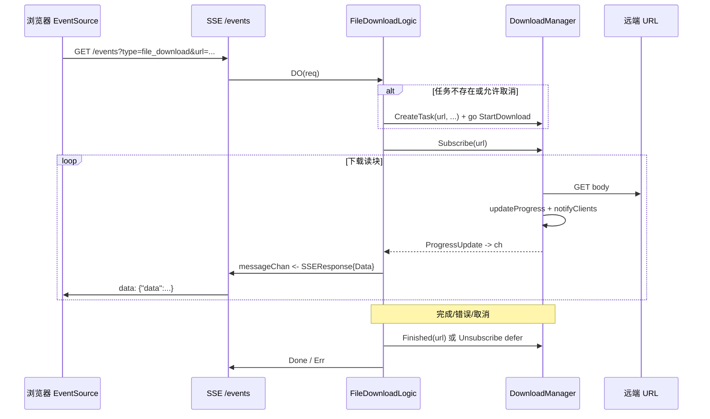

# DownloadManager 架构设计：动机、实现与 SSE 协作

本文介绍 **`core/pkg/functions/download`** 中 **`DownloadManager`** 的职责划分、关键数据结构、这样设计的原因，以及 **优劣势**；最后说明在 **VSS SSE（`type=file_download`）** 场景下的端到端流程。

**项目地址** [https://github.com/openskeye/go-vss](https://github.com/openskeye/go-vss)

---

## 一、组件定位

| 项目        | 说明                                                                          |
|-----------|-----------------------------------------------------------------------------|
| **包路径**   | `core/pkg/functions/download`                                               |
| **实例获取**  | **`download.GetManager()`**：进程内 **单例**（`sync.Once`）                         |
| **典型消费者** | **VSS** `ServiceContext.DownloadManager`（`internal/svc/service_context.go`） |
| **主要能力**  | 基于 URL 创建 **下载任务**、**HTTP 拉流写盘**、向订阅方 **推送进度（`ProgressUpdate`）**、取消与收尾      |

它不依赖 Gin/WebSocket，是 **可复用的下载 + 进度广播** 小内核；与 **SSE** 的关系是：**Manager 负责「下什么、进度多少」**，**SSE 负责「如何把进度推到浏览器」**。

---

## 二、核心数据结构

### 2.1 `DownloadTask`

- **`TaskID`**：当前实现里 **`TaskID == URL`**（`CreateTask` 中 `taskID := url`）。  
- **`Filepath`**：`saveDir` + 调用方传入的 `fileName`。  
- **状态**：`downloading` / `completed` / `error` / `cancelled`。  
- **进度**：`Downloaded`、`Total`（来自 `Content-Length`，未知则为 0）、`Progress`（百分比）、`Speed`（KB/s，按已读字节与耗时估算）。

### 2.2 `DownloadManager`

```text
tasks   *xmap.XMap[string, *DownloadTask]   // taskID -> 任务
clients *xmap.XMap[string, chan ProgressUpdate] // taskID -> 订阅 channel
```

- **`tasks`**：正在进行的任务索引；**`Finished` / 结束后会 `Remove`**。  
- **`clients`**：每个 `taskID` 对应 **一个** `chan ProgressUpdate`（缓冲 **10**），下载循环通过 **`notifyClients`** 写入。

**`xmap.XMap`** 为线程安全泛型 Map（读写锁），适合多 goroutine 并发注册任务与推送进度。

### 2.3 单例

```go
var (
    manager *DownloadManager
    once sync.Once
)

func GetManager() *DownloadManager {
    once.Do(func() { ... })
    return manager
}
```

保证全进程 **唯一 Manager**，任务与订阅表全局共享——与「按 URL 去重、运维看板统计任务数」等需求一致。

---

## 三、API与行为

| 方法                                       | 作用                                                                                         |
|------------------------------------------|--------------------------------------------------------------------------------------------|
| **`CreateTask(url, fileName, saveDir)`** | 确保目录存在；以 **url 为 TaskID** 写入 `tasks`；返回 `DownloadTask`。                                    |
| **`StartDownload(ctx, task)`**           | 当前实现 **未用 ctx 取消 HTTP**；内部 `GET`、按块读 body 写文件；每读一块 **`updateProgress` + `notifyClients`**。 |
| **`Subscribe(taskID)`**                  | `make(chan ProgressUpdate, 10)` 并 **`Set` 到 `clients`**（同 key **覆盖**旧 channel）。            |
| **`Unsubscribe` / `Finished`**           | **`close` 订阅 channel** 并从 `clients`、`tasks` 移除，避免泄漏。                                       |
| **`CancelDownload(taskID)`**             | 将任务标为 **`cancelled`** 并 **`notifyClients`**；下载循环在下轮读到状态后退出并删文件。                            |
| **`CheckExists(taskID)`**                | 判断 `tasks` 中是否已有该 URL 任务。                                                                  |
| **`TaskNum` / `ClientNum`**              | `tasks.Len()` / `clients.Len()`，供 **SSE `sev_state`** 等展示。                                 |

---

## 四、为什么要这样设计？

### 4.1 问题背景

平台侧需要 **从给定 URL 拉文件到服务器磁盘**，同时让 **前端实时看到进度**（百分比、速度、路径）。若仅用「同步 HTTP 下载 + 轮询 DB/Redis」，复杂度高、延迟大；若在业务里手写 goroutine + 多处 `chan`，容易泄漏、难统一取消与统计。

### 4.2 设计选择背后的意图

1. **任务与传输解耦**  
   **DownloadManager** 只关心 **任务生命周期 + 进度事件**；**谁消费进度**（SSE、日志、未来 WebSocket）由上层 **`Subscribe`** 决定，符合 **观察者模式**。

2. **以 URL 为 TaskID**  
   同一 URL 在表里 **天然去重**：避免重复建任务、重复占带宽；与 **`CheckExists`**、**`file_download` SSE** 里「已存在则只订阅」的语义一致。

3. **单例 + 全局 Map**  
   在 **单进程 VSS** 内，所有下载与订阅集中管理，**`TaskNum`/`ClientNum`** 可直接用于 **运维 SSE 面板**（`sev_state`），无需再挂一层注册中心。

4. **进度 channel 带小缓冲（10）**  
   下载循环写进度频率高，缓冲可 **吸收瞬时突发**，减少下载 goroutine 因消费者暂时未读而立刻阻塞的概率（消费者仍要跟得上）。

---

## 五、优势与风险

### 5.1 优势

| 方面           | 说明                                                              |
|--------------|-----------------------------------------------------------------|
| **接入简单**     | `CreateTask` → `go StartDownload` → `Subscribe` 读 channel，心智负担低。 |
| **并发安全**     | `xmap` 封装锁，多协程注册/通知不易出现裸 map 竞态。                                |
| **可观测**      | 任务数、订阅数、进度结构体字段齐全，易对接。                                    |
| **与 SSE 契合** | 推送模型一致：Manager **push** 进度，SSE **转发** 为 `text/event-stream`。    |
| **取消路径清晰**   | `CancelDownload` 改状态 + `notify`；循环侧检测 `StatusCancelled` 后清理文件。  |

### 5.2 风险

| 方面                          | 说明                                                                                             |
|-----------------------------|------------------------------------------------------------------------------------------------|
| **TaskID = URL**            | 相同 URL 无法并发多任务；带不同 query 的 URL 会被视为不同任务，可能重复下载。                                                |
| **`notifyClients` 为阻塞发送**   | `ch <- ProgressUpdate` 无 `select`；若消费者 **从不读或读太慢**，**下载 goroutine 会阻塞在通知上**，相当于背压传递到网络读。       |

---

## 六、与 SSE 的配合过程（VSS `file_download`）

实现位置：**`core/app/sev/vss/internal/logic/sse/file_download.go`**。

### 6.1 时序概览



### 6.2 关键步骤说明

1. **Query 参数**：`type=file_download`、`url`、可选 `filename`、`cancel=1`。  
2. **启动条件**：**`!CheckExists(url)`** 或 **`cancel`** 时调用 **`downloader`**：取消走 **`CancelDownload`**；否则 **`CreateTask`** 并 **`go StartDownload`**。  
3. **订阅**：**`Subscribe(req.Url)`** 与 **`TaskID==url`** 一致；**`defer Unsubscribe`** 保证连接断开或逻辑退出时释放。  
4. **向 SSE 转发**：`for { select { case v := <-ch } }`，将 **`ProgressUpdate`** 封装为 **`SSEResponse.Data`** 写入 **`messageChan`**。  
5. **降频**：通过 **`NowMilli()%100 == 0`** 等条件 **减少 SSE 帧率**（避免每 32KB 都打一帧拖慢浏览器），**终态**（完成/取消/错误）仍强制推送。  
6. **结束**：**`Finished(url)`** 关闭订阅 channel、移除任务；SSE 侧 **`Done: true`** 或 **`Err`** 结束事件流。

### 6.3 小结

| 层级                        | 职责                                                 |
|---------------------------|----------------------------------------------------|
| **DownloadManager**       | HTTP 下载、落盘、进度计算、**向 `chan` 推送**、任务/订阅表维护。          |
| **SSE FileDownloadLogic** | 解析参数、决定何时创建任务、**订阅并桥接到 `messageChan`**、**节流**与终态帧。 |
| **SSE Server**            | `text/event-stream` 编码、`Flush`、连接生命周期。             |

---

## 七、与运维面板的衔接

**`sev_state`**（`internal/logic/sse/sev_state.go`）中两项：

- **「文件下载任务数量」** → **`DownloadManager.TaskNum()`**  
- **「文件下载任务数量」**（第二项实现为 **`ClientNum()`**，语义上更接近 **当前订阅连接数**）

用于观察 **下载与 SSE 订阅** 是否堆积，可与 **`SSE.MessageChanBuffer`** 等配置联合调优（见 SSE 专题文档）。

---

## 八、源码索引

| 说明                 | 路径                                                     |
|--------------------|--------------------------------------------------------|
| DownloadManager 实现 | `core/pkg/functions/download/main.go`                  |
| VSS 注入             | `core/app/sev/vss/internal/svc/service_context.go`     |
| SSE 文件下载           | `core/app/sev/vss/internal/logic/sse/file_download.go` |
| 服务状态中的统计           | `core/app/sev/vss/internal/logic/sse/sev_state.go`     |
| 线程安全 Map           | `core/pkg/xmap/main.go`                                |

---

*本文与《VSS-SSE架构设计》中 `file_download` 一节互补：前者偏传输协议，本文偏下载内核与协作边界。*
