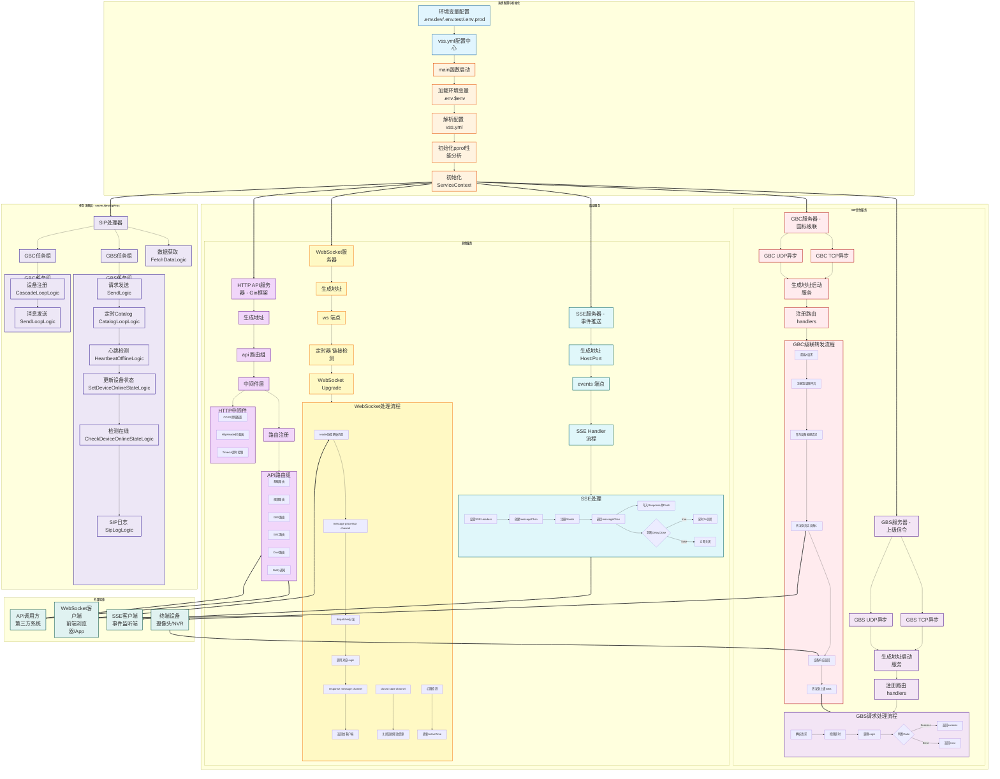

# VSS系统设计文档

VSS（Video Security System）是 Skeyevss 中的**国标信令与流控核心服务**，负责 GB28181 设备接入、SIP 信令、媒体回调、WebSocket/SSE
实时通道等。本文将会讲解包含运行流程、功能介绍、开发使用与注意事项等，并配一些示例代码。

---

## 一、概述

### 1.1 定位

- **国标 GBS**: 作为平台端接收设备注册、目录、Invite/ACK/BYE、MESSAGE（心跳/目录/设备信息等）。
- **国标级联 GBC**: 作为上级或下级平台，处理级联注册、目录、Invite 等。
- **HTTP API**: 对外提供拉流/停流、设备控制、媒体查询、媒体服务回调。
- **SSE / WebSocket**: 为前端提供设备诊断、SIP 日志、语音对讲等实时数据。

### 1.2 依赖

- **etcd**: 服务发现
- **DB RPC**: 数据中心
- **Redis**: 可选
- **媒体服务（SkeyesMS）**: 通过HTTP调用

### 1.3 端口（etc/.vss.yaml，.env）

| 用途        | 默认端口  | 说明              |
|-----------|-------|-----------------|
| SIP GBS   | 11008 | 国标设备信令 TCP/UDP  |
| SIP GBC   | 11015 | 国标级联信令 TCP/UDP  |
| HTTP      | 11013 | REST API + 媒体回调 |
| SSE       | 11014 | 事件推送            |
| WebSocket | 11018 | 语音对讲、状态推送等      |

---

## 二、运行流程

### 2.1 启动顺序（main.go）

```
1. 解析 -env、-f 参数，加载 .env 与 etc/.vss.yaml
2. 设置时区、日志、pprof
3. svc.NewServiceContext(c) 创建上下文（RPC 客户端、各类 channel、map）
4. initialize.DO(svcCtx, baseConf) 初始化（Broadcast 清理、SIP 日志目录、媒体服务配置等）
5. InitFetchDataState.Wait() 配合FetchDataLogic使用，先等数据拉取完成
6. 启动4个SIP服务（阻塞 Listen）: 
   - GBS TCP、GBS UDP、GBC UDP、GBC TCP
7. 启动 SSE 服务: go server.NewSSESev(svcCtx).Start()
8. 启动 WebSocket 服务: go server.NewWSSev(svcCtx).Start()
9. 启动 HTTP 服务: go server.NewHttpSev(svcCtx).Start()
10. InitFetchDataState.Add(2)，与proc中Done配合
11. 启动后台任务链 server.NewSipProc(svcCtx).DO(...)
12. <-stop等待 SIGTERM/SIGINT，然后Shutdown四个SIP服务
```

### 2.2 后台任务链（SipProc）

`DO` 中注册的每个 `SipProcLogic` 在独立 goroutine 中执行，且内部有 `recoverCall` 防止 panic 导致进程退出:

| 顺序 | Logic                       | 作用                                                           |
|----|-----------------------------|--------------------------------------------------------------|
| 1  | FetchDataLogic              | 从DBRPC拉字典、设置、媒体服务器列表、级联、设备在线状态; ONVIF发现; 定时刷新                |
| 2  | SendLogic                   | 消费channel: Catalog、Invite、Bye、设备控制、预设位、录像、订阅、语音对讲等，发SIP到真实设备 |
| 3  | CatalogLoopLogic            | 定时向已注册设备发 Catalog 请求（间隔 Sip.CatalogInterval）                 |
| 4  | HeartbeatOfflineLogic       | 心跳超时判定设备离线                                                   |
| 5  | SetDeviceOnlineStateLogic   | 上下线结果写入队列                                                    |
| 6  | CheckDeviceOnlineStateLogic | 消费队列，通过RPC更新设备/通道在线状态                                        |
| 7  | SipLogLogic                 | 写SIP收发日志（文件/广播）                                              |
| 8  | CascadeLoopLogic            | 级联注册循环                                                       |
| 9  | SendLoopLogic               | 级联消息发送循环                                                     |

**注意**: SIP 服务器要 `InitFetchDataState.Wait()` 后才 `Listen`，确保字典、设置等已拉取，避免程序运行时拿不到配置。

### 2.3 数据流简图

```
设备/NVR ──SIP(TCP/UDP)──► VSS (GBS/GBC)
                              │
                              ├─► SendLogic 等消费 channel 发 SIP
                              ├─► HTTP 回调 (媒体服务) ──► notify/* ──► 更新通道状态、保活等
                              ├─► HTTP API (Backend/前端) ──► invite/stop/deviceControl/...
                              ├─► SSE ──► 设备诊断、SIP 日志、状态
                              └─► WebSocket ──► 语音对讲、状态推送

VSS ──RPC──► DB (配置/设备/通道)
VSS ──HTTP──► 媒体服务 (start_rtp_pub, ack_rtp_pub, 停止流等)
```

---

## 三、目录结构

```
core/app/sev/vss/
├── main.go                   # 项目入口: flag、env、config、SIP/SSE/WS/HTTP、SipProc
├── internal/
│   ├── config/               # 配置（使用 tps.VssSevConfig）
│   ├── svc/                  # ServiceContext注入服务上下文，构造（RPC、Redis、各类 channel/map）
│   ├── types/                # 请求/响应/SIP 相关类型、ServiceContext 定义
│   ├── handler/
│   │   ├── http/             # Gin 路由注册、泛型 handler（newHandler/newHandlerWithParams）
│   │   ├── sse/              # SSE 路由（type=xxx 分发）
│   │   ├── ws/               # WebSocket 路由、广播
│   │   ├── gbs_sip/          # GBS SIP 方法注册（REGISTER/INVITE/ACK/BYE/MESSAGE）
│   │   └── gbc_sip/          # GBC SIP 方法注册
│   ├── logic/
│   │   ├── proc/             # 后台任务: FetchDataLogic
│   │   ├── gbs_proc/         # GBS 相关: Send、CatalogLoop、Heartbeat、OnlineState、SipLog
│   │   ├── gbc_proc/         # GBC: CascadeLoop、SendLoop
│   │   ├── gbs_sip/          # GBS SIP 处理: Register、Invite、ACK、Bye、Keepalive、Catalog、...
│   │   ├── gbc_sip/          # GBC SIP 处理，消息转发，可以理解为真实设备（中转）
│   │   ├── http/
│   │   │   ├── base/         # 状态、设备控制、预设位、录像、WS Token
│   │   │   ├── video/        # 流播放/停止、流信息
│   │   │   ├── gbs/          # Catalog、Invite、StopStream、回放控制、订阅
│   │   │   ├── gbc/          # 级联 Catalog
│   │   │   ├── ms/           # 媒体服务: 流组、录像、配置、Reload
│   │   │   ├── notify/       # 媒体回调: on_pub_start/stop、on_sub_start/stop、on_rtmp_connect 等
│   │   │   └── onvif/        # ONVIF 发现、设备信息、Profile
│   │   ├── sse/              # 设备/通道诊断、文件下载、服务状态、SIP 日志等
│   │   └── ws/               # 语音对讲: 发送/停止、SIP 注册、通道注册、广播
│   ├── server/               # SIP/HTTP/SSE/WS 服务封装
│   ├── interceptor/          # HTTP 超时、Header 等
│   └── pkg/                  # SIP 解析/发送、媒体服务 HTTP 封装、ONVIF、端口分配等
```

---

## 四、功能介绍

### 4.1 SIP（GBS）

- **REGISTER**: 设备注册，回复 200 OK; 触发目录订阅、心跳定时。
- **INVITE**: 设备侧发起（如对讲）; 服务端也可主动 Invite（直播/回放）通过 SendLogic 执行 `SipSendVideoLiveInvite`。
- **ACK**: 对Invite的确认，携带SDP，之后设备开始推流。
- **BYE**: 结束会话。
- **MESSAGE**: 根据 CmdType 分发为
  Keepalive、Catalog、DeviceInfo、ConfigDownload、PresetQuery、RecordInfo、Alarm、MediaStatus、Broadcast 等。

### 4.2 SIP（GBC 级联）

- 独立端口，对Register/Invite/ACK/BYE/MESSAGE 处理，实际上和真实设备处理信令一直。
- 级联注册、保活、目录、Invite 等由 gbc_proc 与 gbc_sip 配合完成。

### 4.3 HTTP API 分组

- **base**: 状态、设备控制、预设位、录像查询、WS Token。
- **video**: 获取播放地址、停止播放、流信息。
- **ms**: 媒体服务流组、按流名查录像、配置、Reload。
- **gbs**: Catalog、Invite（直播/回放）、StopStream、回放控制、订阅。
- **gbc**: 级联 Catalog。
- **onvif**: 发现、设备信息、Profile。
- **notify**: 媒体服务回调。

### 4.4 媒体服务回调（notify）

媒体服务按配置调用 VSS 的 POST 接口，VSS 更新通道状态、做保活或停流:

| 路径                                                   | 含义              |
|------------------------------------------------------|-----------------|
| /api/notify/on-pub-start                             | 设备向MS开始推流       |
| /api/notify/on-pub-stop                              | 推流停止            |
| /api/notify/on-push-start / on-push-stop             | 作为下级推给上级        |
| /api/notify/on-reply-pull-start / on-reply-pull-stop | 拉流开始/停止         |
| /api/notify/on-rtmp-connect                          | 有RTMP推流连接建立的事件通知   |
| /api/notify/on-sub-start / on-sub-stop               | 播放开始/停止（做实时流保活） |

实现: 解析 `streamName` → 校验通道存在 → 更新DB中通道stream_state/online 等，流还会在on_pub_stop时发BYE停流。

### 4.5 SSE

- 连接: `GET /events?type=xxx`。
- `type` 取值: 设备诊断、通道诊断、文件下载、服务状态、设备在线状态、SIP 日志等（详细见 `handler/sse/routers.go`，也是通过这个文件注册）。
- 通过 `messageChan` 向客户端推事件。

### 4.6 WebSocket

- 连接: `/`，需携带合法 token（通过 backendApi`/api/base/ws-token`获取）。
- 消息体带 `type` 路由到对应 handler（见 `handler/ws/register.go`），如:
    - 语音对讲: 发送音频、停止、SIP 注册、通道注册;
    - 广播: 对讲 SIP 状态、使用状态等。
    - 后续功能增加处理对应`register.go`

---

## 五、配置说明

### 5.1 配置文件

- 路径: `etc/.vss.yaml`，内容由环境变量占位（如 `${SKEYEVSS_VSS_HTTP_PORT}`），需配合 .env 使用。

### 5.2 关键配置项（core/tps/conf 中 VssSevConfig）

| 配置                          | 说明                 |
|-----------------------------|--------------------|
| Host / Port                 | SIP 监听地址与端口（GBS）   |
| Sip.CascadeSipPort          | 级联 SIP 端口          |
| Http.Port                   | HTTP API 端口        |
| SSE.Port / WS.Port          | SSE / WebSocket 端口 |
| Sip.CatalogInterval         | 定时 Catalog 间隔（秒）   |
| Sip.LifetimeTimeoutInterval | 心跳超时（秒）            |
| DBGrpc                      | 通过 Etcd 发现 DB RPC  |
| Onvif                       | ONVIF 多播地址、端口、发现超时 |

---

## 六、开发使用

### 6.1 本地运行

```bash
# 确保 etcd、DB RPC、媒体服务已启动，.env 已配置
go run main.go -env .env.local -f etc/.vss.yaml
```

### 6.2 新增 HTTP 接口（无请求体）

1. 在`internal/logic/http/xxx`下新增Logic，需要实现`types.HttpEHandleLogic`:

```
// 实现 HttpEHandleLogic[*XxxLogic]
var (
    _ types.HttpEHandleLogic[*XxxLogic] = (*XxxLogic)(nil)
    XxxLogic = new(xxxLogic)
)

type xxxLogic struct {
    ctx    context.Context
    c      *gin.Context
    svcCtx *types.ServiceContext
}

func (l *xxxLogic) New(ctx context.Context, c *gin.Context, svcCtx *types.ServiceContext) *xxxLogic {
    return &xxxLogic{ctx: ctx, c: c, svcCtx: svcCtx}
}

func (l *xxxLogic) Path() string {
    return "/xxx/path"
}

func (l *xxxLogic) DO() *types.HttpResponse {
    // 使用 l.ctx, l.c, l.svcCtx 处理，返回 types.HttpResponse
    return &types.HttpResponse{Data: result}
}
```

2. 在 `internal/handler/http/routers.go` 中注册:

```
router.GET(xxxLogic.Path(), newHandler(svcCtx, xxxLogic))
```

### 6.3 新增HTTP接口（带请求体）

1. 定义请求类型（如 `types.XxxReq`），Logic 实现 `types.HttpRHandleLogic[Logic, Req]`:

```
var _ types.HttpRHandleLogic[*XxxLogic, types.XxxReq] = (*XxxLogic)(nil)

func (l *xxxLogic) DO(req types.XxxReq) *types.HttpResponse {
    // 使用 req 与 l.svcCtx
    return &types.HttpResponse{Data: result}
}
```

2. 注册:

```
router.POST(xxxLogic.Path(), newHandlerWithParams[types.XxxReq](svcCtx, xxxLogic))
```

### 6.4 新增媒体回调（notify）

1. 在 `internal/logic/http/notify` 下新增 Logic，实现 `HttpRHandleLogic`，`Path()` 返回如 `/notify/on-xxx`。
2. 在 `routers.go` 中注册POST/GET:

```
router.POST(notify.VOnXxxLogic.Path(), newHandlerWithParams[types.NotifyStreamReq](svcCtx, notify.VOnXxxLogic))
```

3. 若逻辑与on_pub_start/on_pub_stop类似（仅更新流状态），可复用`setStreamState`（见`notify/common.go`）。

### 6.5 新增后台任务（SipProcLogic）

1. 在 `internal/logic/gbs_proc` 或新建包中实现:

```
var _ types.SipProcLogic = (*XxxProcLogic)(nil)

type XxxProcLogic struct {
    svcCtx      *types.ServiceContext
    recoverCall func (name string)
}

func (l *XxxProcLogic) DO(params *types.DOProcLogicParams) {
    l.svcCtx = params.SvcCtx
    l.recoverCall = params.RecoverCall
    defer l.recoverCall("XxxProcLogic")
    // 循环 select channel 或 ticker...
}
```

2. 在 `main.go` 的 `server.NewSipProc(svcCtx).DO(...)` 中追加:

```
new(xxxpkg.XxxProcLogic),
```

### 6.6 发送 SIP 请求（通过channel）

业务侧不直接发SIP，而是向`svcCtx`的channel投递，由SendLogic统一发送，例如:

```
// Catalog
l.svcCtx.SipSendCatalog <- &types.Request{ID: deviceId, Req: req, ...}

// Invite（通常由HTTP invite逻辑组织好，再SipVideoLiveInviteMessage后投递）
l.svcCtx.SipSendVideoLiveInvite <- &types.SipVideoLiveInviteMessage{...}

// BYE
l.svcCtx.SipSendBye <- &types.SipByeMessage{StreamName: streamName}
```

---

## 七、注意事项

### 7.1 启动顺序

- 必须先启动**etcd**和**DBRPC**，再启动VSS，否则RPC连接失败会导致FetchData失败、InitFetchDataState不Done，内置服务将无法正常启动。
- **媒体服务** 在Vss启动时需要更新检测配置并启动

### 7.2 端口与防火墙

- SIP端口（GBS/GBC）需对设备/上级平台开放;RTP端口范围（Invite时由媒体服务分配）也要开放（需要和.env配置文件一致）。
- 若VSS与媒体服务不在同一机，媒体服务回调的VSS地址要填对（内网或外网），否则将会无法播放、状态无法正常更新。

### 7.3 并发与 channel

- `SipSendVideoLiveInvite`、`SipSendBye` 等channel有缓冲，避免慢消费时阻塞调用方;但不要无限制投递，防止内存与goroutine暴涨。
- `AckRequestMap`、`PubStreamExistsState`、`SipCatalogLoopMap`等由多goroutine访问，实现为`xmap`/`set`等并发安全结构。

### 7.4 流名称与锁❗❗❗❗

- **同一个`streamName`的Invite流程会加锁（见invite逻辑），避免重复Invite或状态错乱**。
- **停流时要同时:发BYE、删`AckRequestMap`、删`PubStreamExistsState`，并通知媒体服务关流**。

### 7.5 配置与环境变量

- `.vss.yaml`中大量`${SKEYEVSS_*}`，部署前确认.env中已导出且无误，否则端口为空会启动失败或监听异常。
- 修改SIP端口、HTTP端口、媒体回调地址后，需同时检查媒体服务配置里的回调URL与VSS实际地址一致。

### 7.6 日志与排查

- SIP 收发可开启 `UseSipPrintLog` 或写文件（`SipLogPath`），便于排查信令问题。
- 使用pprof时注意`PProfPort`、`PProfFileDir`配置，避免与其它服务冲突。

## 八、系统设计图

