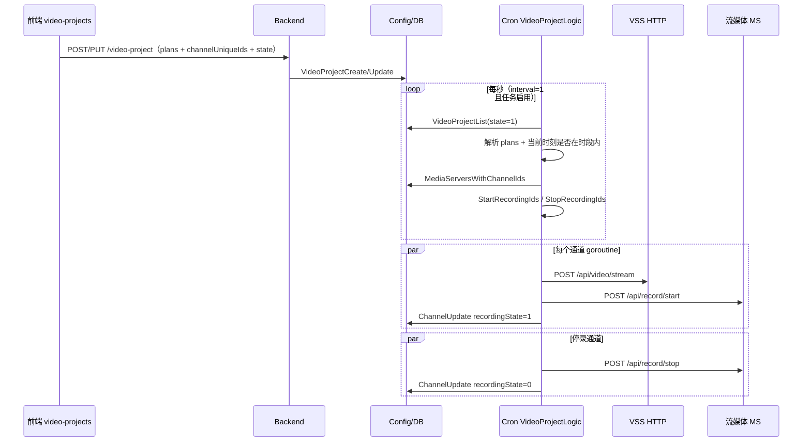

# 录像计划：前端配置到定时录制执行

本文说明从 **Web 配置录像计划** 到 **Cron 服务按周历触发、调用流媒体开始/停止录制** 的完整链路，便于联调与排障。

**项目地址** [https://github.com/openskeye/go-vss](https://github.com/openskeye/go-vss)

---

## 一、功能概述

- **录像计划**：一条配置包含 **名称**、**启用状态**、**关联通道列表**、**周历格子计划**（7×24 小时，每小时是否录像）。
- **生效方式**：**Cron 服务**（`core/app/sev/cron`）按秒轮询任务表；对启用且当前时刻落在计划时段内的通道，向 **流媒体（MS）** 下发 **开始录像**；对上一轮在录、本轮已不在计划内的通道下发 **停止录像**。
- **与「设备录像 / 平台录像查询」的区别**：计划录制是 **主动推流 + MS 落盘**；设备侧 GB28181 RecordInfo 查询是 **读设备索引**，见 `docs/vss/gbs/设备录像.md`、`docs/vss/1.1平台与设备录像.md`。

---

## 二、数据模型

| 项目   | 说明                                                                          |
|------|-----------------------------------------------------------------------------|
| 表名   | `sk-video-projects`                                                         |
| 模型   | `core/repositories/models/video-projects/model.go` → `VideoProjects`        |
| 主要字段 | `name`、`state`（0 停用 / 1 启用）、`channelUniqueIds`（JSON 数组字符串）、`plans`（周历位图字符串） |

**`plans` 格式（与前端一致）**

- 固定长度 **168** 个字符，**`0` / `1`**表示。
- 下标 **按周分段**：第 `week` 天（1=周一 … 7=周日）对应 `plans[(week-1)*24 : week*24]`，共 24 位表示当天 0–23 点；`1` 表示该小时需要录像。

后端周序号与前端一致：`TimestampWeekDay` 将时间戳映射为 **1–7（周一–周六）及 7 表示周日**。

---

## 三、前端配置

### 3.1 代码路径

本机示例路径：

`skeyevss_backend_showcase/src/pages/configs/video-projects`

| 文件               | 作用                             |
|------------------|--------------------------------|
| `api.ts`         | 对接 Backend HTTP                |
| `index.tsx`      | 表格 + 表单 CRUD                   |
| `model.tsx`      | 列定义、表单字段（含通道弹窗 `setChannel`）   |
| `components.tsx` | **`CPlain`**：7×24 格子编辑 `plans` |

### 3.2 HTTP 接口

| 方法     | 路径                    | 说明   |
|--------|-----------------------|------|
| POST   | `/video-project`      | 创建   |
| PUT    | `/video-project`      | 更新   |
| DELETE | `/video-project`      | 删除   |
| GET    | `/video-project/:id`  | 单行   |
| POST   | `/video-project/list` | 列表   |

权限（`index.tsx`）：`P_1_4_4`、`P_0_2_4`。

### 3.3 计划编辑（`CPlain`）

- 内部用长度 **168** 的数组，`0/1` 表示格子状态；拖拽与点击批量修改。
- 提交前通过 `props.setFieldValue('plans', data.join(''))` 写入 **连续字符串**（与 DB `plans` 一致）。

### 3.4 关联通道

- 表格列「关联通道」打开弹窗，勾选通道存库为 JSON 数组字符串。

---

## 四、后端配置 API（Backend → DB）

| 项目      | 路径                                                                                        |
|---------|-------------------------------------------------------------------------------------------|
| 路由注册    | `core/app/sev/backend/internal/handler/routes.go`（`/video-project` 系列）                    |
| Handler | `core/app/sev/backend/internal/handler/config/vp/`（Create / Update / Delete / Row / List） |
| Logic   | `core/app/sev/backend/internal/logic/config/vp/`                                          |
| 持久化     | gRPC → `ConfigService.VideoProjectCreate                                                  |Update|Delete|Row|List`（`core/app/sev/db`） |

配置写入 **`sk-video-projects`** 后，**Cron 不读 HTTP**，仅通过 **Config RPC 拉列表**。

---

## 五、Cron 调度与任务注册

### 5.1 进程入口

`core/app/sev/cron/main.go` 注册：

```go
&crontab.VideoProjectLogic{
    StartRecordingIds: make(chan map[uint64]*cTypes.ChannelMSRelItem, 10),
    StopRecordingIds:  make(chan map[uint64]*cTypes.ChannelMSRelItem, 10),
},
```

### 5.2 调度周期

`core/app/sev/cron/internal/handler/crontab.go`：

- 全局 **`time.Ticker(1 * time.Second)`**。
- 对每个任务记录：若 `status!=0` 且 `interval!=0`，且 **`now % interval == 0`**，则触发一次 `DO`。
- 初始化数据见 `core/repositories/models/crontab/variables.go`：`uniqueId = "video-project"`，`interval = 1` → **每秒执行一次**逻辑（若任务启用）。
- `timeout`：单次 `DO` 外层 `context` 超时（默认 10 秒）。
- `blockStatus == 1`：在 `VideoProjectLogic.DO` 内 **同步**执行 `do`；`== 0` 则 `go do`（当前初始化为 **1，同步**）。

### 5.3 防并发

- `VideoProjectLogic.Executing()` 为 true 时，**本轮跳过**（避免上一轮未结束又进）。
- Redis 锁：`video-project-record-cron-lock`，保证多实例下同一时刻只有一个节点跑「计划计算 + 下发通道集合」主逻辑。

---

## 六、`VideoProjectLogic` 执行流程

实现文件：`core/app/sev/cron/internal/logic/crontab/video-project.go`。

### 6.1 `DO` 入口

1. **`makeRecord.Do`**：仅启动一次 goroutine **`makeRecord`**，死循环从 `StartRecordingIds` / `StopRecordingIds` 两个 channel 收包，分别调用 **`startRecording` / `stopRecording`**（与主循环 **解耦**，避免阻塞调度）。
2. 根据 `BlockStatus` 同步或异步调用 **`do`**。

### 6.2 `do`：算「当前应录」的通道集

1. **抢 Redis 锁**，失败写 `CrontabRecord.Logs` 并返回。
2. **RPC `VideoProjectList`**：条件 **`state = 1`** 且 **`channelUniqueIds != "[]"`**（启用且绑定了通道）。
3. 对每条计划：
   - `plans` 为空或 **`len(plains) != 168`** 则跳过（数据错乱）。
   - 按天切成 `weekMaps[1..7]`，每天 24 个字符。
   - 取 **`weekNum = TimestampWeekDay(params.Now)`** 当天的 24 位，调用 **`stream.NewVideoPlain().GetTimeRanges(hourState, params.Now)`** 得到当日若干 **Unix 区间 `[start,end]`**（左闭右开语义由 `GetTimeRanges` 实现，见 `core/common/stream/plain.go`）。
   - 若 **`params.Now` 落在任一区间内**，则将该计划下所有 **`channelUniqueIds` 并入**本轮「应录集合」。
4. **去重** `channelIds`。
5. **停录集合**：上一轮保存在内存的 **`execChannelUniqueIds`** 中，**不在本轮 `channelIds` 里的** → `stopChannelIds`。
6. **更新内存**：`l.execChannelUniqueIds = channelIds`。
7. **RPC `MediaServersWithChannelIds`**：一次性查询「应开录 + 应停录」通道的 **设备/通道/MS 绑定**（`ChannelMSRelItem`）。
8. 若 **`start` 非空**：`StartRecordingIds <- start`；若 **`stop` 非空**：`StopRecordingIds <- stop`。

### 6.3 时间片算法（与前端展示对齐）

`GetTimeRanges`：以 **`params.Now` 所在自然日 0 点** 为基准，把 24 个 `'1'` 连续段转为 Unix 时间区间；跨 23→24 点用当日 24:00。

---

## 七、实际开始 / 停止录制（`core/common/videoProject/recording.go`）

Cron 中 **`startRecording` / `stopRecording`** 调用 **`videoProject.NewRecoding().StartRecording|StopRecording`**（注意包内命名为 `NewRecoding`）。

对 **map 中每个通道** 启 **独立 goroutine**（并发下发）。

### 7.1 `StartRecording`（计划录像）

1. **`POST http://{VssHttpTarget}/api/video/stream`**  
   Body：`deviceUniqueId`、`channelUniqueId` —— 在 VSS 侧创建/拉起播放 **group**（与实时预览同源链路）。
2. **`POST http://{MS}/api/record/start`**  
   - `stream_name`：`stream.New().Produce(device, channel, PlayTypePlay)`（Cron 传入 **`PlayTypePlay`**）。  
   - `record_interval`：**60**（秒，分片）；`record_type`：**0**（计划录像）；`record_format`：**0**（MP4）。
3. 非下载模式：RPC **`ChannelUpdate`** 将对应通道 **`recordingState = 1`**。

### 7.2 `StopRecording`

1. **`POST http://{MS}/api/record/stop`**：`stream_name` 同上，`record_type: 0`。
2. 非下载模式：**`recordingState = 0`**。

---

## 八、端到端时序图



---

## 九、故障排除

| 问题       | 排查方向                                                                              |
|----------|-----------------------------------------------------------------------------------|
| 配置了计划从不录 | `state` 是否为 1；`channelUniqueIds` 是否非空；`plans` 长度是否为 168；当前星期与小时格子是否为 `1`          |
| 偶发不执行    | Cron 任务表 **`status` / `interval`**；**`Executing`** 是否一直为 true（上一轮卡住）；Redis 锁是否被占用 |
| 开始录失败    | **VSS** `VssHttpTarget` 是否可达；`/api/video/stream` 是否成功                             |
| MS 无文件   | **MS** `record/start` 是否成功；`stream_name` 与推流是否一致；MS 磁盘与 record 配置                 |
| 停不掉      | `StopRecording` 是否被调用（通道是否从「应录集合」中移除）；MS `record/stop` 日志                         |

---

## 十、相关代码索引

| 模块          | 路径                                                                      |
|-------------|-------------------------------------------------------------------------|
| Cron 录像计划逻辑 | `core/app/sev/cron/internal/logic/crontab/video-project.go`             |
| Cron 调度器    | `core/app/sev/cron/internal/handler/crontab.go`                         |
| 开始/停止录制实现   | `core/common/videoProject/recording.go`                                 |
| 周历时间区间计算    | `core/common/stream/plain.go`（`VideoPlain.GetTimeRanges`）               |
| 任务默认配置      | `core/repositories/models/crontab/variables.go`（`UniqueIdVideoProject`） |
| 数据模型        | `core/repositories/models/video-projects/`                              |

