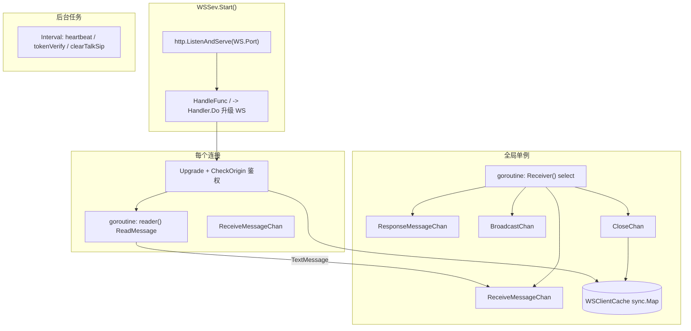
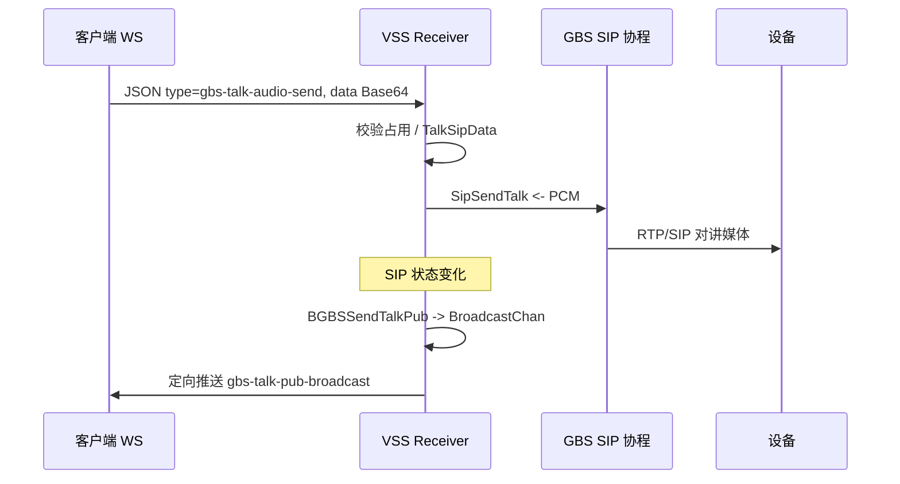

# VSS 中 WebSocket 架构设计

本文面向 **`core/app/sev/vss`** 信令服务内的长连接模块，说明其进程模型、连接鉴权、消息总线与业务扩展方式，便于阅读代码与二次开发。

**项目地址** [https://github.com/openskeye/go-vss](https://github.com/openskeye/go-vss)

---

## 一、定位与目标

|      | 说明                                                                                                                                          |
|--------|---------------------------------------------------------------------------------------------------------------------------------------------|
| **协议栈** | 基于 **Gorilla WebSocket**，独立 **HTTP Server** 监听 `Config.WS.Port`（与 Gin API、SSE 端口分离）。                                                        |
| **场景** | 实时信令辅助能力：如 **GB28181 语音对讲** 上行音频帧、SIP 状态通知、连接保活与登录态校验等。                                                                                     |
| **设计** | **读连接与业务处理解耦**（每连接 `reader` + 全局单协程 `Receiver`） **统一出站队列**（`ResponseMessageChan`） **连接索引**（`sync.Map`） **可扩展的路由表**（按 JSON `type` 分发）。 |

入口：`core/app/sev/vss/main.go` 中 `go server.NewWSSev(svcCtx).Start()`。

---

## 二、进程内组件一览

| 组件      | 路径                                              | 职责                                                                 |
|---------|-------------------------------------------------|--------------------------------------------------------------------|
| 服务启动    | `internal/server/ws.go`                         | 监听端口、启动 `Interval`、`Receiver`、注册 `/` 升级为 WebSocket。                |
| 握手与连接对象 | `internal/handler/ws/handler.go`                | `Upgrader`、**子协议鉴权**、构造 `WSClient`、启动 `reader`。                    |
| 消息总线    | `internal/handler/ws/proc.go`                   | `reader` 只负责读并投递 channel；`Receiver` 统一处理 **收/发/广播/关闭**。            |
| 路由与校验   | `internal/handler/ws/dispatch.go`、`register.go` | 按 `type` 找处理器、`RequestParse` + **validator**、请求超时 `WS.ReqTimeout`。 |
| 写回客户端   | `internal/handler/ws/response.go`               | `current`（本连接）、`somebody`（按 `ConnType+userid` 查缓存定向发送）。            |
| 定时策略    | `internal/handler/ws/interval.go`               | 活跃检测、Token 周期校验、对讲 SIP 会话闲置清理。                                     |
| 类型与上下文  | `internal/types/types.go`                       | `WSClient`、`WSProc`、`WSRequestContent` 等。                          |
| 依赖注入    | `internal/svc/service_context.go`               | 初始化各 channel 容量（默认 **100**）与 `WSClientCache`。                      |

---

## 三、连接建立与子协议鉴权

### 3.1 独立端口

`WSSev.Start` 使用标准库 `net/http`：

- 地址：`fmt.Sprintf("%s:%d", Config.Host, Config.WS.Port)`  
- 根路径 `"/"` 即 WebSocket 入口：`ws.NewWSSev(svcCtx).Do`

### 3.2 `Sec-WebSocket-Protocol`

握手时在 `Upgrader.CheckOrigin` 中读取 **`websocket.Subprotocols(r)`**，约定：

1. **必须为 2 段**：`[0]` = **连接类型** `ConnType`（如区分 frontend / backend），`[1]` = **加密 Token**。  
2. `ConnType` 非空；Token 经 **`pkg.NewAes(svcCtx.Config).ParseUserToken(token)`** 解析出用户 ID。  
3. 成功后设置 `client.Validate = true`，`Userid`、`ClientId`、`Token`；**`ClientId = MakeClientId(ConnType, userId)`**（`internal/pkg/make.go`，形如 `frontend:123`）。  
4. 写入 **`WSClientCache`**：先 `Delete(client)` 再 `Add`，同一 `ClientId` **后连踢前连**。

未通过校验则 `CheckOrigin` 返回 `false`，连接不会升级。

### 3.3 HTTP 侧 Token 签发

业务侧可先调 VSS HTTP：**`POST /api/ws-token`**（`internal/logic/http/base/ws_token.go`），Body `{"id": userid}`，返回 AES 包装的授权串，供 WebSocket 子协议第二段使用。

### 3.4 缓冲区

`ReadBufferSize` / `WriteBufferSize` 来自配置 **`WS.ReadBufferMaxSize`**、**`WS.WriteBufferMaxSize`**（`core/tps/conf/config.go`）。

---

## 四、单连接读循环与中央 `Receiver`

### 4.1 `reader(client)`

- 每个连接一个 goroutine，`ReadMessage()` 阻塞读取。  
- **仅处理文本帧** `websocket.TextMessage`：更新 `client.ActiveTime`，封装为 `WSMessageReceiveItem` 写入 **`WSProc.ReceiveMessageChan`**。  
- 关闭类错误：向 **`CloseChan`** 投递 `WSCloseChanItem`，结束循环。  
- 其它帧类型：视为异常，同样走关闭流程。

这样 **网络 I/O 不与业务互斥**，避免在读循环里做重逻辑。

### 4.2 `Receiver()`（单协程）

`select` 四路：

| Channel               | 行为                                                                                              |
|-----------------------|-------------------------------------------------------------------------------------------------|
| `ReceiveMessageChan`  | `parser` JSON → `WSRequestContent` → `dispatch` → 若有 `WSResponse` 则入队 `ResponseMessageChan`。    |
| `ResponseMessageChan` | `newResponse(...).current` 写回 **当前 Client**；写失败则 `CloseChan`；支持 **`AlterCall` 回调**（如先发错误帧再关连接）。 |
| `BroadcastChan`       | `newBroadcaster.dispatch`：按 `BroadcastMessageItem.Type` 查 **`broadcasters` 表** 执行广播逻辑。          |
| `CloseChan`           | `closer`：`IsClosed=true`，`sync.Once` 内删缓存、`Conn.Close()`。                                       |

**背压**：四类 channel 缓冲均为 **100**（`service_context.go`），高并发下需注意生产者阻塞风险，可按容量与业务峰值调参。

---

## 五、请求路由与上下文

### 5.1 报文格式

客户端 JSON 需可被反序列化为 **`WSRequestContent`**：`type`、`data`、`lan` 等；服务端补充 `MessageType`。

### 5.2 `dispatch`

1. 更新 `client.ActiveTime`。  
2. `context.WithTimeout(..., WS.ReqTimeout * time.Millisecond)` 包裹业务。  
3. `routers[req.Type]` 命中则调用对应 `handler(svcCtx, WSHandlerCallParams)`。  
4. `RequestParse`：`ConvInterface` + **`validator.Struct`**，校验失败返回 `WSResponse.Errors`。

### 5.3 已注册路由（示例）

定义于 **`internal/handler/ws/register.go`** 的 `routers`：

| `type`                | 行为概要                                                                                                             |
|-----------------------|------------------------------------------------------------------------------------------------------------------|
| `heartbeat`           | 空处理，依赖 Interval 侧活跃检测；客户端需周期性发送以刷新 `ActiveTime`。                                                                 |
| `gbs-talk-audio-send` | 对讲音频：占用检测、`TalkSipData`、Base64 解码后 **`SipSendTalk`** 下发 RTP/SIP 侧（`internal/logic/ws/r_gbs_talk_audio_send.go`）。 |

扩展新业务：**在 `routers` 增加 `type` → handler**，复杂逻辑放在 `internal/logic/ws/`。

---

## 六、出站：本连接与指定用户

`internal/handler/ws/response.go`：

- **`current`**：对当前 `WSClient.WebsocketConn` 写 JSON（`WSResponseMessage.ToRespMap()` 序列化）。  
- **`somebody(message, userid)`**：用 **`MakeClientId(当前 ConnType, userid)`** 在 **`WSClientCache.Row`** 查找，向 **另一用户同类型连接** 写消息（用于多端、多协同类场景）。

---

## 七、连接缓存与 `WSClient` 状态

- **`WSClientsCache`**：`sync.Map`，key = `ClientId`。  
- **`WSClient`** 关键字段：`Token`、`Userid`、`ClientId`、`ConnType`、`ActiveTime`/`ConnTime`（秒）、`Validate`、`IsClosed`、`SipTalkActivateKey`（对讲相关：与广播筛选有关）、`ResponseTo`（闭包引用 `somebody`）。

---

## 八、定时任务 `Interval`

`internal/handler/ws/interval.go` 在 `Start()` 时启动三个 goroutine：

### 8.1 `heartbeat`（1s）

- 遍历所有客户端：已关闭则 `closer`。  
- 若 **`now - ActiveTime >= WS.MaxLifetime`**：判定不活跃，断开（需客户端定期发消息或 `heartbeat` 类型刷新活跃时间）。  
- 若 **`now - ConnTime >= WS.AuthorizationLifetime` 且 `!Validate`**：断开长时间未成功鉴权的连接。

### 8.2 `tokenVerify`（20s）

- 对有 `Token` 的连接重新 `ParseUserToken`；失败则通过 **`ResponseMessageChan`** 下发 `type: "login"`、`errors: 登录超时`，并在 **`AlterCall`** 里再投递 **`CloseChan`**。

### 8.3 `clearTalkSipStatus`（1s）

- 扫描 **`TalkSipData`**，若 **`ActivateAt` 闲置超过 `WS.ClearTalkSipInterval`**，调用 **`RGBSTalkAudioStop`** 释放对讲资源。

---

## 九、广播：`BroadcastChan` 与对讲业务

### 9.1 数据结构与入口

- **`BroadcastMessageItem`**：`Type`、`Caller`、`Data`。  
- 业务侧通过 **`logic/ws`** 中如 **`BGBSSendTalkPub` / `BGBSSendTalkUsageStatus`** 等函数向 **`WSProc.BroadcastChan`** 投递事件（SIP Invite/ACK、对讲占用状态等场景会调用）。

### 9.2 分发与落地

`newBroadcaster(svcCtx).dispatch` 根据 **`broadcasters[req.Type]`** 调用注册的 `handler`。典型处理器（如 **`BGBSTalkPubLogic.Do`**）内部使用 **`broadcasts.sendWithActivateKey`**（`b_base.go`）：

- 遍历 **`WSClientCache`**；  
- 仅向 **`client.SipTalkActivateKey == key`** 的连接推送 **`ResponseMessageChan`**，实现 **按对讲会话 Key 定向多连接通知**，避免全局噪声。

### 9.3 扩展注意

新增广播类型时，应在 **`register.go` 的 `broadcasters`** 中注册 **`Type` → handler**（通常委托 `logic/ws` 中 `NewXXX(...).Do`）。若未注册，`BroadcastChan` 上的该 `Type` 将被静默忽略，需在联调时重点核对。

---

## 十、与 SIP/对讲的衔接（简图）

---

## 十一、配置项（`core/tps/conf/config.go` · `WS`）

| 字段                                         | 用途                                |
|--------------------------------------------|-----------------------------------|
| `Port`                                     | WebSocket 监听端口                    |
| `ReadBufferMaxSize` / `WriteBufferMaxSize` | Gorilla 读写缓冲                      |
| `MaxLifetime`                              | 无消息最大间隔（秒），超时断开                   |
| `AuthorizationLifetime`                    | 未验证连接最长存活（秒）                      |
| `ReqTimeout`                               | 单次路由处理超时（毫秒）                      |
| `ClearTalkSipInterval`                     | 对讲会话无操作清理阈值（毫秒，与 `ActivateAt` 比较） |

（配置文件中可能还有 `WaitTimeOut`、`HeartbeatTimer` 等字段，与 YAML 模板一致，以实际部署为准。）

---

## 十二、设计要点

1. **单写出口**：除 `reader` 内读操作外，向连接写数据尽量经 **`ResponseMessageChan`**，由 `Receiver` 串行化，降低与 `ReadMessage` 并发写竞态（仍需注意业务侧其它 goroutine 直接 `WriteMessage` 的风险，当前主干以 channel 为主）。  
2. **连接键策略**：`ConnType + 用户 ID` 决定 `ClientId`，支持同用户多连接时 **覆盖式** 登录。  
3. **关闭**：`CloseChan` + `sync.Once` 保证资源只释放一次。  

---

## 十三、相关源码索引

| 说明            | 路径                                                         |
|---------------|------------------------------------------------------------|
| 服务启动          | `core/app/sev/vss/main.go`                                 |
| WS Server     | `core/app/sev/vss/internal/server/ws.go`                   |
| 握手            | `core/app/sev/vss/internal/handler/ws/handler.go`          |
| 总线与读循环        | `core/app/sev/vss/internal/handler/ws/proc.go`             |
| 路由注册          | `core/app/sev/vss/internal/handler/ws/register.go`         |
| 定时任务          | `core/app/sev/vss/internal/handler/ws/interval.go`         |
| 类型定义          | `core/app/sev/vss/internal/types/types.go`（`websocket` 段落） |
| Context 初始化   | `core/app/sev/vss/internal/svc/service_context.go`         |
| WS Token HTTP | `core/app/sev/vss/internal/logic/http/base/ws_token.go`    |
| 对讲广播基类        | `core/app/sev/vss/internal/logic/ws/b_base.go`             |
