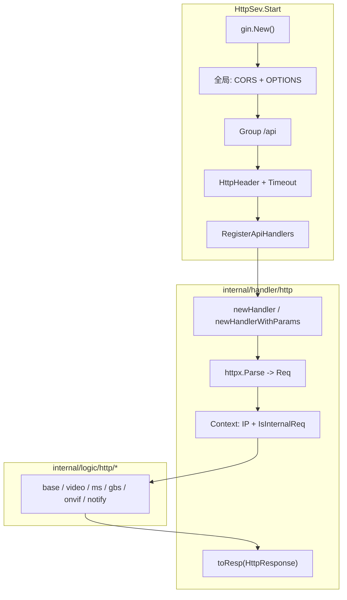

# VSS 中 HTTP 架构设计

本文说明 **`core/app/sev/vss`** 信令服务中 **REST/JSON HTTP API** 的分层结构：Gin 引擎、全局中间件、`/api` 路由组、泛型 Handler 与业务 Logic 契约，以及与 **SIP、流媒体（MS）、设备 RPC** 的协作关系。

**项目地址** [https://github.com/openskeye/go-vss](https://github.com/openskeye/go-vss)

---

## 一、在整体进程中的位置

| 项目 | 说明 |
|------|------|
| 启动 | `main.go` 中 `go server.NewHttpSev(svcCtx).Start()`，与 **SIP（TCP/UDP）**、**SSE**、**WebSocket** 并行运行。 |
| 监听 | `":" + Config.Http.Port`（仅端口，绑定 `0.0.0.0` 由 Gin 默认行为决定）。 |
| 框架 | **Gin**（`gin.New()`，默认 **ReleaseMode**）。 |
| API 前缀 | 业务接口统一挂在 **`/api`** 下（见 `internal/server/http.go`）。 |

---

## 二、分层结构总览



| 层级              | 路径                                                          | 职责                                                                       |
|-----------------|-------------------------------------------------------------|--------------------------------------------------------------------------|
| **Server**      | `internal/server/http.go`                                   | 创建 Engine、挂中间件、注册 `/api`、监听端口。                                           |
| **Handler**     | `internal/handler/http/handler.go`、`routers.go`             | 解析请求、注入 `Context`、调用 Logic、统一写出 JSON。                                    |
| **Logic**       | `internal/logic/http/{base,video,ms,gbs,onvif,notify}`      | 具体业务；实现 `Path()` + `New()` + `DO()` 契约。                                  |
| **Interceptor** | `internal/interceptor/http.go`                              | `/api` 组内：**超时**（及预留 Header Hooks）。                                      |
| **类型与上下文**      | `internal/types/types.go`、`internal/svc/service_context.go` | `HttpResponse`、`HttpRHandleLogic` / `HttpEHandleLogic`、`ServiceContext`。 |

---

## 三、Server 层：中间件与路由组

### 3.1 全局中间件（所有路径）

在 `router.Use` 中：

- **CORS**：`Access-Control-Allow-Origin: *`、Methods/Headers `*`、预检缓存 `Max-Age` 等。  
- **JSON 倾向**：`c.Set("content-type", "application/json")`。  
- **OPTIONS**：直接 **`204 No Content`** 并 `Abort`，便于浏览器跨域预检。

> 当前未默认启用 `gin.Logger()`，生产日志依赖项目统一 `logx` / 业务日志。

### 3.2 `/api` 组

```go
var aipGroup = router.Group("/api")
aipGroup.Use(interceptor.HttpHeader(), interceptor.Timeout(time.Duration(Config.Timeout)*time.Millisecond))
httpHandler.RegisterApiHandlers(svcCtx, aipGroup)
```

- **`HttpHeader()`**：现为透传 `Next()`，可扩展为统一鉴权/Trace 等。  
- **`Timeout(Config.Timeout)`**：对每个请求启 goroutine 执行 `c.Next()`，超时则 **`AbortWithStatusJSON(408, {"error":"request timeout"})`**。  
  - `Config.Timeout` 来自 **`VssSevConfig.Timeout`**（`core/tps/conf/config.go`，字段与 YAML 一致，在代码中与 `time.Millisecond` 相乘，**以实际配置文件为准**，常见为毫秒量级整型）。  
  - 注意：与「单接口长时间阻塞」（如设备录像轮询）需结合业务评估是否应调大超时或拆异步。

### 3.3 路由注册表

所有 HTTP 业务路由集中在 **`internal/handler/http/routers.go`** 的 **`RegisterApiHandlers`**，按领域分组：

| 分组         | 包路径                 | 典型能力                                   |
|------------|---------------------|----------------------------------------|
| **base**   | `logic/http/base`   | `/status`、`/device-videos`、`/ws-token` |
| **video**  | `logic/http/video`  | 取流地址、停流、流信息                            |
| **ms**     | `logic/http/ms`     | 流组、按名查录像、MS 配置、reload                  |
| **gbs**    | `logic/http/gbs`    | Catalog、Invite、StopStream、回放控制、订阅      |
| **onvif**  | `logic/http/onvif`  | 发现、设备信息、Profile                        |
| **notify** | `logic/http/notify` | **流媒体回调**：推/拉流、订阅、统计、HLS、帧信息等          |

完整路径以各 Logic 的 **`Path()`** 为准（例如 `GET /api/status`、`POST /api/video/stream` 等）。

---

## 四、Handler 层：泛型适配与统一响应

### 4.1 两种入口

定义于 `internal/handler/http/handler.go`：

1. **`newHandlerWithParams[Req, Logic]`**  
   - 使用 **`httpx.Parse`** 将 Query / Path / JSON Body 绑定到 **`Req`**。  
   - 调用 **`logic.New(ctx, c, svcCtx).DO(req)`**。

2. **`newHandler[Logic]`**（无请求体）  
   - 直接 **`logic.New(...).DO()`**，适用于纯 **GET** 或参数仅从 Path/Query 由 Logic 自行读取的场景（若仍用 `httpx.Parse` 需在 Logic 内处理，当前部分接口为无参 `DO()`）。

### 4.2 Context 注入

在调用 `New` 之前向 **`context.Context`** 写入：

| Key                                 | 含义                                                                                                   |
|-------------------------------------|------------------------------------------------------------------------------------------------------|
| `constants.HEADER_IP`               | `c.ClientIP()`，便于下游直接获取。                                                                             |
| `constants.CTX_VSS_IS_INTERNAL_REQ` | 是否「内部请求」：根据 **`Referer`** 的 host 是否为 `127.0.0.1` / `::1` / `localhost` 或 **`Config.InternalIp`** 判定。 |

业务可通过 **`contextx.GetIsInternalReq(ctx)`** 读取（例如 `internal/pkg/ms/api.go` 中按内外网区分行为）。

### 4.3 统一响应 `toResp`

Logic 返回 **`types.HttpResponse`**：

```go
type HttpResponse struct {
    Data interface{}
    Err  *response.HttpErr
}
```

- **`Err != nil`**：`response.New().RequestError(...)`，携带统一错误语义与 **`localization` 码**。  
- **`Data != nil`**：`Success` 写出业务数据。  
- **两者皆无 / `resp == nil`**：成功但 body 为 `nil`。

Handler 顶层有 **`recover`**， panic 时打栈日志，避免进程崩溃（与 Gin 默认行为叠加，以实际为准）。

---

## 五、Logic 层契约（接口驱动）

定义于 `internal/types/types.go`：

```go
type HttpHandleLogicBase[Logic any] interface {
    Path() string
    New(ctx context.Context, c *gin.Context, svcCtx *ServiceContext) Logic
}

type HttpRHandleLogic[Logic, Req any] interface {
    HttpHandleLogicBase[Logic]
    DO(req Req) *HttpResponse
}

type HttpEHandleLogic[Logic any] interface {
    HttpHandleLogicBase[Logic]
    DO() *HttpResponse
}
```

**约定习惯**：

- 每个接口一个 **单例指针**（如 `StatusLogic`、`VVideosLogic`），在 `routers.go` 中传给 `newHandler` / `newHandlerWithParams`。  
- **`New`** 注入 `ctx`、`gin.Context`、`ServiceContext`，便于读 Header、访问 **RPC/Redis/配置**。  
- **`DO`** 只做业务，不直接操作 `c.JSON`，保持 **可测** 与 **响应格式统一**。

**编译期检查**：Logic 文件内常见：

```go
var _ types.HttpEHandleLogic[*statusLogic] = (*statusLogic)(nil)
```

---

## 六、导航代码

### 6.1 `video`：播放与流信息

对接 VSS 内部能力与 MS/VSS 协作，如 **`StreamPlayLogic`** 生成播放相关能力、**`StreamStopLogic`** 停止会话等（具体见各文件 `DO`）。

### 6.2 `gbs`：国标信令侧 HTTP 触发

将 HTTP 转为 **channel 消息** 或 **SIP 发送**（如 Catalog、Invite、StopStream、订阅、回放控制），与 **`internal/logic/gbs_proc`** 协程配合。

### 6.3 `ms`：流媒体运维与查询

HTTP 代理调用 **MS 的 HTTP API**（`internal/pkg/ms`），如 all_groups、query_by_names、reload 等；部分逻辑结合 **`contextx.GetIsInternalReq`**。

### 6.4 `notify`：流媒体事件回调

MS/边缘服务向 VSS **POST** 各类事件；公共逻辑在 **`notify/common.go`**（如 **`setStreamState`**：解析 `stream_name`、校验通道存在、更新状态/保活）。与 **`stream.New().Parse`**、**设备 RPC** 强相关。

### 6.5 `onvif`：探测与元数据

设备发现、Profile 等，配置依赖 **`Config.Onvif`**。

### 6.6 `base`：状态与辅助

- **`/status`**：返回绑定地址、HTTP/SIP 端口、部分 SIP 参数（便于探活与运维）。  
- **`/device-videos`**：设备录像查询（SIP RecordInfo 聚合，见专项文档）。  
- **`/ws-token`**：签发 WebSocket 子协议用 Token。

---

## 七、与 WebSocket / SSE 的关系

| 通道        | 端口                 | 说明                                 |
|-----------|--------------------|------------------------------------|
| HTTP API  | `Config.Http.Port` | 本文主体，`/api/...`                    |
| WebSocket | `Config.WS.Port`   | 独立 `net/http`，见《VSS-WebSocket架构设计》 |
| SSE       | `Config.SSE.Port`  | 独立服务，运维状态推送等                       |

HTTP 中的 **`/ws-token`** 为 WebSocket 握手提供 Token，形成 **HTTP 辅助 + WS 长连接** 的组合。

---

## 八、扩展新接口的步骤建议

1. 在 **`internal/types`**（或现有 types 文件）增加 **请求/响应结构体**（若需要）。  
2. 在 **`internal/logic/http/<domain>`** 新增 `xxxLogic`，实现 **`HttpRHandleLogic` 或 `HttpEHandleLogic`**，实现 **`Path()`** 与 **`DO`**。  
3. 在 **`internal/handler/http/routers.go`** 中 **`router.GET/POST(..., newHandler...)`** 注册。  
4. 若需全链路超时，确认 **`Config.Timeout`** 是否足够；超长任务考虑异步化或单独调大（并评估 `Timeout` 中间件对 goroutine 的影响）。  
5. 若依赖内部调用方 **Referer**，注意网关/反向代理是否改写 **`Referer`**，以免影响 **`GetIsInternalReq`**。

---

## 九、设计要点小结

1. **前缀统一**：对外 JSON API 集中在 **`/api`**，与端口、文档、网关规则一致。  
2. **契约清晰**：`Path` + `New` + `DO` + `HttpResponse`，Handler 处理器、Logic 业务逻辑。  
3. **解析统一**：有 body 的接口优先 **`httpx.Parse`**，减少手写 `ShouldBind`。  
4. **横切能力**：CORS、OPTIONS、超时、（可扩展）Header 中间件；Context 注入 IP 与内部请求标记。  
5. **领域分包**：`gbs` / `video` / `ms` / `notify` / `onvif` / `base` 边界清楚，**notify** 与 MS 生命周期绑定紧密。

---

## 十、相关源码索引

| 说明                  | 路径                                                                              |
|---------------------|---------------------------------------------------------------------------------|
| HTTP 服务启动           | `core/app/sev/vss/internal/server/http.go`                                      |
| 泛型 Handler / toResp | `core/app/sev/vss/internal/handler/http/handler.go`                             |
| 路由注册                | `core/app/sev/vss/internal/handler/http/routers.go`                             |
| 超时与 Header 中间件      | `core/app/sev/vss/internal/interceptor/http.go`                                 |
| HTTP 契约类型           | `core/app/sev/vss/internal/types/types.go`（`HttpResponse`、`HttpRHandleLogic` 等） |
| 进程入口                | `core/app/sev/vss/main.go`                                                      |
| VSS 配置结构            | `core/tps/conf/config.go`（`VssSevConfig`）                                       |

---

*可与《VSS-WebSocket架构设计》对照阅读：二者共享 `ServiceContext`，但监听端口与协议模型不同。*
