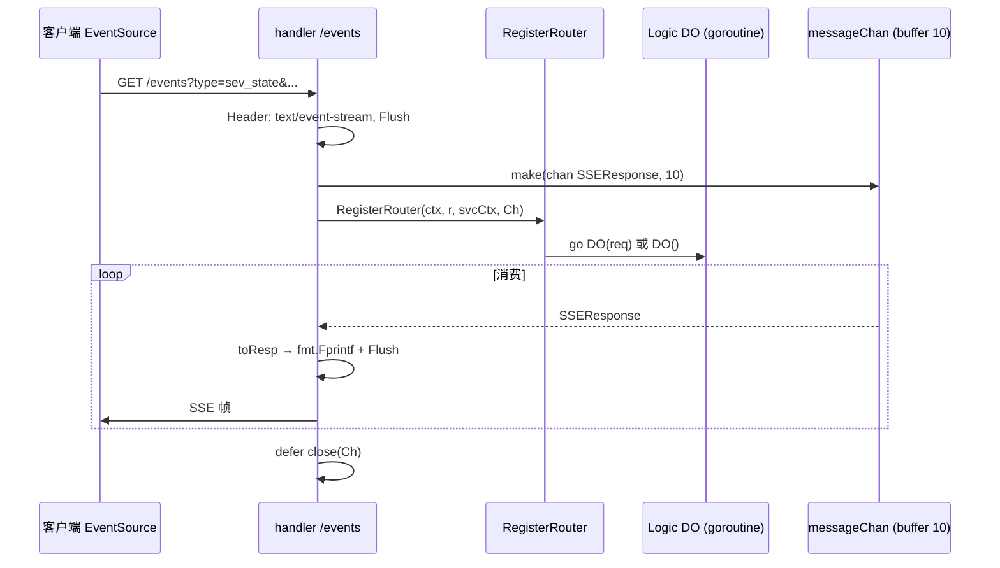

# VSS 中 SSE（Server-Sent Events）架构设计

本文说明 **`core/app/sev/vss`** 信令服务内 **SSE 长连接** 的实现方式：独立 HTTP 服务、`/events` 入口、按 `type` 路由到不同 Logic，以及 **`messageChan` → 文本帧 → Flush** 的推送模型。可与《VSS-HTTP架构设计》《VSS-WebSocket架构设计》对照阅读。

**项目地址** [https://github.com/openskeye/go-vss](https://github.com/openskeye/go-vss)

---

## 一、定位与进程角色

| 项目     | 说明                                                                                       |
|--------|------------------------------------------------------------------------------------------|
| **启动** | `main.go`：`go server.NewSSESev(svcCtx).Start()`，与 **Gin HTTP**、**WebSocket**、**SIP** 并行。 |
| **监听** | `Config.Host` + **`Config.SSE.Port`**（与 `Http.Port`、`WS.Port` 分离）。                       |
| **实现** | 标准库 **`net/http`**，**非 Gin**；单路由 **`GET /events`**。                                      |
| **用途** | 运维/诊断类 **服务端单向推送**：服务状态指标、SIP 日志流、下载进度、设备/通道诊断、设备在线状态等。                                  |

类型名 **`SSWSev`** 为历史命名（源码 `internal/server/sse.go`），语义上即 **SSE Server**。

---

## 二、整体数据流



**要点**：

1. 每个 SSE 连接独占一个 **`messageChan`**（缓冲 **10**）。  
2. Logic 通过 **`messageChan <- &SSEResponse{...}`** 产出事件；**`handler` 中的 `for range messageChan`** 统一写出并 **`http.Flusher.Flush()`**（在需分帧场景）。  
3. 请求生命周期绑定 **`r.Context()`**：`RegisterRouter` 将 **`context.WithCancel(r.Context())`** 传入各 Logic，客户端断开时可取消内部 **`select`**（具体 Logic 是否完全退出取决于是否仍向 channel 发送、以及 channel 何时关闭，见后文「生命周期」）。

---

## 三、HTTP 层：`handler` 与 SSE 帧格式

文件：`internal/server/sse.go`。

### 3.1 响应头

```text
Content-Type: text/event-stream
Cache-Control: no-cache
Connection: keep-alive
Access-Control-Allow-Origin: *
```

### 3.2 `toResp` 与 `SSEResponse` 语义

`types.SSEResponse`（`internal/types/types.go`）：

| 字段           | 含义                                                               |
|--------------|------------------------------------------------------------------|
| `Data`       | 业务负载；序列化后写入 SSE **data** 行。                                      |
| `Err`        | 错误；输出为 **`event: end`** + JSON `error` 字段，并结束本次连接循环。             |
| `Done`       | 正常结束；输出 **`event: end`** + `data: {}`。                           |
| `DelayClose` | 为 `true` 时，在 `defer` 中 **延迟 2s 再 `close(messageChan)`**（便于尾包发出）。 |

**帧拼装规则**（`toResp`）：

- **成功且带 `Data`**：`data: {"data": <JSON>}\n\n`，返回 **`flush=true`** → 写完后 **继续** `for range`（流式多帧）。  
- **`Err`**：`event: end\ndata: {"error":"..."}\n\n`，**`flush=false`** → 写出后 **跳出**循环。  
- **仅 `Done`**：`event: end\ndata: {}\n\n`，**跳出**循环。  
- 空字符串且非 Done：**跳出**循环。

前端可使用 **EventSource** 或自行解析 `data:` 行；嵌套结构为 **`{"data": ...}`**，与部分框架 data裸JSON 略有不同，联调时需注意。

---

## 四、路由：`type` 查询参数 + 注册表

文件：`internal/handler/sse/routers.go`。

- 根据 **`r.URL.Query().Get("type")`** **`switch`** 分发。  
- 带请求体的类型使用 **`sseHandler`**：  
  1. **`gorilla/schema`**：`Decode(req, r.URL.Query())`  
  2. **`go-playground/validator`**：`Struct(req)`  
  3. 校验失败向 **`messageChan`** 写入 **`SSEResponse{Err: ...}`**  
  4. **`go handler.DO(req)`** 在**独立 goroutine**中执行（避免阻塞 `RegisterRouter`）。  
- **`sip_logs`**：**同步**调用 **`VSipLogs.New(...).DO()`**（`DO` 内部再起 goroutine，自身立即返回）。

### 4.1 已支持的 `type` 一览

| `type` 值              | Logic                    | 说明                                                                                     |
|-----------------------|--------------------------|----------------------------------------------------------------------------------------|
| `sev_state`           | `SevState`               | 约 **1s** 推送一组服务内部计数（下载任务、Catalog/心跳 map、Invite 限流、WS 连接数等）。                            |
| `sip_logs`            | `SipLogLogic`            | SIP 收/发日志流；**全局单活**（`atomic.Bool`）；订阅 **`Broadcast`** 两路 topic；带 **1s heartbeat** 数据帧。 |
| `file_download`       | `FileDownloadLogic`      | 文件下载进度，通过 **`DownloadManager`** 拉文件并 **SSE 推送进度**；支持取消 query `cancel=1`。               |
| `device_diagnose`     | `DeviceDiagnose`         | 设备诊断（多阶段向 channel 推 `DeviceDiagnosesResp` 行）。                                          |
| `channel_diagnose`    | `ChannelDiagnose`        | 通道诊断（逻辑类似，步骤更多）。                                                                       |
| `device_online_state` | `DeviceOnlineStateLogic` | 设备在线状态相关推送。                                                                            |

未传 `type` 或无法识别：向 channel 写入 **`Err`（如 type 不能为空）**。

各 Logic 的 **`GetType()`** 与常量（如 `SevStateType`）需与前端约定一致。

---

## 五、Logic 层契约

定义于 `internal/types/types.go`：

```go
type SSEResponse struct {
    Data       interface{}
    Err        *response.HttpErr
    Done       bool
    DelayClose bool
}

// 带 URL 参数解析 + DO(req)
type SSEHandleLogic[Logic any, Req SSERequestType] interface {
    New(ctx context.Context, svcCtx *ServiceContext, messageChan chan *SSEResponse) Logic
    DO(req Req)
    GetType() string
}

// 无 Req，仅 DO() — 如 sip_logs
type SSEHandleSPLogic[Logic any] interface {
    New(ctx context.Context, svcCtx *ServiceContext, messageChan chan *SSEResponse) Logic
    DO()
    GetType() string
}
```

**约定**：

- **`New`** 注入 **`ctx`（可取消）**、`ServiceContext`、**`messageChan`**。  
- **`DO`** 内可多协程；向客户端推送**唯一途径**是写 **`messageChan`**（由 `handler` 统一编码）。  
- 长任务应在 **`select`** 中监听 **`ctx.Done()`**，避免协程泄漏。

---

## 六、典型实现摘析

### 6.1 `sev_state`：定时指标快照

- `time.NewTicker(1 * time.Second)`，每秒组装 `[]SSESevStateItem`。  
- 指标覆盖：`DownloadManager`、SIP 节流 map、Invite 限流、流存在表、SN map、级联、**`WSClientCache.Len()`** 等。  
- 适合 **状态获取 / 运维页** 订阅。

### 6.2 `sip_logs`：广播订阅 + 单连接互斥

- **`sipLogIsActive`**：同一时间只允许一路 **`sip_logs`** SSE，否则 **`Err`**「其他客户端正在使用」。  
- **`Broadcast.RegisterReceiver`** 订阅 **`BroadcastTypeSipRequest` / `BroadcastTypeSipReceive`**，将字符串日志包装为 `map[type,content]` 写入 **`messageChan`**。  
- 另起协程 **每秒** 推送 `content: "heartbeat"`，保持连接与前端心跳逻辑。  
- **`ctx.Done()`** 时：`sipLogIsActive` 置 false，发 **`Done: true`**，**UnregisterReceiver**，结束。

### 6.3 `file_download`：文件下载进度订阅

- Query：`url`、`filename`、`cancel` 等；与 **`DownloadManager`** 的 **Subscribe / Unsubscribe / Finished** 配合。  
- 进度更新按状态机推送 **`Data`**，完成/取消/错误时带 **`Done`** 或 **`Err`** 结束会话。

注意：使用`file_download`需要详细阅读`DownloadManager`实现与使用。

### 6.4 诊断类（device / channel）

- 多步骤 RPC/探测，**分多帧**推送 **`DeviceDiagnosesResp`**（`Line`/`Title`/`Value` 等），便于控制台逐行渲染；含超时与错误分支。

---

## 七、与 HTTP API、WebSocket 的对比

| 维度  | Gin HTTP `/api`   | SSE `/events`                        | WebSocket            |
|-----|-------------------|--------------------------------------|----------------------|
| 端口  | `Http.Port`       | `SSE.Port`                           | `WS.Port`            |
| 方向  | 请求-响应为主           | **服务端主导推送**                          | 双向                   |
| 框架  | Gin + httpx       | `net/http`                           | `net/http` + Gorilla |
| 鉴权  | 视网关/业务            | **当前 handler 未内置鉴权**，部署侧需网络隔离或反向代理校验 | 子协议 Token            |

SSE 适合 **单向、文本 JSON、浏览器 EventSource**；大流量二进制更偏向 WS 或独立下载接口。

---

## 八、背压与 channel 容量

- **`messageChan` 容量为 10**。Logic 若在短时内连续发送超过 10 条且 **`handler` 未及时消费**，**发送方会阻塞**。  
- 高频场景（如 SIP 日志洪峰）需控制上游广播速率，或评估 **增大缓冲 / 丢弃策略**。  
- **`Flush`** 每次写后刷新，减少代理缓冲导致的延迟。

---

## 九、连接生命周期说明

- **`handler` 的 `defer`** 在 **`for range messageChan` 退出后** `close(messageChan)`（若 `DelayClose` 则延迟 2s 再 close）。  
- **长连接类 Logic**（如 `sev_state`）仅在 **`ctx.Done()`** 时停止发送；若客户端断开而 **channel 未再收到结束帧且未 close**，理论上 **`range` 可能长期阻塞**——生产环境建议结合 **代理超时、客户端重连**，或在演进中在 **`handler` 侧 `select` `ctx.Done()` 与 `messageChan`** 做联合消费（属增强项，以当前源码为准）。

---

## 十、扩展新 SSE 能力的步骤

1. 在 **`internal/logic/sse`** 新增 Logic，实现 **`SSEHandleLogic` 或 `SSEHandleSPLogic`**，定义 **`GetType()`** 常量。  
2. 在 **`internal/handler/sse/routers.go`** 的 **`switch`** 增加 **`case`**：  
   - 有 Query 结构体 → **`sseHandler(...)`**；  
   - 无参或特殊启动方式 → 与 **`sip_logs`** 类似直接 **`New(...).DO()`**。  
3. 约定 **Query 字段 tag**（`form`/`validate`）与前端 **`/events?type=...`** 一致。  
4. 评估 **推送频率** 与 **channel 缓冲**，避免阻塞 Logic。  
5. 若对公网开放，在 **网关** 上补 **认证、限流、IP 白名单**。

---

## 十一、相关源码索引

| 说明          | 路径                                                                         |
|-------------|----------------------------------------------------------------------------|
| SSE 服务启动与写出 | `core/app/sev/vss/internal/server/sse.go`                                  |
| 路由与参数解析     | `core/app/sev/vss/internal/handler/sse/routers.go`                         |
| 类型契约        | `core/app/sev/vss/internal/types/types.go`（`SSEResponse`、`SSEHandleLogic`） |
| 各业务 Logic   | `core/app/sev/vss/internal/logic/sse/*.go`                                 |
| 进程入口        | `core/app/sev/vss/main.go`                                                 |
| SSE 端口配置    | `core/tps/conf/config.go` → `VssSevConfig.SSE.Port`                        |
