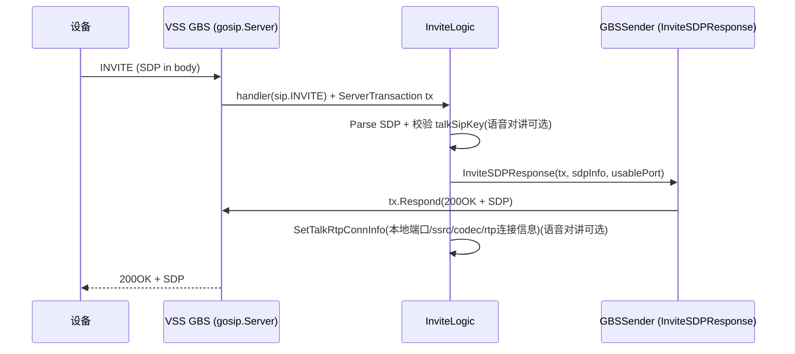
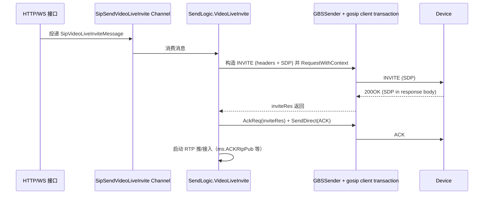

## 基于VSS的gosip实战教程：从server到收发信令

本篇以 `core/app/sev/vss` 为参照，讲解VSS是如何接入 `github.com/ghettovoice/gosip`，用来完成 SIP 信令的“从收请求、到响应，再到主动发起发起请求，以 INVITE+ACK为例。

参考代码 [点击直达](https://github.com/yyyirl/go-vss/blob/main/core/app/sev/vss)


为便于落地，下面会用 `INVITE` 贯穿两条典型链路：

1. 入站 `INVITE`（设备 -> VSS）：VSS 的 `InviteLogic` 负责解析 SDP、分配本地 RTP 端口、回 200OK+SDP。
2. 出站 `INVITE`（VSS -> 设备）：VSS 的 `VideoLiveInvite` 负责构建 SDP、发起 INVITE、解析响应 SDP、再发 ACK。

---

## 1. VSS 中 gosip 的角色

在 `core/app/sev/vss` 中，`gosip.Server` 既承担“服务端（接收设备请求）”，也承担“客户端（主动发起请求）”的事务层能力：

- 作为服务端：`server.NewSipSev(svcCtx).SipGbsServer(...)` 创建 `gosip.NewServer(...)`，并用 `OnRequest` 把 `REGISTER / INVITE / ACK / BYE / MESSAGE` 等方法路由到业务 handler。
- 作为客户端：出站发起 SIP 时，`GBSSender.Send()` 会根据 `TransportProtocol` 选择 `GBSUDPSev / GBSTCPSev`，然后调用 `RequestWithContext(ctx, req)` 等待事务返回的最终响应。

---

## 2. 创建服务

VSS 程序入口在 `core/app/sev/vss/main.go`。启动顺序可以概括为：

- 加载配置、创建 `svcCtx`
- 初始化（`initialize.DO`）
- 启动两个 SIP Server：GBS over `TCP` + `UDP`
- 启动 SIP 发送处理循环（`gbs_proc.SendLogic` 等）
- 等待退出并调用 `Shutdown()`

`main.go` 中与 SIP Server 相关的关键代码片段如下：

```go
// SIP 服务器
{
	var wg sync.WaitGroup
	wg.Add(2)

	// GBS TCP
	go func() {
		defer wg.Done()
		server.NewSipSev(svcCtx).SipGbsServer(server.SipTCP, gbs_sip.RegisterHandlers(svcCtx))
	}()

	// GBS UDP
	go func() {
		defer wg.Done()
		server.NewSipSev(svcCtx).SipGbsServer(server.SipUDP, gbs_sip.RegisterHandlers(svcCtx))
	}()

	wg.Wait()
}
...
server.NewSipProc(svcCtx).DO(
	// ...
	new(gbs_proc.SendLogic),
	// ...
)

<-stop
{
	(*svcCtx.GBSTCPSev).Shutdown()
	(*svcCtx.GBSUDPSev).Shutdown()
}
```

---

### 2.1 `SipGbsServer`：真正创建 gosip.NewServer + 监听 + 挂载 handler

`SipGbsServer` 在 `core/app/sev/vss/internal/server/sip.go` 中实现。它完成了四件事：

1. 等待初始化就绪：`svcCtx.InitFetchDataState.Wait()`，这一步也是vss项目中所有服务的数据依赖
2. 创建 gosip server：`gosip.NewServer(...)`
3. 注册每个 SIP 方法的回调：`sipSvr.OnRequest(key, item)`
4. 开始监听：`sipSvr.Listen(network, addr)`，并写回 `svcCtx.GBSUDPSev/GBSTCPSev`

节选代码：

```go
var (
	sipSvr = gosip.NewServer(gosip.ServerConfig{Host: s.svcCtx.Config.InternalIp}, nil, nil, NewLogger())
	addr   = fmt.Sprintf("%s:%d", s.svcCtx.Config.Host, s.svcCtx.Config.Sip.Port)
)

for key, item := range handlers {
	if err := sipSvr.OnRequest(key, item); err != nil {
		functions.LogError(fmt.Sprintf("Sip GBS Request [%S] err: %s", key, err.Error()))
	}
}

if err := sipSvr.Listen(string(networkType), addr); err != nil {
	panic(err)
}

if networkType == SipTCP {
	s.svcCtx.GBSTCPSev = &sipSvr
} else {
	s.svcCtx.GBSUDPSev = &sipSvr
}
```

---

### 2.2 `RegisterHandlers`：把 SIP 方法路由到业务逻辑

`core/app/sev/vss/internal/handler/gbs_sip/routers.go` 定义了路由表。以 `INVITE` 为例：

```go
sip.INVITE: func(req sip.Request, tx sip.ServerTransaction) {
	sip2.DO("GBS", svcCtx, req, tx, nil, new(gbssip.InviteLogic))
},
```

这意味着：gosip 收到 `INVITE` 后，会进入 `sip2.DO`，最终由 `InviteLogic.DO()` 处理业务。

---

## 3. 入站 INVITE（设备 -> VSS）：InviteLogic 响应 200OK + SDP

入站 INVITE 的处理链路可以按“包装层 + 业务层”拆开：

1. gosip 触发 handler：`OnRequest(sip.INVITE, handler)`
2. `sip2.DO(...)` 做通用处理（解析请求、黑名单校验、错误语义、统一响应策略）
3. 调用 `InviteLogic.DO()` 实现 INVITE 的具体业务（解析 SDP、校验、分配端口、回包）

---

### 3.1 统一入口：`sip2.DO` 怎么把 sip.Request 变成你们的 types.Request

在 `core/app/sev/vss/internal/pkg/sip/sip_handler.go` 中，`DO()` 做了这些关键事情：

- 调用 `ParseToRequest(h.req)` 解析 `From`、`Source`、`Body`、`Via` 等信息，生成 `*types.Request`
- 维护日志：写入 `svcCtx.SipLog`
- 超时控制：`context.WithTimeout(..., svcCtx.Config.Timeout)`
- 调用业务逻辑：`h.logic.New(ctx, h.svcCtx, data, h.tx).DO()`
- 根据 `types.Response` 决定是否响应、如何响应

`ParseToRequest` 的关键点在 `core/app/sev/vss/internal/pkg/sip/utils.go`：

- `ID` 来自 `req.From().Address.User().String()`
- `TransportProtocol` 从 `ViaHop.Transport` 推断（UDP/TCP 等）
- `Body` 就是 `req.Body()`（INVITE 的 SDP 正在这里）

---

### 3.2 业务层：`InviteLogic.DO()` 做了什么

入站 INVITE 的核心代码在 `core/app/sev/vss/internal/logic/gbs_sip/invite.go`，它的流程可以概括为：

1. 解析 SDP：
   - `sdpInfo, err := sdp.ParseString(l.req.Original.Body())`
   - 检查 `len(sdpInfo.Media) > 0`
2. 校验请求是否合法：
   - 通过 `l.req.ID` 去 `svcCtx.TalkSipData` 的 key 里查找匹配（避免“未知对讲会话”被错误启动）
3. 分配本地端口：
   - `usablePort := common.UsablePort(l.svcCtx)`
   - 这里会跳过当前正在占用的端口，并检查系统可用性
4. 直接用 `ServerTransaction` 回 200OK + SDP：
   - `sip2.NewGBSSender(...).InviteSDPResponse(l.tx, sdpInfo, usablePort)`
   - 这一步会调用 `tx.Respond(resp)` 把响应发回去
5. 写入 RTP 连接信息（供后续音频 RTP 发送/接收使用）：
   - `common.SetTalkRtpConnInfo(svcCtx, sdpInfo, talkSipKey, usablePort)`
6. 返回 **`Ignore: true`**❗❗❗：
   - 表示“响应已经在 InviteSDPResponse 里完成了”，不要让 `sip2.DO` 继续再做一层默认 OK 回包

如果你想快速理解为什么入站 `INVITE` 必须先回 SDP 再写缓存，可以重点看 `common.SetTalkRtpConnInfo`（`core/app/sev/vss/internal/pkg/common/talk.go`）做了这些事：

- 从 SDP 的 `Media[0]` / `Media[].Formats[]` 中推导音频 codec：`PCMA / PCMU / AAC` 对应 payloadType 与 sampleRate
- 从 SDP 的 `SSRC`（有些设备带前缀时会裁剪）解析出数字型 SSRC，并写入缓存
- 把本次可用端口 `usablePort` 写入 `RTPUsablePort`，并计算 `RTPRtpPort/RTPRtcpPort` 的对应关系
- 把 `sdpInfo.Connection.Address` 写入 `RTPRemoteIP`，为后续 RTP 通信准备“对端 IP + 本端端口”

“先自定义响应，再返回 Ignore”的模式在 `InviteLogic` 里是明确存在的：

```go
// 回复invite 200OK
if err := sip2.NewGBSSender(l.svcCtx, l.req, l.req.ID).InviteSDPResponse(l.tx, sdpInfo, usablePort); err != nil {
	return &types.Response{Error: types.NewErr(err.Error())}
}
...
return &types.Response{Ignore: true}
```

---

### 3.3 入站 INVITE 时序图（设备 -> VSS GBS）

注意区分`GBS`与`GBC`的区别



---

## 4. 出站 INVITE（VSS -> 设备）：VideoLiveInvite + ACK

出站 INVITE 没有走 `InviteLogic`（因为 `InviteLogic` 是服务端接收 INVITE 的 handler）。出站 INVITE 的触发链路是：

1. 外部 HTTP 触发“拉流/回放”入口（例如 `video_live_invite.go`）
2. 把“需要发起 INVITE 的参数”投递到 `svcCtx.SipSendVideoLiveInvite` channel
3. `gbs_proc.SendLogic` 循环消费该 channel
4. `SendLogic.VideoLiveInvite` 调用 `sip2.NewGBSSender(...).VideoLiveInvite(req)`
5. `GBSSender.VideoLiveInvite` 构建 INVITE 的 SDP 并通过 gosip 的 `RequestWithContext` 发起请求
6. 收到响应后解析 SDP，并构建 ACK 再发一次

---

### 4.1 触发点：HTTP 逻辑如何投递 `SipSendVideoLiveInvite`

HTTP 入口在 `core/app/sev/vss/internal/logic/http/gbs/video_live_invite.go`。在准备好 stream/media server 信息后，会做：

```go
l.svcCtx.SipSendVideoLiveInvite <- &types.SipVideoLiveInviteMessage{
     StreamPort:     streamRes.StreamPort,
     MediaTransMode: streamRes.TransportProtocol.MediaTransMode,
     MediaServerUrl: streamRes.MediaServerUrl,
     MediaServerIP:  msIP,
     MediaServerPort: streamRes.MSNode.HttpPort,
     StreamName:     streamName,
     PlayType:       args.PlayType,
     ChannelUniqueId: args.ChannelItem.UniqueId,
     DeviceUniqueId:  args.DeviceUniqueId,
     Req:             sipReqRes.Req,
     TransportProtocol: args.DeviceItem.TransportProtocol(),
     Download: args.Download,
 }
```

---

### 4.2 `SendLogic.VideoLiveInvite`：主动发 INVITE，并在响应后发 ACK

核心在 `core/app/sev/vss/internal/logic/gbs_proc/send_sip_proc.go` 的 `VideoLiveInvite`：

握手顺序工作：

- `invite -> ack(from to tag callid) -> info(...) -> notify(...) -> bye`

其中最与 gosip 直接相关的是 INVITE/ACK 两步：

1. INVITE：
   - `inviteData, inviteRes, err := sip2.NewGBSSender(...).VideoLiveInvite(req)`
   - 要检查成功 `inviteRes.StatusCode()` （项目里允许 `<= 200`）
2. ACK：
   - `ackData, err := sip2.NewGBSSender(...).AckReq(inviteRes)`
   - `sip2.NewGBSSender(...).SendDirect(ackData)` 把 ACK 发出去

紧接着它会把响应 SDP 再解析一遍，然后启动 RTP 相关流程（`ms.New(...).ACKRtpPub(...)`）。其中最关键的输入是：

- `sdpInfo.Media[0].Port`：RTP 端口
- `sdpInfo.Connection.Address`：远端 IP
- `filesize`：从 SDP 的 `attributes` 里提取（用于后续 RTP/下载控制等）

---

### 4.3 `GBSSender.VideoLiveInvite`：如何构造 INVITE + SDP

`core/app/sev/vss/internal/pkg/sip/gbs_send.go` 中，`VideoLiveInvite()` 会：

1. 组装 SIP 头：
   - `Via / From / To / Call-ID / User-Agent`
   - `CSeq: INVITE`
   - `Content-Type: Application/SDP`
2. 生成 SDP：
   - video media（PS/MPEG4/H264/H265）
   - `Connection/Origin` 使用 `MediaServerIP`、`ChannelUniqueId`、本地 `Sip.ID` 等
   - 根据 `PlayType` 决定是否走 playback 分支，并设置 `Subject` header
3. `makeRequest(sip.INVITE, headers, body)` 构造 sip.Request
4. `l.Send(request)` 触发 gosip 的出站事务

其中 `l.Send()` 是这样选 transport server 的（简化描述）：

- `l.req.TransportProtocol == "UDP"` -> 调 `GBSUDPSev.RequestWithContext`
- 否则 -> 调 `GBSTCPSev.RequestWithContext`

---

### 4.4 出站 INVITE 时序图（VSS -> 设备）



---

## 5. 哪些字段必须保持一致 ❗❗❗❗❗❗❗❗❗❗

**在 `send_sip_proc.go` 里有非常关键的点**：

> `invite -> ack(from to tag callid) -> notify(...) -> bye`
>
> `从ack开始 from to tag callid到后续流程这几个值需要保持一致`

参考代码 [点击直达](https://github.com/yyyirl/go-vss/blob/main/core/app/sev/vss/internal/logic/gbs_proc/send_sip_proc.go#L260) `core/app/sev/vss/internal/logic/gbs_proc/send_sip_proc.go:260`

结合 `GBSSender.AckReq(resp sip.Response)` 的实现，可以看出 ACK 依赖响应里的：

- `Call-ID`：从 `inviteRes.CallID()` 提取
- `To/From`：从 `inviteRes.To()` / `inviteRes.From()` 取回

所以当需要扩展更多 SIP 方法（比如补齐 catalog/notify/broadcast 或者增加 talk 完整版流程）时，务必从：

- 发起方构造的请求头字段
- 响应方回来的 To/From/Call-ID/CSeq

注意这两端做字段对齐

---

## 6. 阅读代码的推荐路线，最快把握 gosip 集成方式

如果你要快速理解 VSS 如何使用 gosip，建议按下面顺序读：

1. [core/app/sev/vss/main.go](https://github.com/yyyirl/go-vss/blob/main/core/app/sev/vss/main.go)：服务启动与退出流程
2. [core/app/sev/vss/internal/server/sip.go](https://github.com/yyyirl/go-vss/blob/main/core/app/sev/vss/internal/server/sip.go)：`gosip.NewServer + Listen + OnRequest`
3. [core/app/sev/vss/internal/handler/gbs_sip/routers.go](https://github.com/yyyirl/go-vss/blob/main/core/app/sev/vss/internal/handler/gbs_sip/routers.go)：方法路由表（INVITE -> InviteLogic）
4. [core/app/sev/vss/internal/pkg/sip/sip_handler.go](https://github.com/yyyirl/go-vss/blob/main/core/app/sev/vss/internal/pkg/sip/sip_handler.go)：`sip2.DO` 通用解析/响应框架
5. [core/app/sev/vss/internal/logic/gbs_sip/invite.go](https://github.com/yyyirl/go-vss/blob/main/core/app/sev/vss/internal/logic/gbs_sip/invite.go)：入站 INVITE 的业务实现
6. [core/app/sev/vss/internal/logic/http/gbs/video_live_invite.go](https://github.com/yyyirl/go-vss/blob/main/core/app/sev/vss/internal/logic/http/gbs/video_live_invite.go)：出站 INVITE 的触发入口
7. [core/app/sev/vss/internal/logic/gbs_proc/send_sip_proc.go](https://github.com/yyyirl/go-vss/blob/main/core/app/sev/vss/internal/logic/gbs_proc/send_sip_proc.go)：出站 INVITE + ACK 的握手编排
8. [core/app/sev/vss/internal/pkg/sip/gbs_send.go](https://github.com/yyyirl/go-vss/blob/main/core/app/sev/vss/internal/pkg/sip/gbs_send.go)：INVITE/ACK SDP 与 header 的构造

---

## 7. 注意事项

- `sip.INVITE` 的入站场景与 `GBSSender.VideoLiveInvite` 的出站场景区分清楚（同为 INVITE，但 SDP/缓存 key/媒体类型不同）
- `Ack` 后续的 RTP 协议入参与 SDP 中的 `connection/ssrc/port/codec` 做一致性校验（避免问题难排查）
- GBC是信令下级服务器 （平台或者设备端）实际与GBS使用方式大体一致，需要注意的是GBC是设备方，而GBS是作为上级信令服务器
- 如果在同样的工程结构里实现完整的信令服务器（比如`catalog` / `register` / `keepalive` / `bye` 等），需要严格按照项目结构注册路由等


