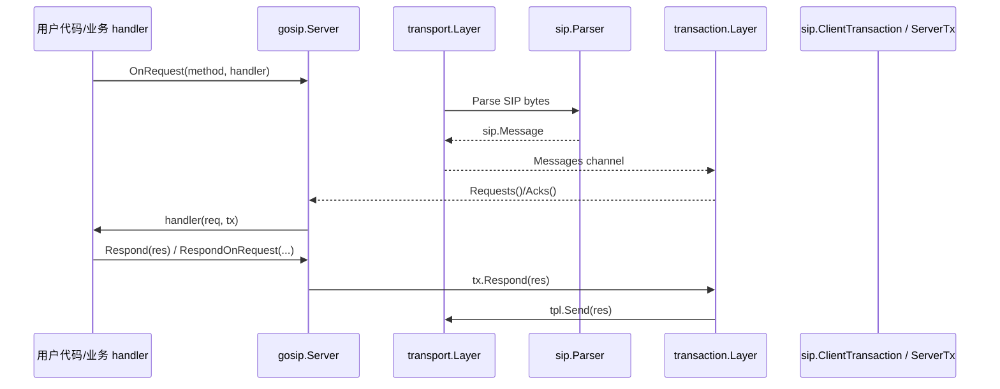

## GoSIP 功能简介与技术解读：用 Go 实现 RFC 3261 的 SIP 栈

`ghettovoice/gosip` 是一个用 Go 编写的 SIP（Session Initiation Protocol）协议栈实现，目标覆盖 RFC 3261 的关键能力：消息模型、解析/构建、事务状态机、传输层，以及面向业务的 Server 编程接口。

协议标准参考：RFC 3261（[IETF](https://tools.ietf.org/html/rfc3261)）

项目地址：[`ghettovoice/gosip`](https://github.com/ghettovoice/gosip)

---

## 1. 总体架构：Server 分层编排 + 传输/事务/消息解耦

从源码目录和模块划分（`server.go`、`transport/`、`transaction/`、`sip/`）可以把 gosip 抽象成四层：

- **Server（应用编排层）**
  - 负责接收传输/事务层上报的请求或 ACK
  - 按 `RequestMethod` 路由到业务注册的 handler
  - 提供 `Request(...)` / `RequestWithContext(...)` 这种“发起请求并等待响应”的 API
  - 提供 `Respond(...)` / `RespondOnRequest(...)` 回包能力
- **Transport（传输层）**
  - 支持 UDP/TCP/TLS/WS/WSS 等网络协议
  - 负责监听、发送与消息解析产出 `sip.Message`
- **Transaction（事务状态机层）**
  - 实现 SIP Transaction Layer（客户端事务、服务器事务）
  - 使用 FSM + RFC 定时器管理重传、超时、ACK/CANCEL 相关流程
  - 对外暴露统一的通道/接口（`Requests()`、`Acks()`、`Responses()`、`Errors()`）
- **SIP（消息模型层）**
  - 定义 `sip.Message`、`sip.Request`、`sip.Response` 等接口与数据结构
  - 实现报文构建器（`sip/builder.go`）与解析器（`sip/parser/*`）
  - 提供 Digest 等认证能力（`sip/auth.go`）

这种解耦的好处是：你可以在不改业务逻辑的前提下，替换传输实现或复用事务/消息模型。

---

## 2. Server：路由请求、发起请求、上下文等待响应

### 2.1 `OnRequest`：按方法注册回调

Server 在创建时会初始化传输层与事务层（`transport.Layer` 与 `transaction.Layer`）。

业务侧通过：

- `OnRequest(method, handler)` 注册回调

当事务层上报新请求时，Server 会在 `handleRequest` 中按 `req.Method()` 查表路由到对应 handler。

若找不到 handler：

- 对非 ACK 请求：自动构造 `405 Method Not Allowed` 并回包
- 对 ACK：跳过响应阶段（ACK 场景没有完整事务响应）

### 2.2 发起请求：`RequestWithContext`

Server 提供：

- `Request(req)`：返回 `sip.ClientTransaction`
- `RequestWithContext(ctx, request, options...)`：返回最终 `sip.Response`（支持等待与取消）

在 `RequestWithContext` 中，Server 会：

- 创建 client transaction
- 启动 goroutine 监听：
  - `tx.Responses()`：区分 provisional / success / failure
  - `tx.Errors()`：事务错误上报
- 将 ctx.Done() 作为取消信号，触发 `tx.Cancel()`

此外还支持：

- `ResponseHandler`：每个收到的响应都可回调
- `Authorizer`：如果遇到 `401/407`，基于 Authorizer 进行认证并重试请求

### 2.3 自动补齐头字段

Server 的发送/回包前会执行 `appendAutoHeaders`，用于补齐例如：

- 缺少 `User-Agent`：追加默认 UA
- 缺少 `Server`：追加默认 Server header
- 对部分方法（如 `INVITE/REGISTER/OPTIONS/REFER/NOTIFY`）补齐 `Allow` 与 `Supported`（取决于已注册 handlers 与 extensions）
- 缺少 `Content-Length`：保证 body 长度一致

---

## 3. SIP 消息模型：线程安全的 headers + 明确的 request/response 接口

`sip/` 包里的关键点包括：

- `sip.Message` 抽象统一了：
  - `StartLine()` / `String()` / `Body()` / `SetBody()`
  - headers 管理（`AppendHeader/PrependHeader/ReplaceHeaders/...`）
  - 常用 getter（如 `CallID`、`Via`、`From`、`To`、`CSeq`、`Content-Length` 等）
- `sip.Request`：
  - 提供 `Method()`、`Recipient()`、`IsInvite()`、`IsAck()`、`IsCancel()` 等
  - `StartLine()` 会按 request line 规则组装：`METHOD recipient SIP/2.0`
  - `Transport()` 会结合 `Via`、Route、URI 参数、MTU 规则进行推断（例如 UDP 太大可能切换到 TCP）
  - `Source()/Destination()` 会从 Via/Route/URI 推断端点信息
- `sip.Response`：
  - 提供 `StatusCode()`、`Reason()`、`Previous()`（保存 provisional responses）
  - `StartLine()` 输出为 status line：`SIP/2.0 200 OK`
  - `IsProvisional/IsSuccess/...` 用于分类响应

headers 的内部实现通过锁保证并发安全，同时维护 header 输出顺序（`headerOrder`）。

---

## 4. 报文构建与解析：Builder + PacketParser（支持 packet 与 streamed）

### 4.1 Builder：`sip/builder.go`

`RequestBuilder` 提供链式构建请求：

- 默认生成 `Call-ID`、`CSeq`、`User-Agent`、`Max-Forwards`
- 支持设置：
  - transport、host、method、recipient、body、call-id、via
  - From/To/Contact/Expires/User-Agent 等标准头
  - Accept/Require/Supported/Route 等能力头
- 以统一方式输出规范 SIP 报文

### 4.2 Parser：`sip/parser/*`

解析器核心是 `Parser` 接口（`Write` 入队、`ParseHeader` 注册自定义 header parser、`Stop/Reset` 控制状态）。

`PacketParser` 会：

- 通过双 CRLF 定位 body 起点并判断 body 长度
- 解析 start line（request 或 response）
- 解析 headers：
  - 支持 header fold（续行行首为空白字符）
  - 维护 header 解析策略：对已注册的 headerName 使用对应 parser，否则使用 `GenericHeader` 封装
- 解析 body：
  - 校验长度与 `Content-Length` 一致
  - 返回 `BrokenMessageError` 等结构化错误（便于上层处理）

流式解析（`streamed` 模式）则依赖 `Content-Length`，用于 TCP 等无法可靠识别消息边界的场景。

---

## 5. Transaction：客户端事务与服务器事务（FSM + RFC 定时器）

事务层是 gosip 最核心、也最“贴 RFC”的部分。

### 5.1 事务接口

事务层对外统一暴露：

- 客户端事务：`ClientTx` / `Responses()` / `Cancel()` / `OnAck/OnCancel`
- 服务器事务：`ServerTx` / `Respond(res)` / `Acks()` / `Cancels()`

事务层内部通过 `MakeClientTxKey` / `MakeServerTxKey` 生成交易匹配 key，用于关联重传、ACK、CANCEL 与最终响应。

### 5.2 FSM 状态与输入

客户端事务在 `client_tx.go` 中会：

- 初始化 FSM（`initFSM`）
- 设置定时器：
  - 不可靠传输启动 Timer A（request 重传）
  - 通用启动 Timer B（超时）
  - reliable transport 则按 RFC 规则调整
- 在 `Receive` 时把 response 归类为：
  - 1xx / 2xx / 300+，分别映射到不同 FSM 输入

服务器事务在 `server_tx.go` 中会：

- 根据 origin 是否 INVITE 选择不同 FSM 初始化策略
- 为 INVITE 触发 Timer 1xx，定时返回 `100 Trying`
- 在 `Receive` 中处理：
  - 与 origin 方法匹配的 request
  - ACK 与 CANCEL 的输入映射

这些行为让上层业务只需要关注 `Respond()`，无需关心重传/超时的复杂性。

---

## 6. Transport：网络协议适配层（UDP/TCP/…）

transport 层提供统一接口：

- `Listen(network, addr, options...)`
- `Send(msg)`
- `Messages()`：上送解析后的 `sip.Message` 给事务层
- `Errors()`：网络/连接错误上报
- `IsReliable()`、`IsStreamed()`：给事务层决定定时器策略

在 `transport/layer.go` 中，按网络名选择协议实现：

- `udp` -> `NewUdpProtocol`
- `tcp` -> `NewTcpProtocol`
- `tls/ws/wss` 等对应实现

### 6.1 发送时的 Via rewrite 与 DNS SRV

`Send(msg)` 中对 request 会执行：

- rewrite Via 的 `sent-by`：
  - Transport 改写为实际 transport
  - Host 改写为本机 IP
  - 端口推断（如果未填，基于监听端口集合补齐或使用默认端口）
- 如果目的 host 不是 IP，会做 DNS SRV lookup（`LookupSRV("sip", proto, target.Host)`），选择合适的地址与端口后发送

### 6.2 UDP 与 TCP 的差异

- UDP：
  - `udpProtocol.Listen()` 创建 UDP conn 并放入 ConnectionPool
  - `Send()` 遍历 pool 按端口匹配连接并写入 `msg.String()`
- TCP：
  - 通过 ListenerPool 和 ConnectionPool 管理监听器与连接
  - 通过新连接事件 pipePools() 把连接交给连接池服务

---

## 7. 认证能力：Digest（MD5）与挑战应答重试

`sip/auth.go` 提供 Digest 认证（当前实现支持 Digest + MD5）。

核心包括：

- 从响应 header 中解析 challenge：`AuthFromValue(value)`
- 计算 response：`CalcResponse()`（按 RFC 2617 Digest 组合）
- `AuthorizeRequest(request, response, user, password)`：
  - 处理 401（WWW-Authenticate）与 407（Proxy-Authenticate）
  - 生成/注入 `Authorization` 或 `Proxy-Authorization`

配合 Server 的 `RequestWithContext` 重试逻辑，使认证流程在栈内部闭环。

---

## 8. 请求处理主线

---

## 9. 适用场景

凭借上述模块化设计，gosip 常见用途包括：

- 实现 SIP UA（发起 INVITE/处理响应、ACK/CANCEL）
- 实现 Registrar/Proxy/Options/Refer/Notify 等方法型服务端能力（使用 `OnRequest`）
- 需要事务状态机正确性的 SIP 中继/代理场景
- 需要 Digest 认证闭环的部署（Server + Authorizer）

---

## 10. 总结

gosip 的价值在于：

- **分层清晰**：Server/Transport/Transaction/SIP 解耦，便于扩展与复用
- **事务状态机工程化**：FSM + RFC 定时器把复杂 SIP 行为内聚到栈内部
- **消息模型完备**：Request/Response 与 header 操作具备线程安全与可扩展性
- **解析/构建可用**：Builder + Parser 覆盖常见报文处理路径
- **认证闭环**：Digest 认证与挑战重试在栈内完成

如果你在项目里需要一个“可以直接写 SIP 业务代码”的工程化栈，gosip 是一个很值得研究并快速落地的选择。

