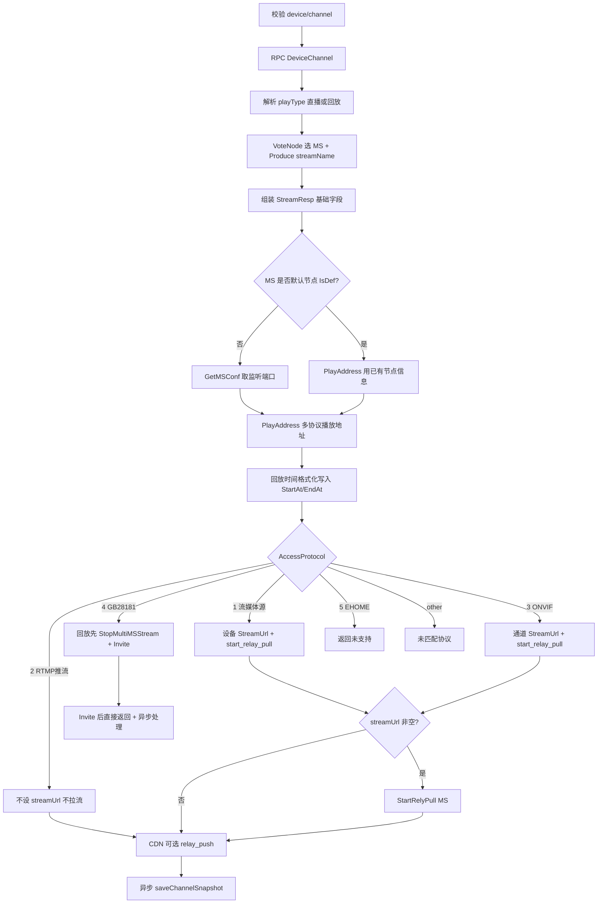

# VSS 播放流的流程

本文基于 **`core/app/sev/vss/internal/logic/http/video/stream_play.go`** 的源码：从参数与设备查询，到按接入协议分支、触发 MS 拉流或 GB28181 Invite，再到返回 **`StreamResp`** 与异步处理。

---

## 一、接口入口与请求体

| 项目        | 说明                                                                                   |
|-----------|--------------------------------------------------------------------------------------|
| **注册**    | `internal/handler/http/routers.go`：`router.POST(video.VStreamPlayLogic.Path(), ...)` |
| **Path**  | **`/video/stream`**（挂在 Gin 的 **`/api`** 组下，完整路径为 **`POST /api/video/stream`**）       |
| **Logic** | `StreamPlayLogic.DO(req types.VideoStreamReq)`                                       |

**`VideoStreamReq`**（`internal/types/types.go`）主要字段：

| 字段                                   | 含义                                                             |
|--------------------------------------|----------------------------------------------------------------|
| `deviceUniqueId` / `channelUniqueId` | 必填；用于拉取设备+通道及绑定 MS。                                            |
| `startAt` / `endAt`                  | 毫秒时间戳；**均大于 0** 时视为 **回放**（`playType = playback`）。             |
| `download`                           | 是否下载场景（透传给 GB Invite）。                                         |
| `speed`                              | 回放倍率等（透传 Invite）。                                              |
| `https`                              | 影响 MS 节点选择时是否按 HTTPS 能力投票（`ms.New(...).WithHttps(req.Https)`）。 |

**流名称覆盖**：若 Handler 注入了 `*gin.Context` 且 Query 里存在 **`streamName`**，则用其 **覆盖** `stream.New().Produce(...)` 的默认流名称（便于与已有会话对齐）。

---

## 二、主流程总览



---

## 三、步骤说明

### 3.1 参数与设备通道

- 若 `deviceUniqueId` 或 `channelUniqueId` 为空，直接返回 **`参数错误`**。  
- **`RpcClients.Device.DeviceChannel`** 拉取 **`DeviceChannel`**；设备或通道为空则 **`设备获取失败`**。

### 3.2 直播 / 回放与 MS 超时参数

- 默认 **`playType = play`**（直播），**`autoStopPullAfterNoOutMs = 60000`**。  
- 当 **`req.EndAt > 0 && req.StartAt > 0`**：`playType = playback`，**`autoStopPullAfterNoOutMs = 10000`**（回放更快放弃无输出拉流，避免长时间占资源）。

### 3.3 流名称与 MS 节点

- **`streamName = stream.New().Produce(device, channel, playType)`**  
  - 直播：`stream_{deviceUniqueId}_{channelUniqueId}_play`。  
  - 回放：带全局递增 **`PlaybackCount`** 后缀，保证多路回放流名称隔离（见 `core/common/stream/main.go`）。  
- **`ms.New(ctx, svcCtx).WithHttps(req.Https).VoteNode(device.MSIds)`** 选择媒体节点；**`nil` 则返回「未设置流媒体源」**。

### 3.4 响应体 `StreamResp` 与播放地址 `Addresses`

填充 **`ctypes.StreamResp`**：接入协议文案、MS 信息、设备/通道 ID、流名称、通道在线状态、`StreamUrl` 占位等；通道/设备展示名优先 **`Label`** 否则 **`Name`**。

**`MediaServerNode.IsDef` 分支**（是否「默认/简略」节点）：

- **非默认**：再调 **`GetMSConf(http://{msAddress})`** 取 **HTTP/HTTPS/RTSP/RTMP** 等端口，拼 **`stream.PlayAddress(StreamPlayProxyPath, MSVoteNodeResp+端口, streamName)`**。  
- **默认**：直接用已有 **`msNode`** 调 **`PlayAddress`**。

**回放时间**：`startAt`/`endAt` > 0 时格式化为字符串写入 **`data.StartAt` / `data.EndAt`**（供调用端展示）。

> **`PlayAddress`** 在 `core/common/stream/main.go` 中根据代理配置、MS 端口与流名称生成 **多协议播放 URL 集合**（HTTP-FLV、WebSocket、HLS 等——具体字段见 `ctypes.PlayAddress`）。

### 3.5 按 `AccessProtocol` 分支（核心）❗❗❗

常量来自 **`repositories/models/devices`**：

| 值           | 含义      | `stream_play` 行为                                                                                                                                                                                                                                        |
|-------------|---------|---------------------------------------------------------------------------------------------------------------------------------------------------------------------------------------------------------------------------------------------------------|
| **1**       | 流媒体源    | **`streamUrl = device.StreamUrl`**；传输层 **`MediaProtocolMode == 0`** 时 **`rtspMode = 1`（UDP）**，否则 TCP。后续 **`StartRelyPull`**。                                                                                                                            |
| **2**       | RTMP 推流 | **不配 `streamUrl`**，注释说明由设备 **推流** 触发 **`on_pub_start`**，**不调用 `start_relay_pull`**。                                                                                                                                                                     |
| **3**       | ONVIF   | **`streamUrl = channel.StreamUrl`**，同样按 `MediaProtocolMode` 决定 RTSP UDP/TCP，再 **`StartRelyPull`**。                                                                                                                                                      |
| **4**       | GB28181 | **回放**：先 **`StopMultiMSStream`** 停掉与当前流名称前缀相关、带 `playback` 的旧流，**睡眠 1s** 降低抢流冲突；再 **`gbs.InviteLogic.Invite(...)`** 下发 **SIP Invite**（含起止时间、`Download`、`Speed`、流名称等）。成功则 **`go saveChannelSnapshot`** 并 **直接返回 `Data`**（**不再走本文件末尾的 `StartRelyPull`**）。 |
| **default** | 其它      | **未匹配的协议类型**。                                                                                                                                                                                                                                           |

**传输协议**：`transportProtocol := res.Data.Device.TransportProtocol()`，用于 RTSP **TCP/UDP** 与后续 MS 参数一致。

### 3.6 MS `start_relay_pull`

当 **`streamUrl != ""`** 时调用：

```text
POST http://{msAddress}/api/ctrl/start_relay_pull
```

参数包括：`stream_name`、`url`、`auto_stop_pull_after_no_out_ms`、`pull_timeout_ms`、`rtsp_mode` 等（见 **`internal/pkg/ms/api.go`** `StartRelyPull`）。失败则整体 **HTTP 错误响应**。

### 3.7 CDN 转发

若 **通道开启 CDN**（`CdnState == 1`）且 **`CdnUrl` 以 `rtmp` 开头**，在返回前 **`go StartRelayPush`** 向 MS 启 **relay_push**，把当前流推到 CDN；错误仅打日志，不阻塞主流程返回。

### 3.8 异步通道快照 `saveChannelSnapshot`

- **`go saveChannelSnapshot(streamName, res.Data)`**（GB 分支在 Invite 成功后也会调用）。  
- 用 **`ms.Snapshot(device, streamName)`** 取一帧，经临时 **`.raw` / `.jpg`** 文件，**`ff.FFMpeg.SnapFile`** 转码，再 **`Mv` 到 `SaveVideoSnapshotDir`** 下由 **`stream.Snapshot(dir, deviceId, channelId)`** 规则命名的路径。  
- 全程 **`defer recover`** 与日志，**失败不影响播放接口成功返回**。

---

## 四、与 `gbs.Invite` 的关系

GB28181 路径：是由 **`Invite`** 走完整链路（Catalog 在线、`StreamInfo`、`GetStreamGroup`、端口范围、防重复 Invite、`SipSendVideoLiveInvite` 等，详见 **`video_live_invite.go`**）。

`stream_play` 传入的 **`InviteParams`** 包括：设备/通道业务 ID、**`PlayType`**、格式化后的 **起止时间字符串**、`Download`、`Speed`、**`StreamName`**、以及已查好的 **`DeviceItem`/`ChannelItem`**，**`Caller`** 标记为 **`http 请求stream play invite`**，便于日志区分来源。

---

## 五、为什么这样写

1. **统一出口**：平台无论网页还是内部服务，只要 **设备+通道** 即可拿 **同一套 `StreamResp`**（MS 节点、流名称、多协议地址），客户端按能力选播。  
2. **协议差异**分支（switch）：流媒体源/ONVIF 走 **拉流 URL + MS**；RTMP 推流走 **设备主动 pub**；GB28181 走 **信令 Invite**，避免一种模式套所有协议。  
3. **直播与回放**：用 **时间区间** 切换 **`playType`** 与 **流名称生成策略**（回放带计数后缀），并差异化 **`autoStopPullAfterNoOutMs`**。  
4. **MS 抽象**：拉流统一 **`StartRelyPull`**；GB仍由 RTP/SIP 与 MS API 协作，此接口只负责 **触发 Invite**。  
5. **快照与播放解耦**：快照慢或失败不影响 **拉流流程**。

---

## 六、注意点

|                             | 说明                                                                                                               |
|-----------------------------|------------------------------------------------------------------------------------------------------------------|
| **GB 回放 StopMultiMSStream** | 按 **流名称前缀 + playback** 模糊停流时，需要注意不同流流名称是否相同。                                                                     |
| **RTMP（= 2）**               | 本请求可能 **只返回地址信息**，需要注意MS **`on_pub_start`** 通知是否有达到。                                                             |
| **Invite 与重复请求**            | `Invite` 内部有 **`InviteRequestState`** 与 MS 上 **`Pub`** 状态判断；<br/>`stream_play` 高频重入，需要注意防抖；防抖可以参考 `core/pkg/dt`。 |
| **流图片快照**                   | 临时文件与 FFmpeg 依赖配置 **`FFMpeg`**、磁盘 **`SaveVideoSnapshotDir`**；未设置会导致快照失败。                                         |

---

## 七、相关源码索引

| 说明                                        | 路径                                                              |
|-------------------------------------------|-----------------------------------------------------------------|
| 流播放 Logic                                 | `core/app/sev/vss/internal/logic/http/video/stream_play.go`     |
| GB Invite                                 | `core/app/sev/vss/internal/logic/http/gbs/video_live_invite.go` |
| MS `start_relay_pull` / `start_relay_push` | `core/app/sev/vss/internal/pkg/ms/api.go`                       |
| 流名称与 `PlayAddress`                        | `core/common/stream/main.go`                                    |
| 响应                                     | `core/common/types/stream.go`（`StreamResp`、`PlayAddress`）       |
| HTTP 路由                                   | `core/app/sev/vss/internal/handler/http/routers.go`             |

