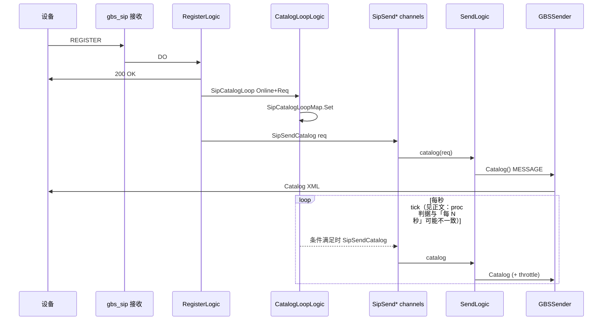

# VSS 国标信令发送设计：`SendLogic` 流水线

本文将详细说明VSS项目中信令**用什么发**、**从设备注册到发出 Catalog** 数据如何串起来、**`types.Request` 等各扮演什么角色**。

**项目地址** [https://github.com/openskeye/go-vss](https://github.com/openskeye/go-vss)

---

## 一、`SendLogic` 是做什么的？

**`SendLogic`** 实现 **`types.SipProcLogic`**，在 **`main.go`** 里与其他 SIP 协程任务一并 **`DO`** 启动。其核心是 **一个永不退出的 `select`**，从 **`ServiceContext`** 上的 **`SipSendXXX` channel** 读任务，**每种信令一个 `case`**，在 **独立 goroutine** 里执行具体发送逻辑。

可以把 **`SendLogic`** 理解成 **「出站 SIP 总线调度器」**——业务层、定时器、HTTP 接口**不直接**调底层 gosip，而是 **往 channel 里丢「发送意图」**；由 **`SendLogic` 统一消费**，再交给 **`GBSSender`** 包装、发 UDP/TCP。

---

## 二、为什么要这么设计？

### 2.1 单一写入出口

SIP **收** 在 gosip 的 **`OnRequest`** 回调里跑；**发** 若在多处随意 `Send`，容易出现：

- 并发写同一套连接/事务状态难排查；
- 重试、节流、日志散落。

把 **发** 收敛到 **一条 goroutine + 多路 channel**，上层只 **投递任务**，结构清晰。

### 2.2 用 channel 做队列（带缓冲）

`ServiceContext` 里例如 **`SipSendCatalog: make(chan *types.Request, 100)`**（见 `internal/svc/service_context.go`）。避免短时突发高并发同步阻塞。

### 2.3 **每个任务再起 goroutine**：隔离耗时与 panic 边界

`SendLogic` 的 `case` 里普遍 **`go func() { ... }(v)`**。原因：

- **`VideoLiveInvite`**、**`RTPPub`**、**`ACKRtpPub`** 可能较慢；不能卡住 **`select`**，否则其他信令饿死。
- **`defer recoverCall("发送处理")`** 在外层 **`DO`** 包一层恢复；子任务错误多 **打日志 + 返回**，避免整条总线挂死。

### 2.4 **`InitFetchDataState.Wait()`**：等配置/初始化完成再发信令

`DO` 开头 **`l.svcCtx.InitFetchDataState.Wait()`**，与 **SIP Server `Listen`**、其它 proc 一致。**RPC 客户端、平台配置、规则等未就绪时不发消息**，减少「空配置乱发导致的无效包」。

---

## 三、从「设备注册」到「发 Catalog」数据如何串联起来？

国标设备先 **`REGISTER`**，平台 **`200 OK`** 后，平台才有稳定 **`To/From/Call-ID/Contact`** 内容去发 **`MESSAGE`**、**`INVITE`** 等。本仓库把 **「注册当次解析出来的 `sip.Request`」** 固化为 **`types.Request`**，后续 **同一设备** 的出站信令 **尽量复用这份语境**（Via/传输、对端 URI 等），由 **`GBSSender`** 按国标协议包装发送。

### 3.1 注册成功：`RegisterLogic` 「下游流水线」

文件：**`internal/logic/gbs_sip/register.go`**

设备 **上线**（`Expires` 非 0，`record.Online=1`）时，在 **RPC `DeviceUpsert`** 成功后，**异步**（`go func` + `Sleep 1s`）做三件事：

| 动作 | Channel / 含义 |
|------|----------------|
| **`SipCatalogLoop <- SipCatalogLoopReq{Req, Online:true, Now}`** | 让 **`CatalogLoopLogic`** 把该设备 **登记进 `SipCatalogLoopMap`**，参与 **定时 Catalog**。 |
| **`SipSendCatalog <- req`** | **立刻发第一次 Catalog**（刷新目录）。 |
| **`SipSendDeviceInfo <- req`** | **立刻拉设备信息**（另 case 进 `SendLogic`）。 |
| **`SipHeartbeatLoop <- ...`** | **心跳/过期检测** 登记（`HeartbeatOfflineLogic`）。 |

**为什么要 `Sleep 1s` 再发？**  给设备 **注册事务收尾、网络栈稳定** 一点时间，降低「刚 200 OK 立刻 MESSAGE 被丢」的概率，非强制使用。

**`types.Request` 里带什么？**（`types.go`）  
**`Original`（原始 `sip.Request`）、`ID`（设备 20 位编码）、`Source`、`TransportProtocol`、`DeviceAddr` 等**。这正是 **`GBSSender`** 组 **Via/From/To** 时与 **「设备当时的注册包」** 对齐的输入。

设备 **下线**（`Expires==0`）：**`SipCatalogLoop <- Online:false`**，**从 `SipCatalogLoopMap` 移除**，并清理心跳 map，避免离线仍刷 Catalog。

### 3.2 定时 Catalog：`CatalogLoopLogic` → 再投递 `SipSendCatalog`

文件：**`internal/logic/gbs_proc/catalog_loop.go`**

-  **`SipCatalogLoop` channel**：**增删** `SipCatalogLoopMap` 中的条目。  
-  **`proc` goroutine**：每秒 **tick**，遍历 **`SipCatalogLoopMap`**；源码条件为：**`item.Online`** 且 **`item.Now%val.Unix() == Config.Sip.CatalogInterval`**（见 **`catalog_loop.go`**）。

**条件**：**`item.Now`** 与 **`val.Unix()`** 均为 **Unix 秒**；**注册之后**通常 **`val.Unix() > item.Now`**，此时在 Go 中 **`item.Now % val.Unix()` 等于 `item.Now`**（被除数小于除数）。于是等式 **`item.Now == Config.Sip.CatalogInterval`** 才会成立——**一般配置下 `CatalogInterval` 为 60、3600 等小整数，几乎不会与注册秒级时间戳相等**，因此 **「定时器每秒扫 map」这条路径往往极少真正投递 `SipSendCatalog`**。线上 **目录刷新** 更常来自：**注册成功立刻 `SipSendCatalog`**、**心跳发现 map 无记录时的补发**（`keepalive.go`）、以及 **HTTP 手工触发**。若产品期望 **严格每 N 秒周期 Catalog**，应对照 **`catalog_loop.go` 判据** 是否需改为例如 **`(val.Unix()-item.Now)%N == 0`** 一类实现。

### 3.3 `SendLogic.catalog`：节流后再 **`GBSSender.Catalog()`**

文件：**`send_sip_proc.go`**

```go
dt.ThrottleFixedGridTrailing(req.ID, 3*time.Second, func() {
    sip2.NewGBSSender(l.svcCtx, req, req.ID).Catalog()
})
```

**为什么还有一层 3 秒节流？**  
定时器 **`CatalogLoop`** 与 **注册/keepalive** 可能 **短时间多次** 往 **`SipSendCatalog`** 塞同一设备；**`ThrottleFixedGridTrailing`**（见 **`core/pkg/dt/throttle_fixed_grid.go`**）在 **固定时间栅格内合并**，**槽尾执行最后一次**，避免 **对同一设备 Catalog 大量重复请求**（保护设备）。

### 3.4 信令组装发送

文件：**`internal/pkg/sip/gbs_send.go`**

1. **`makeRequestBody(types.SipMessageGBSCatalog{ CmdType: Catalog, DeviceID: l.deviceUniqueId, SN: l.SN(...) })`** → **XML body**。  
2. **`makeRequest(MESSAGE, headers..., body)`**：标准头 **Via / From / To / Call-ID / CSeq / Content-Type / Content-Length**。  
3. **`Send(...)`** 走 gosip **客户端**发往设备。

注意：**`NewGBSSender(l.svcCtx, req, req.ID)`** 第三个参数在此是 **设备 ID**；Catalog 的 **`DeviceID` 在 XML** 里也是它。**`req`** 提供 **与注册一致的传输、对端地址等数据**。

### 3.5 流程图



---

## 四、`SendLogic` 支持哪些类型？

| Channel                              | 处理函数                          |
|--------------------------------------|-------------------------------|
| **`SipSendCatalog`**                 | `catalog`                     |
| **`SipSendDeviceInfo`**              | `deviceInfo`                  |
| **`SipSendVideoLiveInvite`**         | `VideoLiveInvite`             |
| **`SipSendTalkInvite`**              | `talkInvite`                  |
| **`SipSendBye`**                     | `bye`                         |
| **`SipSendBroadcast`**               | `broadcast`                   |
| **`SipSendTalk`**                    | `talk`                        |
| **`SipSendQueryPresetPoints` / Set** | `queryPresets` / `setPresets` |
| **`SipSendQueryVideoRecords`**       | `queryVideoRecords`           |
| **`SipSendSubscription`**            | `subscription`                |

---

## 五、重点流程

**`VideoLiveInvite`** 不在 `GBSSender` 里结束：它串联 **MS** 与 **SDP**（见《SDP详解》《stream_play》）：

1. **`ms.RTPPub`**：MS 侧准备收流。  
2. **`VideoLiveInvite`**：SIP INVITE + 平台 SDP。  
3. **`AckReq`** + 缓存 **`AckRequestMap`**（**From/To/tag/Call-ID** 供 **BYE**）。  
4. **`sdp.ParseString(200 OK Body)`** 取 **设备 SDP**。  
5. **`SendDirect(ack)`** + **`ACKRtpPub`**：MS 与 **对端 IP:端口、filesize** 对齐。  
6. **`PubStreamExistsState`** 标记流存在。

**为什么要 `inviteStep` + `StepRecord`？** 给 **前端/SSE/诊断** 一条 **可观测时间线**（拉流成功、INVITE 原文、ACK 原文、完成/错误）。

---

## 六、源码索引

| 说明                 | 路径                                                                                                                               |
|--------------------|----------------------------------------------------------------------------------------------------------------------------------|
| 出站调度               | `core/app/sev/vss/internal/logic/gbs_proc/send_sip_proc.go`                                                                      |
| 定时 Catalog 注册表     | `core/app/sev/vss/internal/logic/gbs_proc/catalog_loop.go`                                                                       |
| 注册后触发              | `core/app/sev/vss/internal/logic/gbs_sip/register.go`                                                                            |
| 心跳与 Catalog 补发     | `core/app/sev/vss/internal/logic/gbs_sip/keepalive.go`（map 内无记录时可 **`SipSendCatalog`**）                                          |
| Catalog MESSAGE 实现 | `core/app/sev/vss/internal/pkg/sip/gbs_send.go` **`Catalog()`**                                                                  |
| 请求语境模型             | `core/app/sev/vss/internal/types/types.go` **`Request`、`SipCatalogLoopReq`**                                                     |
| Channel 初始化        | `core/app/sev/vss/internal/svc/service_context.go`                                                                               |
| 进程挂载               | `core/app/sev/vss/main.go` **`server.NewSipProc(svcCtx).DO(..., new(gbs_proc.SendLogic), new(gbs_proc.CatalogLoopLogic), ...)`** |

---

## 七、小结

| 设计点                                | 目的                                                  |
|------------------------------------|-----------------------------------------------------|
| **多 channel + 单调度循环**              | 出站集中、异步解耦、易加新信令类型                                   |
| **每任务 goroutine**                  | 不阻塞总线；慢操作并行                              |
| **注册写入 `types.Request` + map**     | 全站统一，后续命令免重复解析                                |
| **CatalogLoop + `SipSendCatalog`** | 上线/补线立即发 Catalog；`CatalogLoop.proc` 为每秒扫表 |
| **ThrottleFixedGridTrailing**      | 防 Catalog 风暴                                        |
| **`GBSSender`**                    | Via/From/To/XML/SN 封装复用                             |

---

*本文可以结合《SDP详解-国标与工程实践》《流播放-VSS-stream_play详解》阅读，可覆盖从 Catalog 到 Invite 的完整媒体前奏。*
