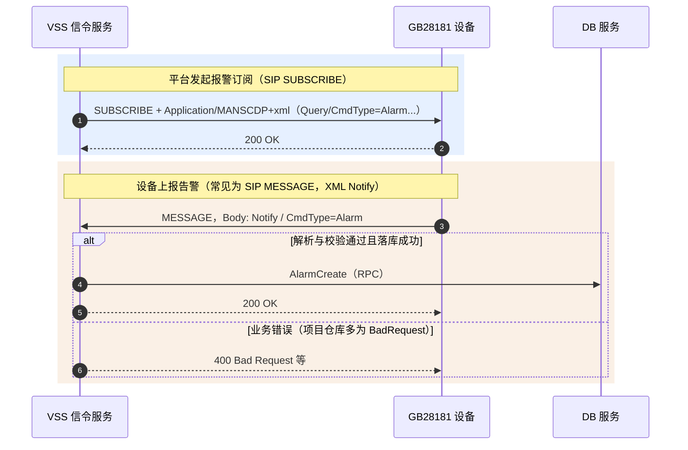

# 国标设备报警订阅与上报机制详解

## 1. 简介

在GB/T 28181标准中，设备报警功能是实现前端智能感知与后端平台联动的重要机制。当摄像机检测到移动侦测、视频丢失、入侵等事件时，需要实时将警情上报给监控中心。

GB28181采用SIP**SUBSCRIBE/NOTIFY**模型实现报警的订阅与推送：

- SUBSCRIBE：平台向设备发起订阅（布防），告知设备需要上报哪些报警
- NOTIFY：设备在有报警发生时，通过NOTIFY请求将警情推送给平台

本文将从平台布防订阅、设备报警上报，到平台存储记录的全流程，结合时序图与真实SIP信令日志，帮助深入理解国标平台的报警机制设计与实现细节。

---

## 2. 整体交互流程

### 2.1 核心时序图

以下为设备报警订阅与上报的完整时序：



**与项目仓库一致的要点**：见 [§6](#6-本仓库实现与源码索引)；其中 **设备→平台** 在路由里按 **MESSAGE** 处理，**不是** `routers.go` 里单独的 SIP NOTIFY 分支。

### 2.2 流程说明

| 步骤   | 方向    | 内容              | 说明                                                                                                                                                          |
|:----:|:------|:----------------|:------------------------------------------------------------------------------------------------------------------------------------------------------------|
|  1   | 平台→设备 | **SUBSCRIBE**   | 携带 `Expires`、`Event`（报警订阅用 **presence** 等，见 `GBSSender.Subscription`）、`Content-Type: Application/MANSCDP+xml`，体为 **Query**，`CmdType=Alarm`，筛选项含优先级、报警方式等。 |
|  2   | 设备→平台 | **200 OK**      | 确认订阅。需在 **Expires 到期前续订**，否则设备可能停止主动上报（视厂商实现而定）。                                                                                                            |
|  3   | 设备内   | -               | 产生报警事件。                                                                                                                                                     |
|  4   | 设备→平台 | **MESSAGE**     | 报文体系为 **MANSCDP+xml**，根元素 **`Notify`**，`CmdType=Alarm`。标准文献中有时也会用 NOTIFY 描述「通知」语义，勿与 SIP `NOTIFY` 方法混谈。                                                     |
|  5   | 平台→DB | **AlarmCreate** | 经 **`Device.AlarmCreate`** RPC 写入报警表（见 `AlarmLogic`）。                                                                                                     |
|  6   | 平台→设备 | **200 OK**      | `sip_handler.success` 默认 **HTTP 200** 对应 SIP **200 OK**。                                                                                                    |
|  7   | 平台→设备 | **400** 等       | `AlarmLogic` 返回 `Error` 且 **Code 为 0** 时，`sip_handler` 按 **BadRequest** 回包（见 `sip_handler.go`）。**403** 在本仓库主要用于 **BanIp** 等场景，并非「设备未注册」的固定响应。               |

---

## 3. 核心信令与示例

### 3.1 平台布防订阅（SUBSCRIBE）

要点：

- **方法名必须是 `SUBSCRIBE`**，**CSeq 的方法也应为 SUBSCRIBE**。若抓包出现首行 `SUBSCRIBE` 但 **CSeq 仍为 MESSAGE**，属于 **抓包/拼接错误** or 中间代理改写问题，应以设备与平台实际处理为准。
- **`Expires`**：订阅生命周期（秒），到期前需再次 **SUBSCRIBE** 续订。
- **Event**：本仓库在 `GBSSender.Subscription` 中，除目录订阅可能用 **Catalog** 事件外，**报警/位置/云台**等分支会附加 **`Event: presence`**（与国标附录及现网实现需以对接厂商说明为准）。

**订阅报文体（与代码一致的结构）** 对应类型 `SipMessageGBSSubscriptionAlarm`（`types.go`）：根元素 **`Query`**，`CmdType=Alarm`，`StartAlarmPriority` / `EndAlarmPriority` / `AlarmMethod`。发送侧默认 **`Start/End=0`、`AlarmMethod=0`** 表示不过滤或「全量」语义（与国标字段解释以对接规范为准）：

```core/app/sev/vss/internal/pkg/sip/gbs_send.go:934
func (l *GBSSender) Subscription(cmdType string) (sip.Response, error) {
	var reqContent interface{}
	if cmdType == types.SubscriptionCatalog {
		reqContent = &types.SipMessageGBSSubscriptionCatalog{
			CmdType:  cmdType,
			DeviceID: l.deviceUniqueId,
			SN:       l.SN(l.deviceUniqueId),
		}
	} else if cmdType == types.SubscriptionAlarm {
		reqContent = &types.SipMessageGBSSubscriptionAlarm{
			CmdType:            cmdType,
			DeviceID:           l.deviceUniqueId,
			SN:                 l.SN(l.deviceUniqueId),
			StartAlarmPriority: 0,
			EndAlarmPriority:   0,
			AlarmMethod:        0,
		}
		// ... MobilePosition / PTZ ...
	}
	// ... 组头：Via/From/To/Call-ID/Expires/Content-Type ...
	return l.Send(l.makeRequest(sip.SUBSCRIBE, headers, body))
}
```

### 3.2 设备报警上报 (NOTIFY)

本仓库在 **`gbs_sip/routers.go`** 中对 **`sip.MESSAGE`** 按 XML 解析出的 **`CmdType`** 分派；**`Alarm`** 进入 **`AlarmLogic`**：

```61:63:core/app/sev/vss/internal/handler/gbs_sip/routers.go
case strings.ToLower(types.MessageCMDTypeAlarm):
    sip2.DO("GBS", svcCtx, req, tx, data, new(gbssip.AlarmLogic))
```

解析模型为 **`SipMessageAlarm`**，XML 根为 **`Notify`**：

```core/app/sev/vss/internal/types/types.go:643
SipMessageAlarm struct {
    MessageReceiveBase
    XMLName  xml.Name `xml:"Notify"`
    CmdType  string   `xml:"CmdType"`
    SN       int      `xml:"SN"`
    DeviceID string   `xml:"DeviceID"`
    AlarmMethod      uint   `xml:"AlarmMethod"`
    AlarmPriority    uint   `xml:"AlarmPriority"`
    AlarmTime        string `xml:"AlarmTime"`
    AlarmDescription string `xml:"AlarmDescription"`
    Longitude        string `xml:"Longitude"`
    Latitude         string `xml:"Latitude"`
    Info *SipMessageAlarmInfo `xml:"Info"`
}
```

XML中可能出现 **`<AlarmInfo>`** 等扩展节点；当前结构体 **未声明该字段**，Go 的 `encoding/xml` **会忽略未知元素**，不影响已声明字段解析。若业务需要持久化 `AlarmInfo`，需在结构体中补字段。

---

## 4. 报警信息字段详解

### 4.1 核心字段说明

| 字段                            | 字段说明   | 取值说明                                                                                                                                                                                                                                                                                                                 |
|:------------------------------|:-------|:---------------------------------------------------------------------------------------------------------------------------------------------------------------------------------------------------------------------------------------------------------------------------------------------------------------------|
| CmdType                       | 命令类型   | Alarm-报警                                                                                                                                                                                                                                                                                                             |
| SN                            | 消息序列号  | 唯一标识请求/响应                                                                                                                                                                                                                                                                                                            |
| DeviceID                      | 设备国标ID | 20位国标编码                                                                                                                                                                                                                                                                                                              |
| AlarmPriority                 | 报警级别   | 1-一级警情<br>2-二级警情<br>3-三级警情<br>4-四级警情                                                                                                                                                                                                                                                                                 |
| AlarmMethod                   | 报警方式   | 1-电话报警<br>2-设备报警<br>3-短信报警<br>4-GPS报警<br>5-视频报警<br>6-设备故障报警<br>7-其他报警                                                                                                                                                                                                                                                |
| AlarmTime                     | 报警时间   | ISO格式: yyyy-MM-ddTHH:mm:ss                                                                                                                                                                                                                                                                                           |
| AlarmDescription              | 报警描述   | 文本描述信息                                                                                                                                                                                                                                                                                                               |
| Longitude                     | 经度     | GPS经度坐标                                                                                                                                                                                                                                                                                                              |
| Latitude                      | 纬度     | GPS纬度坐标                                                                                                                                                                                                                                                                                                              |
| AlarmInfo                     | 报警附加信息 | 自定义扩展字段                                                                                                                                                                                                                                                                                                              |
| Info/AlarmType                | 报警类型   | **AlarmMethod=2时**:<br>1-视频丢失报警<br>2-设备防拆报警<br>3-存储磁盘满报警<br>4-设备高温报警<br>5-设备低温报警<br>**AlarmMethod=5时**:<br>1-人工视频报警<br>2-运动目标检测报警<br>3-遗留物检测报警<br>4-物体移除检测报警<br>5-绊线检测报警<br>6-入侵检测报警<br>7-逆行检测报警<br>8-徘徊检测报警<br>9-流量统计报警<br>10-密度检测报警<br>11-视频异常检测报警<br>12-快速移动报警<br>**AlarmMethod=6时**:<br>1-存储设备磁盘故障<br>2-存储设备风扇故障 |
| Info/AlarmTypeParam/EventType | 事件类型   | 入侵检测报警时:<br>1-进入区域<br>2-离开区域                                                                                                                                                                                                                                                                                         |

### 4.2 嵌套字段说明 (Info)

当 `AlarmMethod` 为特定值时，`Info` 字段提供更详细的报警类型参数，其结构如下：

| AlarmMethod  | AlarmType 取值 | AlarmType 说明 | EventType 取值 | EventType 说明 |
|:-------------|:-------------|:-------------|:-------------|:-------------|
| **2-设备报警**   | 1            | 视频丢失报警       | -            | -            |
| 2-设备报警       | 2            | 设备防拆报警       | -            | -            |
| 2-设备报警       | 3            | 存储磁盘满报警      | -            | -            |
| 2-设备报警       | 4            | 设备高温报警       | -            | -            |
| 2-设备报警       | 5            | 设备低温报警       | -            | -            |
| **5-视频报警**   | 1            | 人工视频报警       | -            | -            |
| 5-视频报警       | 2            | 运动目标检测报警     | -            | -            |
| 5-视频报警       | 3            | 遗留物检测报警      | -            | -            |
| 5-视频报警       | 4            | 物体移除检测报警     | -            | -            |
| 5-视频报警       | 5            | 绊线检测报警       | -            | -            |
| 5-视频报警       | 6            | **入侵检测报警**   | 1            | 进入区域         |
| 5-视频报警       | 6            | 入侵检测报警       | 2            | 离开区域         |
| 5-视频报警       | 7            | 逆行检测报警       | -            | -            |
| 5-视频报警       | 8            | 徘徊检测报警       | -            | -            |
| 5-视频报警       | 9            | 流量统计报警       | -            | -            |
| 5-视频报警       | 10           | 密度检测报警       | -            | -            |
| 5-视频报警       | 11           | 视频异常检测报警     | -            | -            |
| 5-视频报警       | 12           | 快速移动报警       | -            | -            |
| **6-设备故障报警** | 1            | 存储设备磁盘故障     | -            | -            |
| 6-设备故障报警     | 2            | 存储设备风扇故障     | -            | -            |

---

## 5. 设计要点与注意事项

### 5.1 订阅维持

- **Expires 续订**：平台应在过期前重新 **SUBSCRIBE**。本仓库 **未在定时任务中自动续订**；订阅由 HTTP **`POST /gbs/subscription`** 投递到 **`SipSendSubscription`** 触发（见 §6.1）。生产环境可在外层调度或由运维脚本周期调用，避免订阅过期。
- **布防与订阅**：开启「报警」类订阅且请求体 **`emergencyCall`** 为真时，先发 **`SetGuard`（MESSAGE 布防）**，再发报警 **SUBSCRIBE**（见 `SendLogic.subscription`）。

### 5.2 报警去重

若设备重复上报，将产生多条 **`AlarmCreate`** 记录。若需要去重，应在 **DB 唯一约束 / 业务幂等 / 消息队列** 层补齐。

### 5.3 并发与削峰

大量 MESSAGE 同时到达时，每条仍走 **RPC 落库**；高负载时可考虑修改为异步队列、批量写入等（当前为同步 RPC）。

---

## 6. 本仓库实现与源码索引

### 6.1 平台如何发出「报警订阅」

1. HTTP：`SubscriptionLogic.DO` → **`svcCtx.SipSendSubscription <- req`**（`internal/logic/http/gbs/subscription.go`，路径 **`/gbs/subscription`**）。
2. `SendLogic` 消费：`subscription`（`send_sip_proc.go`）。
3. 要求设备已在 **`SipCatalogLoopMap`**（未注册则直接 **DeviceUnregistered**）。
4. 若 **`req.Subscription.EmergencyCall`**：**`SetGuard`**（MESSAGE）→ 再 **`Subscription(Alarm)`**（SUBSCRIBE）。

```core/app/sev/vss/internal/logic/gbs_proc/send_sip_proc.go:480
func (l *SendLogic) subscription(req *types.SubscriptionReq) error {
	sipReq, ok := l.svcCtx.SipCatalogLoopMap.Get(req.DeviceUniqueId)
	if !ok {
		return constants.DeviceUnregistered
	}
	if req.Subscription.EmergencyCall {
		if _, err := sip2.NewGBSSender(l.svcCtx, sipReq.Req, req.DeviceUniqueId).SetGuard(); err != nil {
			return err
		}
	}
	if req.Subscription.Catalog { /* Subscription(Catalog) */ }
	if req.Subscription.EmergencyCall {
		if _, err := sip2.NewGBSSender(l.svcCtx, sipReq.Req, req.DeviceUniqueId).Subscription(types.SubscriptionAlarm); err != nil {
			functions.LogError("订阅消息发送失败, EmergencyCall err:", err)
		}
	}
	// Location / PTZ ...
	return nil
}
```

请求体中的 **`Subscription`** 对应 **`devices.Subscription`**：目录 / 报警（`EmergencyCall`）/ 位置 / PTZ（见 `core/repositories/models/devices/model.go`）。

### 6.2 设备上报后平台如何处理

`AlarmLogic.DO`（`internal/logic/gbs_sip/alarm.go`）核心步骤：

1. **解析** `SipMessageAlarm`。
2. **取 SIP From**，否则报错。
3. **`ChannelRowFind`**：条件为 **`channels.uniqueId = XML.DeviceID`** 且 **`channels.deviceUniqueId = From.User()`**（即报文里的 DeviceID 按 **通道国标 ID** 使用，父设备号从 **From** 对齐）。
4. **联级**：若通道带 **`CascadeChannelUniqueId`**，当前存在 **向上级转发**。
5. **AlarmMethod + Info.AlarmType** 映射为 **`alarms.AlarmType`**；**EventType** 写入记录。
6. **`Device.AlarmCreate`** 落库；失败则返回 **Error** → 多表现为 **400**。
7. 成功 → **`200 OK`**。

### 6.3 源码文件一览

| step           | 路径                                                               |
|:---------------|:-----------------------------------------------------------------|
| MESSAGE 路由分派   | `core/app/sev/vss/internal/handler/gbs_sip/routers.go`           |
| 报警接收与落库        | `core/app/sev/vss/internal/logic/gbs_sip/alarm.go`               |
| SUBSCRIBE 订阅发送 | `core/app/sev/vss/internal/pkg/sip/gbs_send.go` → `Subscription` |
| 布防 SetGuard    | 同上 → `SetGuard`                                                  |
| HTTP 触发订阅      | `core/app/sev/vss/internal/logic/http/gbs/subscription.go`       |
| 出站调度           | `core/app/sev/vss/internal/logic/gbs_proc/send_sip_proc.go`      |
| XML / 类型定义     | `core/app/sev/vss/internal/types/types.go`                       |

---

## 7. 总结

- **订阅**：**SIP SUBSCRIBE** + **MANSCDP+xml**（报警体为 `<Query><CmdType>Alarm</CmdType>...`），并可在 **`EmergencyCall`** 场景下先 **MESSAGE 布防（SetGuard）**。
- **上报**：在 **SIP MESSAGE** 上接收 **`<Notify><CmdType>Alarm</CmdType>...`**，经 **`AlarmLogic`** 校验 **`通道 + From 设备`** 后 **RPC 写库**。
