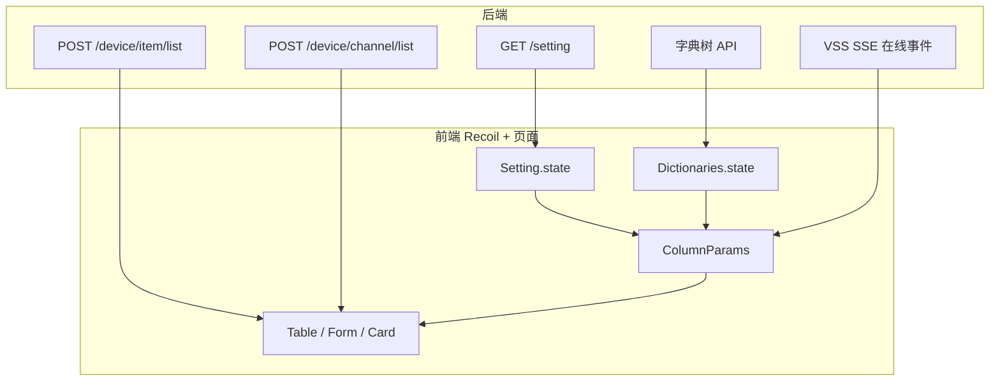

# 设备与通道管理实现解析（`src/pages/devices`）

本文档将描述 **设备（items）** 与 **通道（channels）** 的数据关系、**接入协议 `accessProtocol`** 对表单与能力的影响、**在线状态** 的推送与展示，以及 **枚举/展示文案** 如何从 **系统设置（Setting）** 与 **字典（Dictionaries）** 注入前端表格与表单。

**项目地址** [https://github.com/openskeye/skeyevss_frontend_web](https://github.com/openskeye/skeyevss_frontend_web)

界面展示：

  
  

  
  

---

## 1. 设备与通道的关系

### 1.1 数据模型

- **设备** `pages/devices/items/model.tsx` → `Item`  
  - 主键：`id`；业务锚点：`deviceUniqueId`。  
  - 含 `accessProtocol`、`channelCount`、`msIds` 等，描述「如何接入平台」与媒体服务绑定。

- **通道** `pages/devices/channels/model.tsx` → `Item`  
  - 主键：`id`；业务主键：`uniqueId`。  
  - **外键**：`deviceUniqueId`，指向所属设备。  
  - 设备挂载 **`deviceItem?: DeviceItem`**：列表接口在 `maps` 里带回设备详情，便于表单按协议显隐字段、卡片展示协议名称等。

### 1.2 API 与列表形态

| 资源   | 主要接口                        | 说明                                                  |
|------|-----------------------------|-----------------------------------------------------|
| 设备   | `POST /device/item/list`    | 标准分页列表，`transformType: Item` 转换 `list`              |
| 通道   | `POST /device/channel/list` | 列表 + `maps`（`deviceUniqueId → 设备`）+ `ext.plans` 等扩展 |

通道页通过查询条件里的 **`deviceUniqueId`** 固定「当前设备」，再 `DeviceRow(deviceUniqueId)` 拉设备详情写入面包屑与 `currentDeviceItemRef`，新建通道时把 `deviceUniqueId` 注入 `Create` 请求（见 `channels/index.tsx`）。

### 1.3 父子关系

通道模型上的 **`parentUniqueIdKeyColumn` → `deviceUniqueId`** 表明表格/表单框架把它当作 **挂在某设备下的子资源**（路由上从设备列表进入通道列表）。

---

## 2. `accessProtocol`：类型含义与创建/编辑时的差异

代码里用 **数字枚举** 区分协议（与后端约定一致）。设备模型中写死了示例名与能力分支：

| 值   | `accessProtocolExample()`  | `controlState()`（云台等）  | `addChannelState()`（是否允许走「手工加通道」一类能力）  |
|-----|----------------------------|------------------------|----------------------------------------|
| 1   | 流媒体源                       | 否                      | 否（仅 RTMP 为 true）                       |
| 2   | RTMP 推流                    | 否                      | **是**                                  |
| 3   | ONVIF                      | **是**                  | 否                                      |
| 4   | GB28181                    | **是**                  | 否                                      |

> 说明：「能否在 UI 里加通道」还与通道行的 `setHiddenState()` 一致：仅 **RTMP(2)** 不隐藏删除/勾选等（其它协议通道行多项操作被隐藏），与设备侧「只有 RTMP 可 addChannel」形成产品逻辑上的闭环。

### 2.1 创建设备时：表单字段显隐与联动（`items/model.tsx` → `formColumns`）

`accessProtocol` 的 `afterOnChange` 是核心：切换协议会 **`setHiddenMaps` / `setReadonlyMaps`**，并顺带清空 ONVIF 发现等字段。

- **流媒体源 (1)**：大量字段隐藏（用户名密码、订阅、通道筛选、码流索引、在线等），突出拉流地址与传输相关配置。  
  解析 `streamUrl` 可回填 `address` / `username` / `password`（`extractUrlComponents`）。

- **RTMP 推流 (2)**：隐藏与国标相关的订阅/通道筛选等；**`streamUrl` 只读**，由 **绑定媒体服务 `msIds`** 的 `afterOnChange` 自动生成 `rt推流地址`（默认媒体或指定 SMS 的 `ip:port`）。新建时会延迟触发默认选中媒体服务。

- **ONVIF (3)**：暴露 **设备发现**、手动开关、`onvifDeviceInfo` 等；部分字段只读由 `onvifReadonlyMaps` 控制。

- **GB28181 (4)**：表单里大量主信息字段隐藏，强调 **订阅、通道筛选、码流索引、媒体服务** 等国标侧配置；**新建时** 下拉里对 4 做了 `disabled`（`antOptionsFilter`），避免误选需由平台侧注册录入的协议——具体以产品为准，代码意图是 **创建入口限制协议类型**。

### 2.2 传输模式与协议

`mediaTransModeOptions(accessProtocol, options)`：非 GB28181 时会过滤掉值为 `2` 的项，并对文案做「被动/主动」替换；**GB28181(4)** 保留完整选项。表格列里 `媒体传输模式` 的 `options` 也走同一函数，保证 **列表编辑** 与 **表单** 可选范围一致。

### 2.3 通道侧：协议对表单与列表的影响

- **`Item.apType(accessProtocol)`**（`channels/model.tsx`）：区分 **`pub` / `pull`**，用于流媒体侧会话类型（如码率统计字段在视频组件里用 `pub`/`pull` 取不同 key）。  
  - `pub`：**RTMP(2)、GB(4)**  
  - 其余为 **`pull`**

- **通道表单** `streamUrl`：当设备为 **GB** 时字段 **隐藏**（推流/注册由设备与平台信令完成，不要求手工填拉流 URL）；其它协议展示可编辑地址类配置（具体校验与 `deviceItem` 挂钩）。

- **通道卡片**（`channels/components.tsx`）：仅当 **`deviceItem.accessProtocol === 2`** 时展示 **RTMP 播放/推流地址**（`streamNameProduce` 组 live 路径），其它协议不展示该块。

---

## 3. 在线状态：持久字段 vs 实时 SSE

### 3.1 列表上的「在线」列（静态）

设备、通道表结构里都有 **`online` 数值字段**，表格列可按 `0/1` 渲染文案（设备列表里「在线状态」列曾被设为 `hidden: true`，以卡片视图为主）。

### 3.2 实时状态：`OnlineState`（`repositories/apis/base`）

设备页与通道页均在 `useEffect` 里建立 **`EventSource`**：

- **设备列表** `items/index.tsx`：`OnlineState({ type: 1, url: vssSseUrl, ... })`  
- **通道列表** `channels/index.tsx`：`OnlineState({ type: 2, ... })`

服务端推送 JSON，前端解析为 **`{ [key: string]: 0 | 1 }`**，合并进 `columnParams.deviceOnlineState`，触发表格/卡片重渲染。设备页用 **`compareEQ`** 与 ref 避免相同数据重复 setState。

### 3.3 展示上的 Key 约定

- **设备卡片**（`items/components.tsx`）：  
  `deviceOnlineState?.[record.deviceUniqueId] === 1` → 在线图标。

- **通道卡片/工具条**（`channels/components.tsx`）：  
  **`deviceUniqueId + '-' + uniqueId`** 作为 key，与设备维度的 key 区分，避免多通道id相同时冲突。

Tooltip 统一用「在线 / 离线」提示。也就是说：**业务上「通道路由」的在线与设备在线是两套推送类型（type 1 / 2）**，前端用不同字典 key 取值。

---

## 4. 字典与展示值：Setting / Dictionaries / 列表扩展

前端不硬编码所有下拉与标签文案，而是 **启动后从 Recoil 状态注入 `ColumnParams`**。

### 4.1 系统设置 `Setting`（键值多为「数字 → 文案」）

在 **`items/index.tsx`** 初始化列参数时，从 `setting.state` 读取：

- **`access-protocols`** → `accessProtocolOptions` / `accessProtocolMaps`，表格「接入协议」列 `renderHook` 用 `accessProtocolMaps[id].title`。  
- **`access-protocol-colors`** → 卡片协议标签颜色（若有）。  
- **`media-trans-modes`**、`channel-filters`、`bitstream-indexes` → 对应下拉与多选。

在 **`channels/index.tsx`**：

- **`ptz-types`** → 云台类型 `ptzTypeOptions`。  
- 同样使用 **`access-protocols`** 做 **`accessProtocolMaps`**，卡片上展示「协议: xxx」。

这些键的定义见 `repositories/types/config.ts` 中 **`Setting` 接口扩展字段**（与后端 `/setting` 返回对齐）。

### 4.2 字典服务 `Dictionaries`（树形 + `maps`）

`Dictionaries` 提供：

- **`groupTrees`**：按 **`DictUniqueIdType`**（如 `device-manufacturer`）分组的选项树。  
- **`maps`**：**`{ [id: number]: TreeItem }`**，用于按 **主键 id** 取节点名称等。

设备列表中：

- **平台厂商** `manufacturerId`：选项来自 `groupTrees[DictUniqueIdType.deviceManufacturer].children`。  
- **卡片展示厂商名**：除 `deviceTypeMaps` 外，又用 **`dictMaps[record.manufacturerId].name`**（`items/components.tsx`），字典树与 setting 选项并存，便于复杂层级名称展示。

部门名称 **不在字典** 里，而是由 **`List` 响应的 `ext`（设备列表为 `departmentMaps`）** 映射 `depIds → 部门名`，渲染为可跳转 Tag。

### 4.3 数据流

---

## 5. 关键文件索引

| 文件                                          | 作用                                                              |
|---------------------------------------------|-----------------------------------------------------------------|
| `src/pages/devices/items/index.tsx`         | 设备表：组装 `ColumnParams`、SSE `type: 1`、创建默认 `sourceType: 1`        |
| `src/pages/devices/items/model.tsx`         | 设备 `Item`、`columns`/`formColumns`、协议分支与 `mediaTransModeOptions` |
| `src/pages/devices/items/components.tsx`    | 设备卡片：在线图标、`dictMaps` 厂商                                         |
| `src/pages/devices/channels/index.tsx`      | 通道表：设备上下文、`deviceMaps`、`plans`、SSE `type: 2`                    |
| `src/pages/devices/channels/model.tsx`      | 通道 `Item`、`apType`、`setHiddenState`、`formColumns`               |
| `src/pages/devices/channels/components.tsx` | 通道卡片/控制条：在线 key 组合、RTMP 地址、协议标题                                 |
| `src/repositories/apis/base.ts`             | `OnlineState` EventSource 封装                                    |
| `src/repositories/types/config.ts`          | `Setting`、`Dictionaries` 类型                                     |
| `src/repositories/types/foundation.ts`      | `DictUniqueIdType`、`TreeItem`                                   |

---

## 6. 小结与注意点

1. **设备是接入与媒体绑定的主体，通道是业务播放与组织的最小单元**；通道列表强依赖 **`deviceUniqueId`** 过滤。  
2. **`accessProtocol` 同时驱动**：能力位（云台、加通道）、表单显隐、传输模式可选集、RTMP 推流地址生成、通道卡片的播放地址是否展示。  
3. **在线状态** 是 **SSE 增量字典**，与库里的 `online` 字段并存，UI 以 **`deviceOnlineState`** 为准做实时灯态。  
4. **文案与选项** 优先来自 **Setting 的 map 配置**；**厂商等树形数据** 来自 **Dictionaries**；**部门名** 来自 **列表 `ext`**，三类来源不要混用。
5. 若后端枚举值有增减，需同步 `Setting` 接口、`accessProtocol` 的 `switch` 分支及表单 `hiddenMaps`；字典以 `DictTrees` 与 `maps` 的 id 为准。
