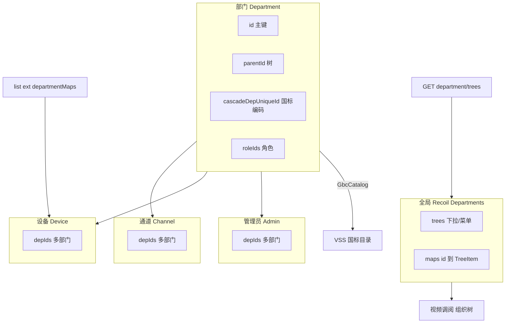

# 6.3 组织部门模块实现（`src/pages/system/departments`）

本文说明 **组织架构（部门）** 在前端的字段模型、API、**树形维护方式**，以及 **`depIds` / `cascadeDepUniqueId` / Recoil 部门树** 与设备、通道、管理员、国标目录、视频调阅等模块的关联。

**项目地址** [https://github.com/openskeye/skeyevss_frontend_web](https://github.com/openskeye/skeyevss_frontend_web)


---

## 1. 模块定位

- **路由**：`/system/departments`（见 `src/routers/sites.tsx`），根表格传入 **`parentId={0}`、`parentName=""`**，表示从「顶级」部门起查。
- **权限**：表格 `authority` 绑定 `P_1_1_3`、`P_0_1_3`（与菜单 `uniqueId` 体系一致）。
- **核心能力**：部门的增删改查、**子部门嵌套表格**（展开行内再挂一张表）、部门与 **角色（多选）** 绑定、部门与 **监控通道（多对多）** 通过 **`depIds`** 维护；修改 **级联编号** 时触发 **国标目录同步**。

---

## 2. 数据模型

定义于 `src/pages/system/departments/model.tsx` → `Item`：

| 字段                        | 类型/含义      | 说明                                               |
|---------------------------|------------|--------------------------------------------------|
| `id`                      | `number`   | 主键，部门在库里的数字 id；全局树、下拉、通道 `depIds` 都引用它           |
| `name`                    | `string`   | 部门名称（列表、面包屑、表单必填）                                |
| `state`                   | `number`   | 启用/停用，表格为开关，与全局 `stateOptions` 一致                |
| `remark`                  | `string`   | 备注                                               |
| `parentId`                | `number`   | **父部门 id**；根列表固定条件 `parentId === 0`，子表传入当前行 `id` |
| `cascadeDepUniqueId`      | `string`   | **级联/国标侧部门业务编号**（可与平台内 `id` 并存）；空时列表显示 `-`       |
| `roleIds`                 | `number[]` | **关联角色 id 列表**，与系统「角色管理」多对多                      |
| `createdAt` / `updatedAt` | `number`   | 时间戳                                              |

### 2.1 级联编号的生成

新建表单中 `cascadeDepUniqueId` 使用 **`fetchDefValue`**：若为空则调用 **`genUniqueId({ type: 'cascadeDepCode', count: 1 })`**（`#repositories/apis/base`）由后端生成默认编码。

### 2.2 创建时的字段裁剪

`index.tsx` 中 `create` 在提交前对 `record` 做 **`mapFilter`**：**若 `cascadeDepUniqueId` 为空则从 payload 中去掉**，避免传空串覆盖后端默认策略（与表单「可空由后端生成」的语义一致）。

---

## 3. API 一览

`src/pages/system/departments/api.ts`：

| 方法     | HTTP   | 路径                 | 用途                         |
|--------|--------|--------------------|----------------------------|
| Create | POST   | `/departments`     | 新建部门                       |
| Delete | DELETE | `/departments`     | 删除                         |
| Update | PUT    | `/department`      | 更新（单资源 PUT 与列表路径区分）        |
| List   | POST   | `/department/list` | 分页/条件列表，`list` 转为 `Item[]` |
| Row    | GET    | `/department/:id`  | 单行详情（表单编辑用）                |

> 注意：**复数 `/departments` 与单数 `/department`** 在不同操作上混用，联调时需与后端约定保持一致。

---

## 4. UI：树形组织如何在前端展开

并不是单独的「树页面」，而是 **Ant Table 的 `expandableRender`**：

- 根 `Main`：`fetchList` 始终在请求参数中 **追加** `conditions: { column: 'parentId', value: props.parentId }`。根为 `0`。
- 展开一行时，渲染 **另一个 `Main`**，传入 `parentId={record.id}`、`parentName={record.name}`、`tableMode="inner"`，从而在行内嵌套子部门列表。

这样 **任意深度** 都是同一组件递归，数据边界完全由 **`parentId`** 决定。

---

## 5. 与「角色」模块的关系

- 列表列 **`roles`**：`roleIds` 多选展示，选项来自 **`RoleList`（`pages/system/roles/api`）** `isDel === 0` 的全量角色。
- 表单 **`roleIds`**：`XFormItemType.select` + `multiple`，`dynamicAddOption` 提供 **「添加角色」** 按钮，跳转 `makeDefRoutePathWithCreateAnchor` 生成的角色页路径。

部门侧存的是 **角色 id 数组**；权限的最终生效仍由后端鉴权与用户-角色体系完成，前端负责维护 **部门 ↔ 角色** 关联数据。

---

## 6. 与「通道」模块的关系（`depIds`）

通道模型（`pages/devices/channels`）上有 **`depIds: number[]`**，表示**一条通道可挂在多个部门下**（业务分组、视频调阅左侧「组织架构」等）。

### 6.1 部门管理页的「设置通道」

`index.tsx` → `rowCustomActions`：**设置通道[n]**，`n` 来自 **`handleListResponse` 里 `res.data.maps[departmentId]`** 的通道数量。

弹窗内勾选通道后：

- 将选中通道的 **`depIds`** 更新为 **当前部门 id**（`ChannelUpdate`，`column: 'depIds', value: depIds`）。
- 取消勾选的通道可被 **`depIds` 清空为 `[]`**（从所有分组移除）。

这与视频调阅里 **右键部门 → 设置分组** 使用的是 **同一套通道更新 API**，只是入口不同。

### 6.2 列表响应里的 `maps`

部门列表接口除 `list` 外，还带 **`maps: { [departmentId: number]: ChannelItem[] }`**（前端映射为 `channelMaps`），用于展示每个部门下已关联通道数量/弹窗默认勾选，无需再请求一次统计接口。

---

## 7. 与「设备」模块的关系

设备 `Item` 同样有 **`depIds`**（设备维度的组织归属），列表接口扩展里常带 **`departmentMaps: { [id]: 部门名 }`**。

设备表「组织部门」列：对 **`depIds`** 逐个用 **`departmentMaps[id]`** 渲染 Tag，并 **`Location`** 到部门页的 **锚点链接**（`makeDefRoutePathWithIdAnchor(routes[Path.system].subs[Path.departments].path, item)`），实现从设备快速定位到组织管理。

> **设备 `depIds` 与通道 `depIds`** 概念：前者是设备归属部门，后者是通道在视频业务里的分组；可以只绑定通道、只绑定设备或两者都绑，用途上是有不同区分的。

---

## 8. 与「管理员」模块的关系

`pages/system/admins` 中管理员也有 **`depIds`**（可归属多个部门）。

- 表单选项来自 Recoil **`Departments`** 的 **`trees`**（见下节），**不是**部门列表页本地 state。
- 表格展示：用 **`departmentMaps`**（`TreeItem` 展平后的 `id → TreeItem`）把 `depIds` 翻译成部门名称拼接。

即：**管理员归属**依赖全局部门树；**部门 CRUD** 成功后若需管理员页立即一致，需刷新部门树或重新拉 `DeptTrees`（当前项目在 Layout 登录后拉一次，部分操作如 sundry 里会直接 patch `departments.set`）。

---

## 9. 全局部门树 Recoil：`Departments`

类型见 `repositories/types/config.ts` → **`DepartmentsType`**：`trees`（`OptionItem[]`）、`maps`（`{ [id]: TreeItem }`）。

### 9.1 何时写入

- **`components/layout/index.tsx`**：用户已登录后 **`DeptTrees()`**（`GET /department/trees`），再 **`TreeItem.toOptions` / `TreeItem.toMaps`**，**`departments.set({ trees, maps })`**。前缀 **`defOption`** 作为「空/全部」占位。
- **`components/sundry.tsx`**（如部门级联控件里修改 `cascadeDepUniqueId` 后）：在本地 **`departments.set`** 里 **递归更新 `trees`/`maps` 中对应节点的 `raw`**，避免整页刷新。

### 9.2 消费

- **`DepartmentTrees`**（视频调阅「组织架构」Tab）：读 **`Departments`** 的 `trees`/`maps`，渲染 Ant Menu。
- **管理员表单**：选项 = `departmentState.trees`。
- 其它需要 **部门 id → 名称** 的地方：`maps[id].name` 或列表扩展 `departmentMaps`。

---

## 10. 与国标/级联目录的关系：`GbcCatalog`

部门表单 **`updateCompletion`**：若 **`cascadeDepUniqueId` 变更**，调用：

```ts
GbcCatalog({ departmentUniqueId: newData.cascadeDepUniqueId, oldDepartmentUniqueId: oldData.cascadeDepUniqueId })
```

即 **平台组织变更要通知 VSS/国标目录侧** 做 catalog 同步，避免上下级平台或设备目录与本地部门编码不一致。具体以后端实现为准。

---

## 11. 路由锚点与其它页面跳转

`src/routers/anchor.ts` 提供多种带分页占位 + hash 的路径生成器，部门相关常用：

- **`makeDefRoutePathWithIdAnchor(departmentsPath, id)`**：打开部门列表并带上「选中某 id」的锚点（设备列表里点部门 Tag 即用此方式）。

这样 **组织管理** 与 **设备/通道** 在 UI 上可互相跳转，数据上通过 **`depIds`（数字部门 id）** 关联。

---

## 12. 关键文件索引

| 路径                                        | 作用                                     |
|-------------------------------------------|----------------------------------------|
| `src/pages/system/departments/index.tsx`  | 表格、展开子表、通道设置弹窗、`GbcCatalog`            |
| `src/pages/system/departments/model.tsx`  | `Item`、`columns`、`formColumns`         |
| `src/pages/system/departments/api.ts`     | REST 封装                                |
| `src/components/layout/index.tsx`         | 登录后 `DeptTrees` → `Departments.set`    |
| `src/repositories/models/recoil-state.ts` | `Departments` atom                     |
| `src/repositories/apis/base.ts`           | `DeptTrees`、`genUniqueId`、`GbcCatalog` |
| `src/pages/devices/items/model.tsx`       | 设备 `depIds` + `departmentMaps` 展示      |
| `src/pages/devices/channels/model.tsx`    | 通道 `depIds`                            |
| `src/pages/system/admins/model.tsx`       | 管理员 `depIds` + 表单                      |
| `src/pages/video-filters/index.tsx`       | 组织架构 Tab、通道 `depIds` 批量维护              |

---

## 13. 关系图



---

**注意**： 若后端调整 `department/list` 的 `maps` 结构或 `depIds` 语义，需同步 `handleListResponse` 与各页 `ChannelUpdate` 条件；级联编号长度等业务校验以 `sundry` 与后端约定为准。*
